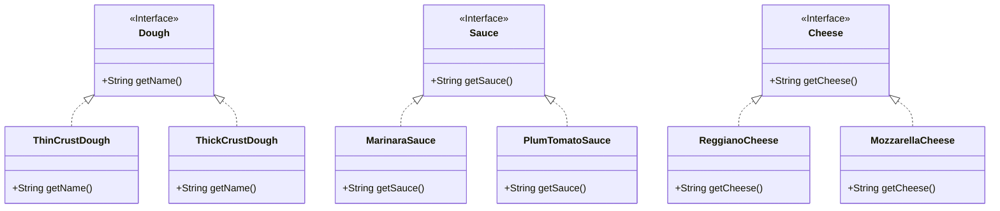

## Definition

The Abstract Factory Pattern provides an interface for creating families of related or dependent objects without specifying their concrete class. 

---
## Real World Analogy

In the previous example of the [[Factory Method Pattern]], we demonstrated ordering pizzas through a `PizzaStore`. However, each store may use different local ingredients, dough, sauce, and cheese, so a pizza with the same name can taste different in different regions. For instance, a New York style pizza uses thin crust dough and marinara sauce, while a Chicago style pizza uses thick crust dough and plum tomato sauce.

Using the Factory Method Pattern, we would need to create separate pizza classes for each store, even though the pizza types (like `CheesePizza` or `SchezwanPizza`) are conceptually the same. The only difference between them is the regional ingredients.

With the Abstract Factory Pattern, we introduce an abstract ingredient factory that the `PizzaStore` uses to create dough, sauce, and cheese. Each store provides its own concrete factory implementation. When ordering a pizza, the store’s factory applies the correct regional ingredients automatically. If a new store opens, you simply add its ingredient factory without modifying the pizza ordering logic.

```java title="Dough.java"
// Interface for creating Dough
interface Dough {
    public String getName();
}
```

```java title="Sauce.java"
// Interface for creating Sauce based on regional style
interface Sauce {
    public String getSauce();
}
```

```java title="Cheese.java"
// Interface for creating Cheese based on regional style
interface Cheese {
    public String getCheese();
}
```

These interfaces define the contracts for dough, sauce, and cheese. Below we implement them for New York style and Chicago style ingredients.

```java title="NYPizzaIngredients.java"
// Creating Dough, Sauce, and Cheese based on New York style
class ThinCrustDough implements Dough {
    @Override
    public String getName() {
        return "ThinCrustDough - NewYorkStore";
    }
}

class ReggianoCheese implements Cheese {
    @Override
    public String getCheese() {
        return "ReggianoCheese - NewYorkStore";
    }
}

class MarinaraSauce implements Sauce {
    @Override
    public String getSauce() {
        return "MarinaraSauce - NewYorkStore";
    }
}
```

```java title="ChicagoPizzaIngredient.java"
// Creating Dough, Sauce, and Cheese for the Chicago Pizza Store
class MozzarellaCheese implements Cheese {
    @Override
    public String getCheese() {
        return "MozzarellaCheese - ChicagoStore";
    }
}

class ThickCrustDough implements Dough {
    @Override
    public String getName() {
        return "ThickCrustDough - ChicagoStore";
    }
}

class PlumTomatoSauce implements Sauce {
    @Override
    public String getSauce() {
        return "PlumTomatoSauce - ChicagoStore";
    }
}
```

Here we implement New York style and Chicago style ingredients by implementing the interfaces. You could also group all regional implementations in a single file if you prefer.

```java title="PizzaIngredientFactory.java"
// Creating the interface for PizzaIngredientFactory
interface PizzaIngredientFactory {
    public Dough createDough();
    public Sauce createSauce();
    public Cheese createCheese();
}
```

We now create the `PizzaIngredientFactory` abstraction, which defines methods to produce each ingredient. Next we implement concrete factories for New York and Chicago styles.

```java title="NyPizzaIngredientFactory.java"
// PizzaIngredientFactory implementation for NYPizzaStore
class NYPizzaIngredientFactory implements PizzaIngredientFactory {
    @Override
    public Dough createDough() {
        return new ThinCrustDough();
    }

    @Override
    public Sauce createSauce() {
        return new MarinaraSauce();
    }

    @Override
    public Cheese createCheese() {
        return new ReggianoCheese();
    }
}
```

```java title="ChicagoPizzaIngredientFactory.java"
// PizzaIngredientFactory implementation for ChicagoPizzaStore
class ChicagoPizzaIngredientFactory implements PizzaIngredientFactory {
    @Override
    public Dough createDough() {
        return new ThickCrustDough();
    }

    @Override
    public Sauce createSauce() {
        return new PlumTomatoSauce();
    }

    @Override
    public Cheese createCheese() {
        return new MozzarellaCheese();
    }
}
```

Next we update the `Pizza` abstract class so each pizza can prepare itself using the provided ingredient factory.

```java title="Pizza.java"
// Base class for creating a Pizza
abstract class Pizza {
    public String name;
    public Dough dough;
    public Sauce sauce;
    public Cheese cheese;

    // Each pizza must prepare itself with regional ingredients
    abstract public void prepare();

    // Common baking step
    public void bake() {
        System.out.println("Baking " + name);
    }

    // Common cutting step
    public void cut() {
        System.out.println("Cutting " + name);
    }

    // Common boxing step
    public void box() {
        System.out.println("Boxing " + name);
    }
}
```

The abstract `prepare` method enforces that each pizza subclass defines its own preparation steps. The `bake`, `cut`, and `box` methods provide shared behavior.

```java title="CheesePizza.java"
// Cheese Pizza class
class CheesePizza extends Pizza {
    // Reference to the ingredient factory
    private PizzaIngredientFactory ingredientFactory;

    public CheesePizza(PizzaIngredientFactory factory) {
        this.ingredientFactory = factory;
        this.name = "Cheese Pizza";
    }

    @Override
    public void prepare() {
        System.out.println("Preparing " + name);
        this.dough = ingredientFactory.createDough();
        this.sauce = ingredientFactory.createSauce();
        this.cheese = ingredientFactory.createCheese();
    }
}
```

```java title="SchezwanPizza.java"
// Schezwan Pizza class
class SchezwanPizza extends Pizza {
    // Reference to the ingredient factory
    private PizzaIngredientFactory ingredientFactory;

    public SchezwanPizza(PizzaIngredientFactory factory) {
        this.ingredientFactory = factory;
        this.name = "Schezwan Pizza";
    }

    @Override
    public void prepare() {
        System.out.println("Preparing " + name);
        this.dough = ingredientFactory.createDough();
        this.sauce = ingredientFactory.createSauce();
        this.cheese = ingredientFactory.createCheese();
    }
}
```

In each pizza class we store the `PizzaIngredientFactory` passed into the constructor. This factory determines which regional ingredients will be used during preparation.

Each `PizzaStore` subclass injects its own ingredient factory when creating pizzas:

```java title="NyPizzaStore.java"
// New York Pizza Store using NY ingredient factory
class NyPizzaStore extends PizzaStore {
    private PizzaIngredientFactory ingredientFactory = new NYPizzaIngredientFactory();

    @Override
    protected PizzaBase createPizza(String type) {
        if (type.equalsIgnoreCase("cheese")) {
            return new CheesePizza(ingredientFactory);
        } else if (type.equalsIgnoreCase("schezwan")) {
            return new SchezwanPizza(ingredientFactory);
        }
        return null;
    }
}
```

```java title="ChicagoPizzaStore.java"
// Chicago Pizza Store using Chicago ingredient factory
class ChicagoPizzaStore extends PizzaStore {
    private PizzaIngredientFactory ingredientFactory = new ChicagoPizzaIngredientFactory();

    @Override
    protected PizzaBase createPizza(String type) {
        if (type.equalsIgnoreCase("cheese")) {
            return new CheesePizza(ingredientFactory);
        } else if (type.equalsIgnoreCase("schezwan")) {
            return new SchezwanPizza(ingredientFactory);
        }
        return null;
    }
}
```

Finally, in our client code we order pizzas from different stores to see the Abstract Factory in action:

```java title="Program.java"
// Ordering pizza from the New York store
PizzaStore1 nyStore = new NyPizzaStore1();
nyStore.orderPizza("cheese");

// Ordering pizza from the Chicago store
PizzaStore1 chicagoStore = new ChicagoPizzaStore1();
chicagoStore.orderPizza("schezwan");
```

**Sample Output:**

```
Preparing Cheese Pizza
Baking Cheese Pizza
Cutting Cheese Pizza
Boxing Cheese Pizza
Preparing Schezwan Pizza
Baking Schezwan Pizza
Cutting Schezwan Pizza
Boxing Schezwan Pizza
```

## Design




---
## Design Principles

- **Encapsulate What Varies** - Identify the parts of the code that are going to change and encapsulate them into separate class just like the Strategy Pattern. 
- **Favor Composition Over Inheritance** - Instead of using inheritance on extending functionality, rather use composition by delegating behavior to other objects. 
- **Program to Interface not Implementations** - Write code that depends on Abstractions or Interfaces rather than Concrete Classes. 
- **Strive for Loosely coupled design between objects that interact** - When implementing a class, avoid tightly coupled classes. Instead, use loosely coupled objects by leveraging abstractions and interfaces. This approach ensures that the class does not heavily depend on other classes.
- **Classes Should be Open for Extension But closed for Modification** - Design your classes so you can extend their behavior without altering their existing, stable code.
- **Depend on Abstractions, Do not depend on concrete class** - Rely on interfaces or abstract types instead of concrete classes so you can swap implementations without altering client code.
