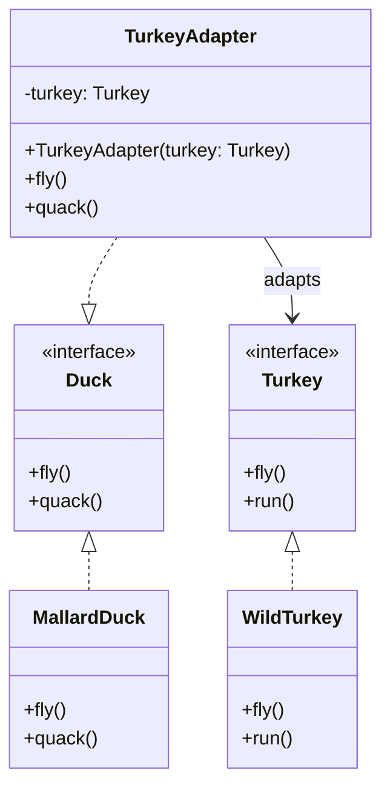

## Definition

The Adapter Pattern converts the interface of a class into another interface that clients expect. Adapter lets classes work together that couldn’t otherwise because of incompatible interfaces.

---
## Real World Analogy

Imagine you bought a machine from China and imported it to India. The problem is that the plugs and sockets used in China are totally different from those in India. You still need to power on the machine, but you can’t simply connect it directly to the Indian socket.

Here the adapter comes into play. Instead of cutting wires and reattaching them to an Indian plug, you can use an adapter that converts the Chinese plug to fit the Indian socket.

![[adapter_workflow.png]]  
_Example of the Adapter Pattern to use a China plug with an Indian socket board._

Similarly, in our code example we have a `Duck` interface and implementations from the [[Strategy Pattern]]. We want to add a new bird type, `Turkey`, but also use the existing `Duck` interface without changing any existing code. As the [[#Definition]] says, we can translate one interface to another without touching the existing implementations. Here, we’ll adapt the `Turkey` to behave like a `Duck`.

---
## Design



_Design diagram showing how `TurkeyAdapter` adapts a `Turkey` to the `Duck` interface._

---
## Implementation In Java

Firstly, let’s look at the existing `Duck` interface and its `MallardDuck` implementation.

```java title="Duck.java"
interface Duck {
    public void fly();
    public void quack();
}
```

```java title="MallardDuck.java"
class MallardDuck implements Duck {

    @Override
    public void fly() {
        System.out.println("Mallard Duck Flying");
    }

    @Override
    public void quack() {
        System.out.println("Mallard Duck quacking");
    }

}
```
The `Duck` interface defines two methods: `fly()` and `quack()`. `MallardDuck` implements these methods, providing the concrete behavior for a normal duck.

Next, we define the `Turkey` interface and its implementation:

```java title="Turkey.java"
interface Turkey {
    public void fly();
    public void run();
}
```

```java title="WildTurkey.java"
class WildTurkey implements Turkey {

    @Override
    public void fly() {
        System.out.println("Turkey Flying");
    }

    @Override
    public void run() {
        System.out.println("Turkey Running");
    }

}
```
The `Turkey` interface has two methods: `fly()` and `run()`. `WildTurkey` provides concrete behavior for these methods.

Since `Turkey` does not have a `quack()` method, we create an adapter to translate a `Turkey` into a `Duck`:

```java title="TurkeyAdapter.java"
class TurkeyAdapter implements Duck {
    private Turkey turkey;

    public TurkeyAdapter(Turkey turkey) {
        this.turkey = turkey;
    }

    @Override
    public void fly() {
        // Delegate the fly call to the turkey
        this.turkey.fly();
    }

    @Override
    public void quack() {
        // Since turkeys don't quack, delegate quack to run()
        this.turkey.run();
    }
}
```
`TurkeyAdapter` implements the `Duck` interface. It holds a reference to a `Turkey` object and delegates `fly()` calls directly, while `quack()` calls are mapped to the turkey’s `run()` method.

Finally, we put everything together:

```java title="ObjectAdapterDemo.java"
public class ObjectAdapterDemo {
    public static void main(String[] args) {
        // Original Duck
        Duck duck = new MallardDuck();
        // Adapted Turkey
        Duck duck2 = new TurkeyAdapter(new WildTurkey());
        
        duck.quack();
        duck2.quack();
    }
}
```
*Output:*
```text
Mallard Duck quacking
Turkey Running
```
---
## Class Adapter

The above example uses the **Object Adapter** approach. You can also implement a **Class Adapter** when the language supports multiple inheritance. Java does not allow multiple class inheritance, but you can achieve similar behavior using multiple interfaces. In languages like C++, you could directly inherit both the target interface and the adaptee.

---
## Real World Example

A classic example in Java is `InputStreamReader`:
```java title="InputStreamExample.java"
public static void main(String[] args) throws FileNotFoundException, IOException {
    String path = System.getProperty("user.dir");
    path = path.concat("/src/adapter/file.txt");

    File file = new File(path);
    // Adaptee: byte-based API
    InputStream fileStream = new FileInputStream(file);
    // Adapter: converts bytes to characters
    Reader inputStreamReader = new InputStreamReader(fileStream);
    // Client: reads text lines
    BufferedReader reader = new BufferedReader(inputStreamReader);
    String line;
    while ((line = reader.readLine()) != null) {
        System.out.println(line);
    }
    reader.close();
}
```
**Why it is called an Adapter?**
1. **Adaptee**: `InputStream` (byte‐based API).
2. **Target Interface**: `Reader` (char‐based API that many APIs expect).
3. **Adapter**: `InputStreamReader` extends `Reader` and internally holds an `InputStream`, delegating calls and translating bytes into characters.

Whenever you need to feed a `byte[]`, a `Socket.getInputStream()`, or a `FileInputStream` into a component that only accepts a `Reader`, you’re using the Adapter Pattern—straight out of the core Java I/O library.

---
## Design Principles:

- **Encapsulate What Varies** - Identify the parts of the code that are going to change and encapsulate them into separate class just like the Strategy Pattern. 
- **Favor Composition Over Inheritance** - Instead of using inheritance on extending functionality, rather use composition by delegating behavior to other objects. 
- **Program to Interface not Implementations** - Write code that depends on Abstractions or Interfaces rather than Concrete Classes. 
- **Strive for Loosely coupled design between objects that interact** - When implementing a class, avoid tightly coupled classes. Instead, use loosely coupled objects by leveraging abstractions and interfaces. This approach ensures that the class does not heavily depend on other classes.
- **Classes Should be Open for Extension But closed for Modification** - Design your classes so you can extend their behavior without altering their existing, stable code.
- **Depend on Abstractions, Do not depend on concrete class** - Rely on interfaces or abstract types instead of concrete classes so you can swap implementations without altering client code.