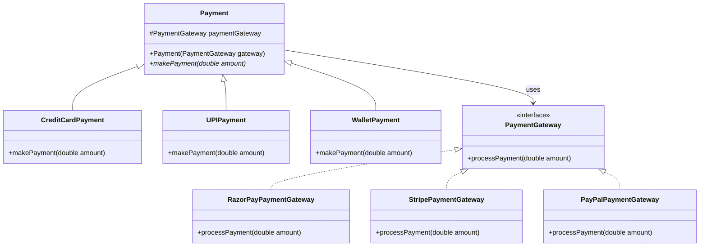

## Definition

The **Bridge** is a structural design pattern that divides business logic or huge class into separate class hierarchies that can be developed independently.

---
## Real World Analogy

Imagine you are implementing a payment system in your application. Users should be able to pay using different payment methods such as **Credit Card**, **Debit Card**, **UPI**, or **Wallet**. However, the application itself does not implement the actual payment processing. Instead, it relies on third‑party payment gateways.

There are multiple payment gateways available such as RazorPay, Stripe, or PayPal. Each gateway should be able to work with any payment method.

If we tightly couple every payment method with every gateway, we would end up creating many classes like:
```txt
RazorPayCreditCardPayment
RazorPayUPIPayment
StripeCreditCardPayment
StripeUPIPayment
```

Now imagine adding a new gateway like `PhonePeGateway`. We would need to create additional classes for every payment method again. This quickly leads to a large number of classes and tightly coupled code.

The **Bridge Pattern** solves this problem by separating the abstraction from its implementation so both can evolve independently.

The pattern contains two major parts:
- **Abstraction** – The high level layer that the client interacts with.
- **Implementation** – The low level layer that performs the actual work.

In this example:
- **Payment Methods** act as the **Abstraction**.
- **Payment Gateways** act as the **Implementation**.

The bridge connects these two hierarchies so that any payment method can work with any payment gateway without creating multiple combinations of classes.

---
### How Bridge Pattern is different from Strategy Pattern?

The **Bridge Pattern** and **Strategy Pattern** both use composition, but they serve different purposes.
The **Bridge Pattern** is used to **separate an abstraction from its implementation so that both can change independently**. It is especially useful when there are **two dimensions that may vary**, such as payment methods and payment gateways. This prevents creating many subclasses for every combination.
In contrast, the **Strategy Pattern** is used to **define multiple algorithms and allow switching between them at runtime**. Its primary goal is to change behavior dynamically, for example selecting different sorting algorithms or payment calculation logic.

---
## Design

The following class diagram shows how the Bridge pattern separates the **Payment type hierarchy** from the **Payment gateway hierarchy**. Both hierarchies are connected through a bridge using composition.

This design ensures that new payment methods or new gateways can be added without modifying existing classes. Each hierarchy can grow independently.



_Class Diagram for the Payment System using the Bridge pattern_

---
## Implementation in Java

```java title="PaymentGateway.java"
interface PaymentGateway {
    void processPayment(double amount);
}
```

This interface represents the **implementation side** of the Bridge pattern. All payment gateways must implement this interface so that the abstraction layer can use them without depending on a specific gateway.
```java title="RazorPayPaymentGateway.java"
class RazorPayPaymentGateway implements PaymentGateway{  
    @Override  
    public void processPayment(double amount) {  
        System.out.println(String.format("Processing the Payment For Amount=%s Via RazorPay",amount
        ));  
    }  
}
```
This class is a concrete implementation of the `PaymentGateway` interface. It simulates processing the payment through RazorPay.
```java title="StripePaymentGateway.java"
class StripePaymentGateway implements PaymentGateway{  

    @Override  
    public void processPayment(double amount) {  
        System.out.println(String.format("Processing the Payment For Amount=%s Via Stripe",amount
        ));  
    }  
}
```
This class represents another gateway implementation. The abstraction layer does not need to know how Stripe works internally.
```java title="PayPalPaymentGateway.java"
class PayPalPaymentGateway implements PaymentGateway{  

    @Override  
    public void processPayment(double amount) {  
        System.out.println(String.format("Processing the Payment For Amount=%s Via PayPal",amount
        ));  
    }  
}
```
This class provides support for the PayPal payment gateway. Any payment type can use this gateway.
```java title="Payment.java"
abstract class Payment{  
    // Payment Supports any Payment Gateway acting as the bridge  
    protected PaymentGateway paymentGateway;  

    public Payment(PaymentGateway paymentGateway){  
        this.paymentGateway=paymentGateway;  
    }  

    abstract void makePayment(double amount);  
}
```
This abstract class represents the **abstraction layer**. It contains a reference to `PaymentGateway`, which acts as the bridge between the payment type and the gateway implementation.
```java title="CreditCardPayment.java"
class CreditCardPayment extends Payment{  

    public CreditCardPayment(PaymentGateway paymentGateway){  
        // Calling the payment Abstract class  
        super(paymentGateway);  
    }  

    @Override  
    void makePayment(double amount) {  
        System.out.println("Payment via CreditCard");  
        this.paymentGateway.processPayment(amount);  
    }  
}
```
This class represents a specific payment type. It uses the gateway object to actually process the payment.
```java title="UPIPayment.java"
class UPIPayment extends Payment{  
    public UPIPayment(PaymentGateway paymentGateway){  
        super(paymentGateway);  
    }  

    @Override  
    void makePayment(double amount) {  
        System.out.println("Payment via UPI");  
        this.paymentGateway.processPayment(amount);  
    }  
}
```
This class represents UPI payments. The logic of how the payment is processed is delegated to the gateway.
```java title="WalletPayment.java"
class WalletPayment extends Payment{  
    public WalletPayment(PaymentGateway paymentGateway){  
        super(paymentGateway);  
    }  

    @Override  
    void makePayment(double amount) {  
        System.out.println("Payment via Wallet");  
        this.paymentGateway.processPayment(amount);  
    }  
}
```
This class represents wallet based payments. Again, it uses the gateway bridge to complete the transaction.
```java title="BridgePattern.java"
public static void main(String[] args) {  
    PaymentGateway razorpay = new RazorPayPaymentGateway();  
    PaymentGateway paypal = new PayPalPaymentGateway();  
    PaymentGateway stripe = new StripePaymentGateway();  

    Payment creditCardPayment = new CreditCardPayment(razorpay);  
    creditCardPayment.makePayment(5000);  

    System.out.println();  

    Payment upiPayment = new UPIPayment(paypal);  
    upiPayment.makePayment(1500);  

    System.out.println();  

    Payment walletPayment= new WalletPayment(stripe);  
    walletPayment.makePayment(3400);  
}
```
The client creates payment gateway objects and passes them to the payment type objects. Because of the Bridge pattern, any payment method can work with any gateway.

**Output:**
```bash
Payment via CreditCard
Processing the Payment For Amount=5000.0 Via RazorPay

Payment via UPI
Processing the Payment For Amount=1500.0 Via PayPal

Payment via Wallet
Processing the Payment For Amount=3400.0 Via Stripe
```
---
## Real world Example

A good real‑world example of the Bridge pattern can be seen in **JDBC (Java Database Connectivity)**. In JDBC, the application code interacts with high‑level abstractions such as `Connection`, `Statement`, and `DriverManager`. These classes do not depend on a specific database implementation.

The actual implementations are provided by database drivers such as:
- MySQL Driver
- PostgreSQL Driver
- Oracle Driver

Because of this separation, the same application code can work with different databases simply by changing the JDBC driver. This is conceptually similar to the Bridge pattern where the abstraction (JDBC API) is separated from the implementation (database drivers).

---
## Design Principles:

- **Encapsulate What Varies** - Identify the parts of the code that are going to change and encapsulate them into separate class just like the Strategy Pattern. 
- **Favor Composition Over Inheritance** - Instead of using inheritance on extending functionality, rather use composition by delegating behavior to other objects. 
- **Program to Interface not Implementations** - Write code that depends on Abstractions or Interfaces rather than Concrete Classes. 
- **Strive for Loosely coupled design between objects that interact** - When implementing a class, avoid tightly coupled classes. Instead, use loosely coupled objects by leveraging abstractions and interfaces. This approach ensures that the class does not heavily depend on other classes.
- **Classes Should be Open for Extension But closed for Modification** - Design your classes so you can extend their behavior without altering their existing, stable code.
- **Depend on Abstractions, Do not depend on concrete class** - Rely on interfaces or abstract types instead of concrete classes so you can swap implementations without altering client code.
- **Talk Only To Your Friends** - An object may only call methods on itself, its direct components, parameters passed in, or objects it creates.
- **Don't call us, we'll call you** - This means the framework controls the flow of execution, not the user’s code (Inversion of Control).
- **A class should have only one reason to change** - This emphasizes the Single Responsibility Principle, ensuring each class focuses on just one functionality.