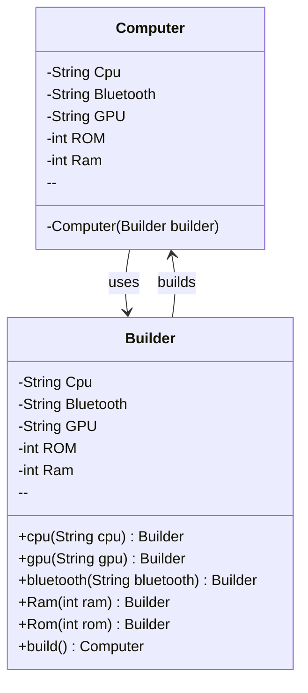

---
tags:
  - creational
title: Builder Pattern
created: 2026-03-31
---
## Definition

The **Builder Pattern** is the Creational Pattern used to construct the objects step by step, especially when the object has many optional feature or configurable parameters.

---
## Real World Analogy

Imagine you are assembling a computer based on specific needs. A gaming computer, an office computer, and a basic home computer all have different requirements. A gaming computer may need a powerful GPU, high RAM, and advanced cooling, while an office computer may only need moderate RAM and no GPU.

If you try to create all these computers using a single constructor with many parameters, you will end up passing unnecessary values such as null for components that are not required.

```
Computer office = new Computer("ram", "rom", "cpu", "bluetooth", null);
```

This approach is not clean and can lead to confusion and errors.

The Builder Pattern solves this problem by allowing you to construct objects step by step and only include the required attributes. This makes the code more readable, flexible, and maintainable.

---
## Why Use Builder Pattern

- Avoids constructors with too many parameters
- Improves readability of object creation
- Allows step by step object construction
- Makes code more maintainable and scalable
- Helps in creating immutable objects

---
### How Builder Pattern is Different from Abstract Factory Pattern?

It may seem that both Builder Pattern and [[Abstract Factory Pattern]] help in object creation, but they serve different purposes.

In **Builder Pattern**, we create different configurations of the same object. For example, a Computer object can have different specifications.

In **Abstract Factory Pattern**, we create families of related objects by selecting from multiple implementations of a common interface.

Builder focuses on how an object is constructed step by step, while Abstract Factory focuses on which object to create.

---
## Design

**Builder Pattern Class Diagram**



This diagram shows that the Builder class is responsible for constructing the Computer object step by step. The Computer class depends on the Builder to initialize its fields.

---
## Implementation in Java

```java title="Computer.java"
class Computer {  
    private String Cpu;  
    private String Bluetooth;  
    private String GPU;  
    private int ROM;  
    private int Ram;  
  
    // Private Constructor only Builder class can call  
    private Computer(Builder builder) {  
        this.Cpu = builder.Cpu;  
        this.ROM = builder.ROM;  
        this.Bluetooth = builder.Bluetooth;  
        this.GPU = builder.GPU;  
        this.Ram = builder.Ram;  
    }  
```

Here, the constructor of the Computer class is private. This ensures that objects cannot be created directly using new. Only the Builder class can create the object, which enforces controlled object creation.

The constructor copies all values from the Builder object to the Computer object.
```java title="Computer.java"
    // Getter Methods  
    public String getCpu() {  
        return Cpu;  
    }  
  
    public String getBluetooth() {  
        return Bluetooth;  
    }  
  
    public String getGPU() {  
        return GPU;  
    }  
  
    public int getROM() {  
        return ROM;  
    }  
  
    public int getRam() {  
        return Ram;  
    }  
```
These are standard getter methods that allow access to the private fields of the Computer class.

```java title="Computer.java"
    @Override  
    public String toString() {  
        return "Computer{" +  
                "Cpu='" + Cpu + '\'' +  
                ", Bluetooth='" + Bluetooth + '\'' +  
                ", GPU='" + GPU + '\'' +  
                ", ROM=" + ROM +  
                ", Ram=" + Ram +  
                '}';  
    }
```
The `toString` method provides a readable representation of the Computer object, which is useful for debugging and printing output.
```java title="Computer.java"
    // Static class as the Builder  
    static class Builder {  
        private String Cpu;  
        private String Bluetooth;  
        private String GPU;  
        private int ROM;  
        private int Ram;  
```
The Builder class holds the same fields as the Computer class. These fields are gradually set using builder methods.
```java title="Computer.java"
        public Builder cpu(String cpu) {  
            this.Cpu = cpu;  
            return this;  
        }  
```
This method sets the CPU value and returns the Builder object itself. Returning this enables method chaining.

```java title="Computer.java"
        public Builder gpu(String gpu) {  
            this.GPU = gpu;  
            return this;  
        }  
```
This method sets the GPU field. It is optional, so it can be skipped when not required.

```java title="Computer.java"
        public Builder bluetooth(String bluetooth) {  
            this.Bluetooth = bluetooth;  
            return this;  
        }  
```
This method sets the Bluetooth specification.

```java title="Computer.java"
        public Builder Ram(int ram) {  
            this.Ram = ram;  
            return this;  
        }  
```
This method sets the RAM value.

```java title="Computer.java"
        public Builder Rom(int rom) {  
            this.ROM = rom;  
            return this;  
        }  
```
This method sets the storage capacity.

```java title="Computer.java"
        public Computer build() {  
            return new Computer(this);  
        }  
    }  
}
```
The build method creates and returns the final Computer object using the Builder instance. This is the final step of object construction.

```java
public static void main(String[] args) {  
    Computer gaming = new Computer.Builder()  
            .Ram(12)  
            .cpu("i9")  
            .gpu("RTX 5090")  
            .Rom(1)  
            .bluetooth("v7")  
            .build();  

    System.out.println(gaming);  

    Computer office = new Computer.Builder()  
            .cpu("i5")  
            .Ram(8)  
            .Rom(512)  
            .bluetooth("v5")  
            .build();  

    System.out.println(office);  
}
```
Here, two different Computer objects are created using the Builder.
The gaming computer includes all specifications such as GPU and high RAM.
The office computer skips the GPU since it is not required. This shows how Builder Pattern avoids unnecessary parameters and keeps object creation clean.

**Output**:
```bash
Computer{Cpu='i9', Bluetooth='v7', GPU='RTX 5090', ROM=1, Ram=12}
Computer{Cpu='i5', Bluetooth='v5', GPU='null', ROM=512, Ram=8}
```

---
## Real World Example

- `StringBuilder` is a common example of the Builder Pattern in Java. It allows you to construct a string step by step by appending values instead of creating multiple string objects.
- `StringBuffer` works similarly to StringBuilder but is thread safe, which makes it suitable for multi threaded environments.
- In `.NET` Core, the **Builder Pattern** is used for configuring applications. For example, when setting up services and middleware, the application is built step by step using a builder approach.

---
## Design Principles:

- **Encapsulate What Varies** - Identify the parts of the code that are going to change and encapsulate them into separate class just like the Strategy Pattern. 
- **Favor Composition Over Inheritance** - Instead of using inheritance on extending functionality, rather use composition by delegating behavior to other objects. 
- **Program to Interface not Implementations** - Write code that depends on Abstractions or Interfaces rather than Concrete Classes. 
- **Strive for Loosely coupled design between objects that interact** - When implementing a class, avoid tightly coupled classes. Instead, use loosely coupled objects by leveraging abstractions and interfaces. This approach ensures that the class does not heavily depend on other classes.
- **Classes Should be Open for Extension But closed for Modification** - Design your classes so you can extend their behavior without altering their existing, stable code.
- **Depend on Abstractions, Do not depend on concrete class** - Rely on interfaces or abstract types instead of concrete classes so you can swap implementations without altering client code.
- **Talk Only To Your Friends** - An object may only call methods on itself, its direct components, parameters passed in, or objects it creates.
- **Don't call us, we'll call you** - This means the framework controls the flow of execution, not the user’s code (Inversion of Control).
- **A class should have only one reason to change** - This emphasizes the Single Responsibility Principle, ensuring each class focuses on just one functionality.