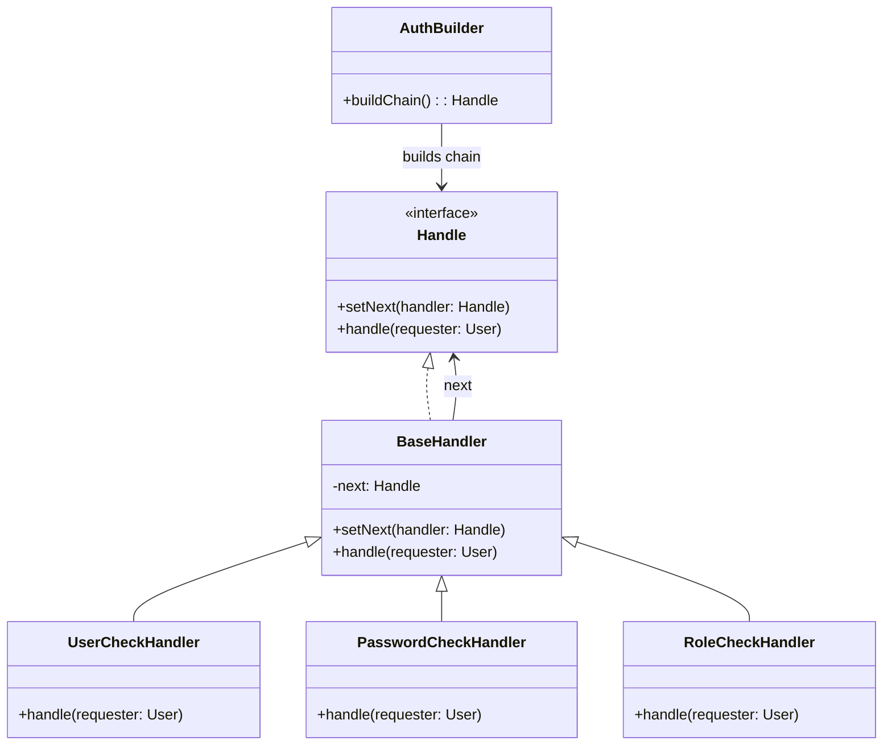

---
tags:
  - behavioral
created: 2026-04-02
title: Chain Of Responsibility Pattern
---
## Definition

**Chain of Responsibility Pattern** is the Behavioral design pattern that let you pass request along a chain of handlers. Upon receiving a request, each handler decides either to process the request or to pass it to the next handler in the chain.

---
## Real World Analogy

Think of a login system in an application. When a user tries to log in, multiple checks need to happen in a specific order. First, the system verifies whether the user exists. If the user is valid, it then checks the password. After that, it verifies the role or permissions of the user.

Now, not every request always needs all checks. Some parts of the system may only require user verification, while others may also need role validation. Instead of writing all these checks in one place with complex conditions, we can split them into separate handlers and connect them in a chain.

Each handler performs its own responsibility and then passes the request to the next handler only if the current check is successful. If any check fails, the process stops immediately. This makes the system flexible and easy to modify.

---
## Design



_Class Diagram for Authentication using Chain of Responsibility Pattern_

---
## Implementation in Java

```java title="User.java"
class User {  
    String username;  
    String role;  
    String password;  
  
    public User(String username, String password, String role) {  
        this.username = username;  
        this.password = password;  
        this.role = role;  
    }  
  
    public String getUsername() {  
        return username;  
    }  
  
    public String getRole() {  
        return role;  
    }  
  
    public String getPassword() {  
        return password;  
    }  
}
```
This class represents the user object that contains username, password, and role. It acts as the request that will be passed through the chain of handlers.

```java title="Handle.java"
// Handler Interface  
interface Handle {  
    void setNext(Handle handler);  
  
    void handle(User requester);  
}
```
This interface defines the structure for all handlers. Each handler must be able to set the next handler and process the request.

```java title="BaseHandler.java"
abstract class BaseHandler implements Handle {  
    protected Handle next;  
  
    @Override  
    public void setNext(Handle handler) {  
        this.next = handler;  
    }  
  
    @Override  
    public void handle(User requester) {  
        if (next != null) {  
            next.handle(requester);  
        }  
    }  
}
```
This abstract class provides a common implementation for all handlers. It stores the reference of the next handler and forwards the request when needed. Concrete handlers will extend this class and add their own logic.

```java title="UserCheckHandler.java"
class UserCheckHandler extends BaseHandler {  
    @Override  
    public void handle(User requester) {  
        if (!requester.getUsername().equals("admin")) {  
            System.out.println("User Does not Exists");  
            return;  
        }  
        System.out.println("User Verified");  
        super.handle(requester);  
    }  
}
```
This handler checks whether the username is valid. If the user does not exist, the chain stops here. If the check passes, it forwards the request to the next handler.

```java title="PasswordCheckHandler.java"
class PasswordCheckHandler extends BaseHandler {  
    @Override  
    public void handle(User requester) {  
        if (!requester.getPassword().equals("1234")) {  
            System.out.println("Invalid password");  
            return;  
        }  
  
        System.out.println("Password verified");  
        super.handle(requester);  
    }  
}
```
This handler validates the password. If the password is incorrect, the process stops. Otherwise, it passes the request further.

```java title="RoleCheckHandler.java"
class RoleCheckHandler extends BaseHandler {  
  
    @Override  
    public void handle(User requester) {  
        if (!requester.getRole().equals("ADMIN")) {  
            System.out.println("Access denied: insufficient role");  
            return;  
        }  
  
        System.out.println("Role verified → Access granted!");  
        super.handle(requester);  
    }  
}
```
This handler checks whether the user has the required role. If not, access is denied. If the role is valid, the request successfully completes.

```java title="AuthBuilder.java"
class AuthBuilder {  
    public static Handle buildChain() {  
        Handle usercheck = new UserCheckHandler();  
        Handle passwordcheck = new PasswordCheckHandler();  
        Handle rolecheck = new RoleCheckHandler();  
  
        usercheck.setNext(passwordcheck);  
        passwordcheck.setNext(rolecheck);  
        return usercheck;  
    }  
}
```
This class is responsible for building the chain. It creates each handler and connects them in the required order.

```java title="CORPattern.java"
public static void main(String[] args) {  
    User user = new User("admin", "1234", "ADMIN");  
  
    Handle chain = AuthBuilder.buildChain();  
    chain.handle(user);  
  
    System.out.println();  
    User user1 = new User("admin", "12234", "ADMIN");  
    chain.handle(user1);  
}
```
Here we create users and pass them through the chain. The chain processes each request step by step based on the defined handlers.

**Output**:
```bash
User Verified
Password verified
Role verified → Access granted!

User Verified
Invalid password
```

---
## Real World Example

This pattern is commonly used in middleware pipelines such as Spring and .NET Core. In these systems, a request passes through multiple middleware components, where each component performs a specific task like authentication, logging, or validation before passing it to the next component.

It is also used in logging frameworks. A log request can pass through different handlers based on its level, such as info, debug, or error, and then get written to different outputs like files or console.

This approach keeps the system clean, flexible, and easy to extend.

---
## Design Principles:

- **Encapsulate What Varies** - Identify the parts of the code that are going to change and encapsulate them into separate class just like the Strategy Pattern. 
- **Favor Composition Over Inheritance** - Instead of using inheritance on extending functionality, rather use composition by delegating behavior to other objects. 
- **Program to Interface not Implementations** - Write code that depends on Abstractions or Interfaces rather than Concrete Classes. 
- **Strive for Loosely coupled design between objects that interact** - When implementing a class, avoid tightly coupled classes. Instead, use loosely coupled objects by leveraging abstractions and interfaces. This approach ensures that the class does not heavily depend on other classes.
- **Classes Should be Open for Extension But closed for Modification** - Design your classes so you can extend their behavior without altering their existing, stable code.
- **Depend on Abstractions, Do not depend on concrete class** - Rely on interfaces or abstract types instead of concrete classes so you can swap implementations without altering client code.
- **Talk Only To Your Friends** - An object may only call methods on itself, its direct components, parameters passed in, or objects it creates.
- **Don't call us, we'll call you** - This means the framework controls the flow of execution, not the user’s code (Inversion of Control).
- **A class should have only one reason to change** - This emphasizes the Single Responsibility Principle, ensuring each class focuses on just one functionality.