## Definition

The Command Pattern turns a request into its own object. This makes it possible to pass different requests to other objects, store or log requests, queue them up, and even undo them.

---
## Real-World Analogy

Imagine a TV remote control with 8 or 9 slots. Each slot has an On and Off button. For example, slot 1 switches a light on or off. Slot 2 controls all the lights in a living room at once. Pressing On in slot 2 might turn on several lights together.

**Example**: You are dining in a restaurant. The waiter comes to take your order and writes it down. He then passes the order to the chef. The chef prepares the meal. Finally, the waiter brings the food back to you.

In this example, the waiter acts like the Invoker in the Command Pattern. The order itself is the Command object. The chef is the Receiver. We also have a Client (you, the customer).

![[comamnd_hotel_workflow.png]]  
_Example of the Command Pattern in a restaurant workflow._

We will use the same approach for our remote control. We'll also add an Undo button that keeps track of the last command you pressed.

---
## Design

```mermaid
classDiagram
    %% Interfaces
    class Command {
        <<interface>>
        +execute()
        +undo()
    }

    %% Receivers
    class Light {
        +on()
        +off()
    }
    class LivingRoom {
        +on()
        +off()
        +fancyLightOn()
        +fancyLightOff()
    }
    class CeilingFan {
        +high()
        +medium()
        +low()
        +off()
        +getSpeed() int
    }

    %% Concrete Commands
    class LightOnCommand {
        -light: Light
        +execute()
        +undo()
    }
    class LightOffCommand {
        -light: Light
        +execute()
        +undo()
    }
    class LivingRoomOnCommand {
        -livingroom: LivingRoom
        +execute()
        +undo()
    }
    class LivingRoomOffCommand {
        -livingroom: LivingRoom
        +execute()
        +undo()
    }
    class CeilingFanOffCommand {
        -ceilingfan: CeilingFan
        -prevSpeed: int
        +execute()
        +undo()
    }
    class CeilingFanHighCommand {
        -ceilingfan: CeilingFan
        -prevSpeed: int
        +execute()
        +undo()
    }
    class CeilingFanMediumCommand {
        -ceilingfan: CeilingFan
        -prevSpeed: int
        +execute()
        +undo()
    }
    class NoCommand {
        +execute()
        +undo()
    }

    %% Invoker
    class RemoteControl {
        -onCommands: Command[]
        -offCommands: Command[]
        -lastCommand: Command
        +setCommand(slot: int, on: Command, off: Command)
        +pressOnButton(slot: int)
        +pressOffButton(slot: int)
        +pressUndoButton()
    }

    %% Relationships
    LightOnCommand    ..|> Command
    LightOffCommand   ..|> Command
    LivingRoomOnCommand  ..|> Command
    LivingRoomOffCommand ..|> Command
    CeilingFanOffCommand ..|> Command
    CeilingFanHighCommand ..|> Command
    CeilingFanMediumCommand ..|> Command
    NoCommand         ..|> Command

    LightOnCommand    --> Light
    LightOffCommand   --> Light
    LivingRoomOnCommand  --> LivingRoom
    LivingRoomOffCommand --> LivingRoom
    CeilingFanOffCommand --> CeilingFan
    CeilingFanHighCommand --> CeilingFan
    CeilingFanMediumCommand --> CeilingFan

    RemoteControl     --> Command : holds 7 on/off slots

```



_Design of the Remote Control_

---
## Implementation in Java

First, create the `Command.java` interface. This defines what every Command must do:

```java title="Command.java"
interface Command {
    public void execute();
    public void undo();
}
```

Next, make the Receiver classes. A Receiver carries out the real work.

```java title="Light.java"
class Light {
    public void off() {
        System.out.println("Light is Turned Off");
    }

    public void on() {
        System.out.println("Light is Turned On");
    }
}
```

```java title="LivingRoom.java"
class LivingRoom {
    public void off() {
        System.out.println("Living Room Light is turned off");
    }

    public void on() {
        System.out.println("Living Room Light is Turned On");
    }

    public void fancyLightOn() {
        System.out.println("Living Room Fancy Light is Turned On");
    }

    public void fancyLightOff() {
        System.out.println("Living Room Fancy Light is Turned Off");
    }
}
```

```java title="CeilingFan.java"
class CeilingFan {
    public static final int OFF = 0;
    public static final int HIGH = 3;
    public static final int MEDIUM = 2;
    public static final int LOW = 1;
    private int speed;

    public void high() {
        this.speed = HIGH;
        System.out.println("CeilingFan is Set to High");
    }

    public void off() {
        this.speed = OFF;
        System.out.println("CeilingFan is turned off");
    }

    public void low() {
        this.speed = LOW;
        System.out.println("CeilingFan is set to Low");
    }

    public void medium() {
        this.speed = MEDIUM;
        System.out.println("CeilingFan is set to Medium");
    }

    public int getSpeed() {
        return this.speed;
    }
}
```

Now write the concrete Command classes. Each one wraps a Receiver and calls its methods.

```java title"LightOnCommand.java"
class LightOnCommand implements Command {
    private Light light;

    public LightOnCommand(Light light) {
        this.light = light;
    }

    @Override
    public void execute() {
        this.light.on();
    }

    @Override
    public void undo() {
        this.light.off();
    }

    @Override
    public String toString() {
        return "LightOnCommand";
    }
}
```

```java title="LightOffCommand.java"
class LightOffCommand implements Command {
    private Light light;

    public LightOffCommand(Light light) {
        this.light = light;
    }

    @Override
    public void execute() {
        this.light.off();
    }

    @Override
    public void undo() {
        this.light.on();
    }

    @Override
    public String toString() {
        return "LightOffCommand";
    }
}
```

```java title="LivingRoomOnCommand.java"
class LivingRoomOnCommand implements Command {
    private LivingRoom livingroom;

    public LivingRoomOnCommand(LivingRoom livingroom) {
        this.livingroom = livingroom;
    }

    @Override
    public void execute() {
        this.livingroom.on();
        this.livingroom.fancyLightOn();
    }

    @Override
    public void undo() {
        this.livingroom.fancyLightOff();
        this.livingroom.off();
    }

    @Override
    public String toString() {
        return "LivingRoomOnCommand";
    }
}
```

```java title="LivingRoomOffCommand.java"
class LivingRoomOffCommand implements Command {
    private LivingRoom livingroom;

    public LivingRoomOffCommand(LivingRoom livingroom) {
        this.livingroom = livingroom;
    }

    @Override
    public void execute() {
        this.livingroom.fancyLightOff();
        this.livingroom.off();
    }

    @Override
    public void undo() {
        this.livingroom.on();
        this.livingroom.fancyLightOn();
    }

    @Override
    public String toString() {
        return "LivingRoomOffCommand";
    }
}
```

You would follow the same pattern for the CeilingFan commands.

Finally, put everything together in the Invoker:

```java title="RemoteControl.java"
class RemoteControl {
    private Command[] onCommands;
    private Command[] offCommands;
    private Command lastCommand = new NoCommand();

    public RemoteControl() {
        this.onCommands = new Command[7];
        this.offCommands = new Command[7];
        Arrays.fill(this.onCommands, new NoCommand());
        Arrays.fill(this.offCommands, new NoCommand());
    }

    public void setCommand(int slot, Command onCommand, Command offCommand) {
        this.onCommands[slot] = onCommand;
        this.offCommands[slot] = offCommand;
    }

    public void pressOnButton(int slot) {
        this.lastCommand = this.onCommands[slot];
        this.onCommands[slot].execute();
    }

    public void pressOffButton(int slot) {
        this.lastCommand = this.offCommands[slot];
        this.offCommands[slot].execute();
    }

    public void pressUndoButton() {
        this.lastCommand.undo();
    }
}
```

When you run this code, the remote control will show which commands are assigned to each slot and allow you to press On, Off, and Undo. The Undo button reverses the last action.

**Sample Output:**
```
--------- Remote Control --------
[slot 0] NoCommand	NoCommand
[slot 1] NoCommand	NoCommand
[slot 2] NoCommand	NoCommand
[slot 3] NoCommand	NoCommand
[slot 4] NoCommand	NoCommand
[slot 5] NoCommand	NoCommand
[slot 6] NoCommand	NoCommand
LastCommand = NoCommand

--------- Remote Control --------
[slot 0] LivingRoomOnCommand	LivingRoomOffCommand
[slot 1] CeilingFanMediumCommand	CeilingFanOffCommand
[slot 2] LightOffCommand	LightOffCommand
[slot 3] CeilingFanMediumCommand	CeilingFanOffCommand
[slot 4] CeilingFanHighCommand	CeilingFanOffCommand
[slot 5] NoCommand	NoCommand
[slot 6] NoCommand	NoCommand
LastCommand = NoCommand

Light is Turned On
CeilingFan is Set to High
Light is Turned Off
Light is Turned On

--------- Remote Control --------
[slot 0] LivingRoomOnCommand	LivingRoomOffCommand
[slot 1] CeilingFanMediumCommand	CeilingFanOffCommand
[slot 2] LightOffCommand	LightOffCommand
[slot 3] CeilingFanMediumCommand	CeilingFanOffCommand
[slot 4] CeilingFanHighCommand	CeilingFanOffCommand
[slot 5] NoCommand	NoCommand
[slot 6] NoCommand	NoCommand
LastCommand = LightOffCommand
```
---
## Real-World Uses

- Job schedulers like Quartz use the Command Pattern. Each scheduled task is a `Job` (a Command) that you can queue, save to disk, retry, or run in parallel.
- GUI frameworks (for example, in Swing) use commands for menu items, toolbar buttons, and keyboard shortcuts. This makes it easy to add undo/redo and centralize logic for enabling or disabling actions.
---
## Design Principles:

- **Encapsulate What Varies** - Identify the parts of the code that are going to change and encapsulate them into separate class just like the Strategy Pattern. 
- **Favor Composition Over Inheritance** - Instead of using inheritance on extending functionality, rather use composition by delegating behavior to other objects. 
- **Program to Interface not Implementations** - Write code that depends on Abstractions or Interfaces rather than Concrete Classes. 
- **Strive for Loosely coupled design between objects that interact** - When implementing a class, avoid tightly coupled classes. Instead, use loosely coupled objects by leveraging abstractions and interfaces. This approach ensures that the class does not heavily depend on other classes.
- **Classes Should be Open for Extension But closed for Modification** - Design your classes so you can extend their behavior without altering their existing, stable code.
- **Depend on Abstractions, Do not depend on concrete class** - Rely on interfaces or abstract types instead of concrete classes so you can swap implementations without altering client code.
