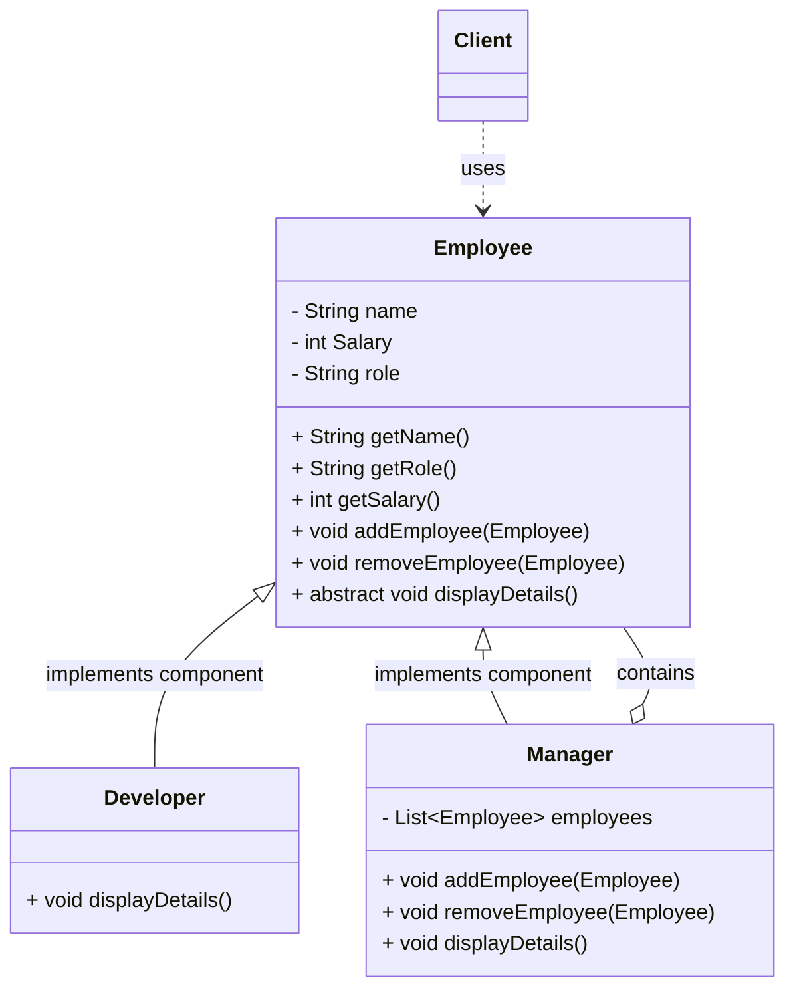

## Definition

The **Composite Pattern** allows you to compose objects into tree structures to represent part-whole hierarchies. Composite lets clients treat individual objects (Leaves) and compositions of objects (Composites) uniformly.

---
## Real World Analogy

The Composite Pattern allows you to create objects in a **tree-like structure to represent hierarchies**. The core benefit is that the client code can work **recursively** with the entire hierarchy or any single part of it without needing to know whether it's dealing with a single object (a Leaf) or a collection (a Composite).

Consider the **corporate organizational hierarchy** starting with the CEO. This structure is a perfect analogy for the Composite Pattern.

The structure composes objects into a tree-like hierarchy to represent part-whole relationships. The **Composite Pattern** is composed of two main types of nodes:

- **Leaf Node:** Represents an individual object (e.g., a **Developer**). It has no children.
- **Composite Node:** Represents a collection of objects (e.g., **CEO**, **Manager**, **Team Lead**). It can contain other Leaf or Composite nodes.

![[composite_pattern.png]]
_Example of Corporate Organizational Hierarchy_

---
## Design

The Composite Pattern relies on a common **Component** interface or abstract class that is implemented by both Leaves and Composites, ensuring they can be treated uniformly.



---
## Implementation in Java

This abstract class, `Employee`, is the **Component** that all objects in the hierarchy implement. It provides the standard methods (`displayDetails()`) that apply to both individual employees and teams, enabling uniform treatment by the client. It throws an `UnsupportedOperationException` for management methods by default, ensuring Leaf nodes don't accidentally try to manage children.

```java title="Employee.java"
import java.util.ArrayList;
import java.util.List;

abstract class Employee {
    private String name;
    private int Salary;
    private String role;

    public Employee(String name, int Salary, String role) {
        this.name = name;
        this.Salary = Salary;
        this.role = role;
    }

    public String getRole() {
        return role;
    }

    public String getName() {
        return name;
    }

    public int getSalary() {
        return Salary;
    }

    // These methods are for managing children. They are included in the Component
    // to maintain a uniform interface, but the default implementation throws an
    // exception, indicating that Leaf nodes do not support these operations.
    public void addEmployee(Employee employee) {
        throw new UnsupportedOperationException("Operation not supported by this employee type (Leaf node)");
    }

    public void removeEmployee(Employee employee) {
        throw new UnsupportedOperationException("Operation not supported by this employee type (Leaf node)");
    }

    // This is the common operation that clients use to process the node.
    public abstract void displayDetails();
}

```

The `Developer` class represents the **Leaf** component. As an individual employee, it is the simplest object in the hierarchy and cannot contain any subordinates. It only implements the `displayDetails()` method.

```java title="Developer.java"
class Developer extends Employee {
    public Developer(String name, int salary, String role) {
        super(name, salary, role);
    }

    @Override
    public void displayDetails() {
        // Displays the details of the individual Developer (Leaf).
        System.out.println("\tRole: " + getRole() + "\tName: " + getName() + "\tSalary: " + getSalary());
    }
}

```

The `Manager` class is the **Composite** component. It holds a list of child `Employee` objects (its subordinates) and provides the concrete logic for adding/removing children. Crucially, its `displayDetails()` method executes its own logic and then recursively calls `displayDetails()` on all its children.

```java title="Manager.java"
class Manager extends Employee {
    private List<Employee> employees = new ArrayList<>();

    public Manager(String name, int salary, String role) {
        super(name, salary, role);
    }

    @Override
    public void addEmployee(Employee employee) {
        // Implementation of the Composite operation to add a child (Employee).
        this.employees.add(employee);
    }

    @Override
    public void removeEmployee(Employee employee) {
        // Implementation of the Composite operation to remove a child (Employee).
        this.employees.remove(employee);
    }

    @Override
    public void displayDetails() {
        // 1. Displays its own details first.
        System.out.println("Role: " + getRole() + "\tName: " + getName() + "\tSalary: " + getSalary());
        System.out.println("-----------------------------------");
        // 2. Then, recursively delegates the request to all its children (Employees).
        for (Employee employee : this.employees) {
            employee.displayDetails();
        }
    }
}

```

This is the **Client** code that uses the Composite Pattern. It first builds the hierarchical tree structure by adding Leaves and Composites to their parent Composites. Then, it only needs to call `displayDetails()` on the root object (`ceo`), and the recursive nature of the Composite handles the entire traversal and display.

```java title="CompositePattern.java"
public class CompositePattern {
    public static void main(String[] args) {
        // NOTE: For a complete runnable example, the Employee, Developer, and Manager
        // classes would need to be in this file or correctly imported.

        // Create Leaf nodes (Developers)
        Employee developer1 = new Developer("John Dantle", 15000, "Frontend Developer");
        Employee developer2 = new Developer("Carry Yadav", 20000, "Backend Developer");
        Employee developer3 = new Developer("Sunny wiley", 12000, "SQL");
        Employee developer4 = new Developer("Alice", 30000, "Full Stack Developer");

        // Create Composite nodes (CEO, Managers, Team Leads)
        Employee ceo = new Manager("Danny", 1300000, "CEO");
        Employee manager1 = new Manager("Bob Rao", 1000000, "Manager");
        Employee manager2 = new Manager("Frank", 120000, "Manager");
        Employee teamlead1 = new Manager("Franklin", 90000, "Team Lead");
        Employee teamlead2 = new Manager("Rosario", 100000, "Senior Team Lead");

        // Build the hierarchy
        ceo.addEmployee(manager1);
        ceo.addEmployee(manager2);

        manager1.addEmployee(teamlead1);
        manager2.addEmployee(teamlead2);
        manager2.addEmployee(teamlead1);

        teamlead1.addEmployee(developer1);
        teamlead1.addEmployee(developer2);
        teamlead2.addEmployee(developer3);
        teamlead2.addEmployee(developer4);
        teamlead2.addEmployee(developer2);

        System.out.println("--------------- Company Organizational Chart ---------------------\n");
        
        // Client code uses the uniform Component interface (Employee) to process
        // the entire tree structure recursively, starting from the root (CEO).
        ceo.displayDetails();
    }
}

```
**Output:**
```txt
--------------- Company Organizational Chart ---------------------

Role: CEO	Name: Danny	Salary: 1300000
-----------------------------------
Role: Manager	Name: Bob Rao	Salary: 1000000
-----------------------------------
Role: Team Lead	Name: Franklin	Salary: 90000
-----------------------------------
	Role: Frontend Developer	Name: John Dantle	Salary: 15000
	Role: Backend Developer	Name: Carry Yadav	Salary: 20000
Role: Manager	Name: Frank	Salary: 120000
-----------------------------------
Role: Senior Team Lead	Name: Rosario	Salary: 100000
-----------------------------------
	Role: SQL	Name: Sunny wiley	Salary: 12000
	Role: Full Stack Developer	Name: Alice	Salary: 30000
	Role: Backend Developer	Name: Carry Yadav	Salary: 20000
Role: Team Lead	Name: Franklin	Salary: 90000
-----------------------------------
	Role: Frontend Developer	Name: John Dantle	Salary: 15000
	Role: Backend Developer	Name: Carry Yadav	Salary: 20000

```
These is the output of the above provided code for **Composite Pattern**.

---
## Real World Example

The Composite Pattern is a fundamental design principle for organizing any structure that involves recursive composition.

It is heavily used in **Graphical User Interface (GUI) toolkits** like **Java Swing** or **JavaFX**.
- The base class, **`Component`** (or similar), acts as the Component interface.
- Simple elements like buttons or text fields are **Leaf** nodes.
- Containers like **`JPanel`** or **`JFrame`** act as **Composite** nodes, as they hold other components (either simple components or other nested containers).

This allows the UI rendering system to treat a single button and a complex, multi-layered window structure with a single, uniform method call (e.g., `draw()`).

---
## Design Principles:

- **Encapsulate What Varies** - Identify the parts of the code that are going to change and encapsulate them into separate class just like the Strategy Pattern. 
- **Favor Composition Over Inheritance** - Instead of using inheritance on extending functionality, rather use composition by delegating behavior to other objects. 
- **Program to Interface not Implementations** - Write code that depends on Abstractions or Interfaces rather than Concrete Classes. 
- **Strive for Loosely coupled design between objects that interact** - When implementing a class, avoid tightly coupled classes. Instead, use loosely coupled objects by leveraging abstractions and interfaces. This approach ensures that the class does not heavily depend on other classes.
- **Classes Should be Open for Extension But closed for Modification** - Design your classes so you can extend their behavior without altering their existing, stable code.
- **Depend on Abstractions, Do not depend on concrete class** - Rely on interfaces or abstract types instead of concrete classes so you can swap implementations without altering client code.
- **Talk Only To Your Friends** - An object may only call methods on itself, its direct components, parameters passed in, or objects it creates.
- **Don't call us, we'll call you** - This means the framework controls the flow of execution, not the user’s code (Inversion of Control).
- **A class should have only one reason to change** - This emphasizes the Single Responsibility Principle, ensuring each class focuses on just one functionality.