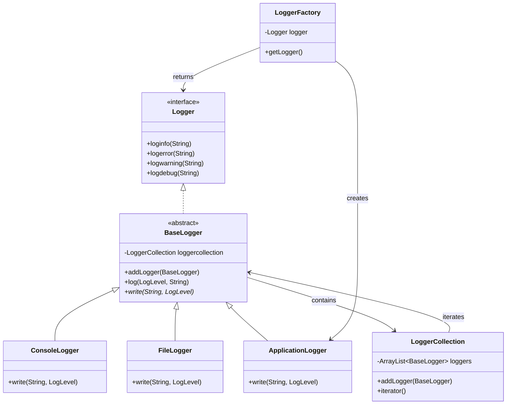

## Definition

Compound Patterns combine two or more patterns into a solution that solves a recurring or general problem.

---
## Real World Analogy

**Compound Patterns** combine two or more patterns to solve a problem. Design patterns are created to solve problems, but they are not limited to using only one pattern at a time. While implementing your own solution, you may notice that multiple patterns are working together. When different patterns are combined to solve a single problem, it is called a **Compound Pattern**. In the next section, we will see the best practices for applying design patterns.

For this analogy, let’s take a simple example of a **Logger**, which is widely used in different applications. In real systems, loggers do not rely on a single design pattern. Instead, multiple design patterns are used to reuse code and keep the implementation flexible. In a real implementation of a logger, you can configure where the logs are written, such as the console, a file, or a database. You can also format the logs as needed without changing the internal implementation. We are going to implement a similar idea here.

[[#Real World Analogy - 2 (MVC)|Next Section]] explains how MVC patterns are used and why they are called a **Compound Pattern**.

In our implementation, the Logger will contain four design patterns:
- [[Strategy Pattern]]: Used for selecting the type of logger, such as `Console`, `File`, or `Db`.
- [[Iterator Pattern]]: Used to go through all added loggers and write logs to each one.
- [[Factory Method Pattern]]: Used for object creation, where initialization takes place.
- [[Composite Pattern]]: A logger can contain multiple types of loggers.

---
## Design

To implement this, we first define an `Interface` called `Logger`, which is responsible for logging. It does not matter what type of logger it is; it will log the message for the loggers added in the `LoggerCollection`.

The following class diagram shows how different classes are related and how multiple patterns are combined.


_Class diagram for the Logger as a Compound Pattern_

---
## Implementation in Java

```java title="LogLevel.java"
enum LogLevel {
    INFO,
    WARNING,
    DEBUG,
    ERROR
}
```
This enum defines different log levels. Each log message is tagged with a level so that logs can be filtered or formatted based on their severity.

```java title="Logger.java"
interface Logger {
    void loginfo(String message);
    void logerror(String message);
    void logwarning(String message);
    void logdebug(String message);
}
```
This interface defines the common operations that every logger must implement. Any class implementing this interface can log messages of different levels.

```java title="LoggerCollection.java"
class LoggerCollection implements Iterable<BaseLogger> {
    private final ArrayList<BaseLogger> loggers = new ArrayList<>();

    public void addLogger(BaseLogger logger) {
        this.loggers.add(logger);
    }

    @Override
    public Iterator<BaseLogger> iterator() {
        return this.loggers.iterator();
    }
}
```
This class stores multiple logger objects. It also implements `Iterable`, which allows us to loop through all loggers one by one. This helps in writing the same log message to multiple loggers.

```java title="BaseLogger.java"
abstract class BaseLogger implements Logger {
    public abstract void write(String message, LogLevel level);

    protected LoggerCollection loggercollection = new LoggerCollection();

    public void addLogger(BaseLogger logger) {
        this.loggercollection.addLogger(logger);
    }

    private void logMessage(String message, LogLevel level) {
        Iterator<BaseLogger> loggeriterator = this.loggercollection.iterator();

        while (loggeriterator.hasNext()) {
            BaseLogger logger = loggeriterator.next();
            logger.log(level, message);
        }
    }

    public void log(LogLevel level, String message) {
        write(message, level);
    }

    @Override
    public void logdebug(String message) {
        logMessage(message, LogLevel.DEBUG);
    }

    @Override
    public void logerror(String message) {
        logMessage(message, LogLevel.ERROR);
    }

    @Override
    public void loginfo(String message) {
        logMessage(message, LogLevel.INFO);
    }

    @Override
    public void logwarning(String message) {
        logMessage(message, LogLevel.WARNING);
    }
}
```
This abstract class provides the base behavior for all loggers. It keeps a collection of child loggers and forwards log messages to each of them. The `write` method is left abstract so that each concrete logger can decide how to store or display the log.

```java title="ConsoleLogger.java"
class ConsoleLogger extends BaseLogger {

    @Override
    public void write(String message, LogLevel level) {
        System.out.printf("%s - %s%n", level.toString(), message);
    }
}
```
This class writes log messages to the console. It formats the log level and message and prints them to standard output.

```java title="FileLogger.java"
class FileLogger extends BaseLogger {

    @Override
    public void write(String message, LogLevel level) {
        try {
            FileWriter writer = new FileWriter("./app.log",true);
            writer.write("%s - %s\n".formatted(level.toString(), message
            ));
            writer.close();
        } catch (IOException e) {
            throw new RuntimeException(e);
        }

    }
}
```
This class writes log messages to a file named `app.log`. Each time a log is written, the message is appended to the file.

**Note:** Here we are hardcoding the log file name as `app.log`, but in a real implementation the user usually selects the file name and log format. For simplicity, these values are fixed in this example.

```java title="ApplicationLogger.java"
class ApplicationLogger extends BaseLogger {
    @Override
    public void write(String message, LogLevel level) {
        System.out.printf("App - %s - %s%n", level.toString(), message);
    }
}
```
This class represents the main or root logger. It adds a prefix so logs can be identified as application-level logs.

```java title="LoggerFactory.java"
class LoggerFactory {
    private static Logger logger;

    public static Logger getLogger() {
        if (logger == null) {
            BaseLogger rootlogger = new ApplicationLogger();
            rootlogger.addLogger(new ConsoleLogger());
            rootlogger.addLogger(new FileLogger());

            logger = rootlogger;
        }
        return logger;
    }
}
```
This factory class creates and returns a single logger instance. It initializes the root logger and attaches console and file loggers to it. This centralizes object creation and avoids creating multiple instances unnecessarily.

```java title="Logging.java"
public static void main(String[] args) {
    Logger logger = LoggerFactory.getLogger();

    logger.logdebug("Application Started");
    logger.loginfo("Application Initiated");
    logger.logerror("Application Failed");
    logger.logwarning("You Cannot Start Application Like These");
}
```
This is the entry point of the program. It gets the logger from the factory and writes log messages of different levels.

**Output:**
```txt
DEBUG - Application Started
INFO - Application Initiated
ERROR - Application Failed
WARNING - You Cannot Start Application Like These
```
The same output is also written to the `app.log` file because both console and file loggers are attached to the main logger.

---
## Real World Analogy - 2 (MVC)

**MVC** stands for **Model View Controller**. These concepts are commonly used in web frameworks like **SpringBoot**, where responsibilities are separated into different layers.

- **Model**: It holds all the data, state, and application logic.  
- **View**: It provides a representation of the model.  
- **Controller**: It takes user input and decides how it should affect the model.

![[Pasted image 20260210071446.png]]
_Model View Controller Architecture Diagram_

![[pattern_mvc.png]]
Let’s understand how MVC internally uses a set of patterns (Compound Pattern).

**Strategy:** The view and controller implement the Strategy Pattern. The view focuses only on visual representation and delegates decisions about behavior to the controller. This keeps the view loosely coupled from the model.

**Composite:** The display is made up of nested components such as windows, panels, buttons, and labels. Each component can contain other components. Updating the top component automatically updates all child components.

**Observer:** The model uses the Observer Pattern to notify interested objects when its state changes. This keeps the model independent from views and controllers and allows multiple views to use the same model.

This is why MVC is also known as a **Compound Pattern.**

---
## Real World Example

As we implemented a logger system, similar approaches are used in real logging libraries where a logger can be configured with multiple outputs and formats. Internally, these libraries make use of several design patterns. **Examples:** `Log4j`, `Logback`.

In UI frameworks, when you add components such as `JPanel` or `JFrame`, they contain multiple UI elements inside them, which is an example of the Composite Pattern. Event listeners attached to components such as `JButton` behave similarly to the Observer Pattern.

Compound Patterns are widely used in many frameworks such as `SpringBoot`, `Angular`, and `Django`.

---
## Design Principles:

- **Encapsulate What Varies** - Identify the parts of the code that are going to change and encapsulate them into separate class just like the Strategy Pattern. 
- **Favor Composition Over Inheritance** - Instead of using inheritance on extending functionality, rather use composition by delegating behavior to other objects. 
- **Program to Interface not Implementations** - Write code that depends on Abstractions or Interfaces rather than Concrete Classes. 
- **Strive for Loosely coupled design between objects that interact** - When implementing a class, avoid tightly coupled classes. Instead, use loosely coupled objects by leveraging abstractions and interfaces. This approach ensures that the class does not heavily depend on other classes.
- **Classes Should be Open for Extension But closed for Modification** - Design your classes so you can extend their behavior without altering their existing, stable code.
- **Depend on Abstractions, Do not depend on concrete class** - Rely on interfaces or abstract types instead of concrete classes so you can swap implementations without altering client code.
- **Talk Only To Your Friends** - An object may only call methods on itself, its direct components, parameters passed in, or objects it creates.
- **Don't call us, we'll call you** - This means the framework controls the flow of execution, not the user’s code (Inversion of Control).
- **A class should have only one reason to change** - This emphasizes the Single Responsibility Principle, ensuring each class focuses on just one functionality.