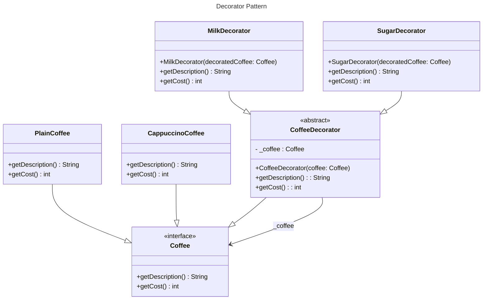

#structural
## Definition

The Decorator pattern attaches additional responsibilities to an object dynamically. Decorators provide a flexible alternative to subclassing for extending functionality. 

---
## Real World Analogy

Consider we are running a **coffee shop**. In the shop, we offer a **variety of coffee** along with options for customers to add **extras** like **extra milk, sugar, coffee powder**, and more.

If a customer buys only a **Plain Coffee**, they should be charged **only the price of the Plain Coffee**. However, if the customer wants **extra coffee powder** (or any other add-on) in their Plain Coffee or any other type of coffee, the **additional cost** of the add-on should be applied **on top of the base cost** of the selected coffee.

To design such a structure, we implement the **Decorator Pattern**. This approach eliminates the need for **if-else statements** in the classes. Instead, we **decorate** the object within the **same class**, maintaining flexibility and scalability. See the Example below:

![[Pasted image 20250224235107.png]]
_Coffee Prices Chart_

The Image shows how the cost is incurred if user adds extras to his coffee. Below is the Implementation of such pattern. 

### Design

_Design of the Coffee Shop_

---
## Coding Decorator Pattern

```java title:Coffee.java
// Coffee.java
interface Coffee {
	public String getDescription();
	public int getCost();
}
```
The `Coffee` interface acts as an **abstraction layer** between the **variety of coffee types**. By implementing this interface, you can create **as many coffee varieties** as needed.
```java title:PlainCoffee.java
// PlainCoffee.java
class PlainCoffee implements Coffee {

	@Override
	public String getDescription() {
		return "PlainCoffee";
	}

	@Override
	public int getCost() {
		return 10;
	}
}
```

```java title:CappuccinoCoffee.java
// CappuccinoCoffee
class CappuccinoCoffee implements Coffee {
	@Override
	public String getDescription() {
		return "Cappuccino";
	}

	@Override
	public int getCost() {
		return 20;
	}
}
```
In the code example above, the `Coffee` interface is implemented by both the **PlainCoffee** and **CappuccinoCoffee** concrete classes. For each coffee type, we override the methods and assign the **specific cost** for each coffee.
```java title:CoffeeDecorator.java
// CoffeeDecorator.java
abstract class CoffeeDecorator implements Coffee {
	protected Coffee _coffee;

	public CoffeeDecorator(Coffee coffee) {
		_coffee = coffee;
	}

	@Override
	public String getDescription() {
		return _coffee.getDescription();
	}

	@Override
	public int getCost() {
		return _coffee.getCost();
	}
}
```
The `CoffeeDecorator` class is the **decorator class** that implements the `Coffee` interface to **decorate different varieties of coffee**. In our case, the **CoffeeDecorator** acts as an **add-on** (e.g., milk, sugar) that can be added to the customer's coffee if requested.
```java title:MilkDecorator.java
// MilkDecorator.java
class MilkDecorator extends CoffeeDecorator {
	public MilkDecorator(Coffee decoratedcoffee) {
		super(decoratedcoffee);
	}

	@Override
	public String getDescription() {
		return super.getDescription() + " + Milk";
	}

	@Override
	public int getCost() {
		return super.getCost() + 5;
	}
}
```

```java title:SugarDecorator.java
// SugarDecorator.java
class SugarDecorator extends CoffeeDecorator {
	public SugarDecorator(Coffee decoratedCoffee) {
		super(decoratedCoffee);
	}

	@Override
	public int getCost() {
		return super.getCost() + 10;
	}

	@Override
	public String getDescription() {
		return super.getDescription() + " + Sugar";
	}
}
```
When creating coffee objects, you can **layer decorators** as needed. For example, a **Cappuccino** with **milk and sugar** is created by **wrapping the decorators** around the base coffee object.
```java title:DecoratorPattern.java
public class DecoratorPattern {
	public static void main(String[] args) {
		Coffee plaincoffee = new PlainCoffee();
		System.out.println(plaincoffee.getDescription() + " Cost=" + plaincoffee.getCost());

		Coffee capuccinocoffee = new CappuccinoCoffee();
		capuccinocoffee = new MilkDecorator(capuccinocoffee);
		capuccinocoffee = new SugarDecorator(capuccinocoffee);
		System.out.println(capuccinocoffee.getDescription() + " Cost=" + capuccinocoffee.getCost());

	}
}
```
**Output**:
```
PlainCoffee Cost=10
Cappuccino + Milk + Sugar Cost=35
```
---
## Complete Code In Java
```java title:Decorator.java
package decorator;

// Coffee.java
interface Coffee {
	public String getDescription();
	public int getCost();
}

// PlainCoffee.java
class PlainCoffee implements Coffee {

	@Override
	public String getDescription() {
		return "PlainCoffee";
	}

	@Override
	public int getCost() {
		return 10;
	}
}

// CappuccinoCoffee
class CappuccinoCoffee implements Coffee {
	@Override
	public String getDescription() {
		return "Cappuccino";
	}

	@Override
	public int getCost() {
		return 20;
	}
}

// CoffeeDecorator.java
abstract class CoffeeDecorator implements Coffee {
	protected Coffee _coffee;

	public CoffeeDecorator(Coffee coffee) {
		_coffee = coffee;
	}

	@Override
	public String getDescription() {
		return _coffee.getDescription();
	}

	@Override
	public int getCost() {
		return _coffee.getCost();
	}
}

// MilkDecorator.java
class MilkDecorator extends CoffeeDecorator {
	public MilkDecorator(Coffee decoratedcoffee) {
		super(decoratedcoffee);
	}

	@Override
	public String getDescription() {
		return super.getDescription() + " + Milk";
	}

	@Override
	public int getCost() {
		return super.getCost() + 5;
	}
}

// SugarDecorator.java
class SugarDecorator extends CoffeeDecorator {
	public SugarDecorator(Coffee decoratedCoffee) {
		super(decoratedCoffee);
	}

	@Override
	public int getCost() {
		return super.getCost() + 10;
	}

	@Override
	public String getDescription() {
		return super.getDescription() + " + Sugar";
	}
}

public class DecoratorPattern {
	public static void main(String[] args) {
		Coffee plaincoffee = new PlainCoffee();
		System.out.println(plaincoffee.getDescription() + " Cost=" + plaincoffee.getCost());

		Coffee capuccinocoffee = new CappuccinoCoffee();
		capuccinocoffee = new MilkDecorator(capuccinocoffee);
		capuccinocoffee = new SugarDecorator(capuccinocoffee);
		// here we added the sugar and milk to the cappucinocoffee
		System.out.println(capuccinocoffee.getDescription() + " Cost=" + capuccinocoffee.getCost());

	}
}
```
---
## Real World Example

The Java I/O library is a textbook example of the Decorator Pattern. The base classes such as `InputStream` and `OutputStream` are extended by concrete classes (like `FileInputStream`) and then wrapped by decorator classes that add additional functionality at runtime.

```java title:StreamInput.java
// Base stream reading from a file
InputStream fileStream = new FileInputStream("data.txt");

// BufferedInputStream decorates fileStream by adding buffering capability
InputStream bufferedStream = new BufferedInputStream(fileStream);

// DataInputStream further decorates bufferedStream to allow reading primitive data types
DataInputStream dataStream = new DataInputStream(bufferedStream);
```
---
## Design Principles

- **Encapsulate What Varies** - Identify the parts of the code that are going to change and encapsulate them into separate class just like the Strategy Pattern. 
- **Favor Composition Over Inheritance** - Instead of using inheritance on extending functionality, rather use composition by delegating behavior to other objects. 
- **Program to Interface not Implementations** - Write code that depends on Abstractions or Interfaces rather than Concrete Classes. 
- **Strive for Loosely coupled design between objects that interact** - When implementing a class, avoid tightly coupled classes. Instead, use loosely coupled objects by leveraging abstractions and interfaces. This approach ensures that the class does not heavily depend on other classes.
- **Classes Should be Open for Extension But closed for Modification** - Design your classes so you can extend their behavior without altering their existing, stable code.
----
