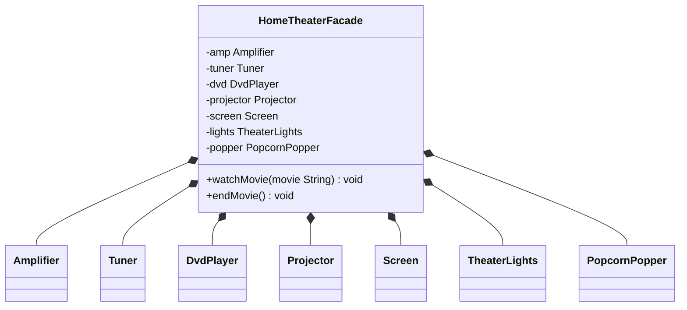

## Definition

The **Facade Pattern** provides a unified interface to a set of interfaces in a subsystem. Facade defines a higher-level interface that makes the subsystem easier to use.

---
## Real World Analogy

Imagine you just visited an ATM machine to withdraw cash by simply using the ATM card. What do you do? You simply insert the ATM card into the machine, give some input to it like the ATM PIN, enter the amount you want to withdraw, and then you get the cash. Simple, right? Insert the card and get the cash.

But it is not as simple as it looks. The entire process you see while withdrawing the cash is the **facade**. Behind the scenes, many services are running like a database, network, bank authentication server, amount dispenser, and logging system. The whole tedious process is being handled by the facade.

Below is the figure showing how the complex ATM system comes together and forms the facade.

![[facade_pattern.png]]  
_Example of the Facade Pattern using the Complex ATM System_

We are going to implement a facade for a **Movie System**. Without the facade, we need to manually turn on all the systems like:
- Turn the Projector On
- Open the Wide Screen
- Set the Volume to 10
- Turn on the Music System
- Play the Music System in Dolby Atmos
- Load the Movie
- Turn on the Popcorn Popper

This is a tedious task. For every new movie, we need to repeat the above steps. By the time we finish, the mood for watching the movie might be gone. Then again, to stop everything, we have to do the same steps in reverse order.

By implementing the **Facade Pattern**, we can simplify this to just one button. All systems will start and stop with a single call. Even if we change the internal complex systems, the facade remains unaffected.

---
## Design



_Class Diagram for HomeTheatreFacade_
 The `HomeTheaterFacade` class acts as the facade. It connects all subsystem components like `Amplifier`, `Tuner`, `DvdPlayer`, `Projector`, `Screen`, `TheaterLights`, and `PopcornPopper`. It provides two main methods: `watchMovie()` to start the movie and `endMovie()` to shut everything down.

---
## Implementation in Java

Below is the Java implementation of the **Facade Pattern** for the home theater system.

```java title="Amplifier.java"
class Amplifier {
	public void on() {
		System.out.println("Amplifier on");
	}

	public void off() {
		System.out.println("Amplifier off");
	}

	public void setDvd() {
		System.out.println("Amplifier setting DVD input");
	}

	public void setSurroundSound() {
		System.out.println("Amplifier surround sound on");
	}

	public void setVolume(int level) {
		System.out.println("Amplifier volume set to " + level);
	}
}
```

The `Amplifier` class represents a subsystem component that controls audio settings. It can turn on/off, set the DVD input, enable surround sound, and adjust the volume.

```java title="Tuner.java"
class Tuner {
	public void on() {
		System.out.println("Tuner on");
	}

	public void off() {
		System.out.println("Tuner off");
	}

	public void setFrequency(double freq) {
		System.out.println("Tuner frequency set to " + freq);
	}
}
```

The `Tuner` class is another subsystem representing radio functionality. It can power on/off and set frequencies.

```java title="DvdPlayer.java"
class DvdPlayer {
	public void on() {
		System.out.println("DVD Player on");
	}

	public void off() {
		System.out.println("DVD Player off");
	}

	public void play(String movie) {
		System.out.println("DVD Player playing \"" + movie + "\"");
	}

	public void stop() {
		System.out.println("DVD Player stopped");
	}

	public void eject() {
		System.out.println("DVD Player eject");
	}
}
```

The `DvdPlayer` class handles playing movies. It can turn on/off, play a given movie, stop playback, and eject the disc.

```java title="Projector.java"
class Projector {
	public void on() {
		System.out.println("Projector on");
	}

	public void off() {
		System.out.println("Projector off");
	}

	public void wideScreenMode() {
		System.out.println("Projector in widescreen mode");
	}
}
```

The `Projector` represents the visual display. It can turn on/off and switch to widescreen mode.

```java title="TheaterLights.java"
class TheaterLights {
	public void dim(int level) {
		System.out.println("Theater Ceiling Lights dimming to " + level + "%");
	}

	public void on() {
		System.out.println("Theater Ceiling Lights on");
	}
}
```

The `TheaterLights` class controls lighting. It can dim lights for movie ambiance and turn them back on.

```java title="Screen.java"
class Screen {
	public void down() {
		System.out.println("Theater Screen going down");
	}

	public void up() {
		System.out.println("Theater Screen going up");
	}
}
```

The `Screen` class represents the projection screen. It can move up and down as needed.

```java title="PopcornPopper.java"
class PopcornPopper {
	public void on() {
		System.out.println("Popcorn Popper on");
	}

	public void off() {
		System.out.println("Popcorn Popper off");
	}

	public void pop() {
		System.out.println("Popcorn Popper popping popcorn!");
	}
}
```

The `PopcornPopper` provides the fun element for the home theater by popping popcorn.

```java title="HomeTheaterFacade.java"
class HomeTheaterFacade {
	private Amplifier amp;
	private Tuner tuner;
	private DvdPlayer dvd;
	private Projector projector;
	private Screen screen;
	private TheaterLights lights;
	private PopcornPopper popper;

	public HomeTheaterFacade(Amplifier amp, Tuner tuner, DvdPlayer dvd, Projector projector, Screen screen,
			TheaterLights lights, PopcornPopper popper) {
		this.amp = amp;
		this.tuner = tuner;
		this.dvd = dvd;
		this.projector = projector;
		this.screen = screen;
		this.lights = lights;
		this.popper = popper;
	}

	// High‑level operation
	public void watchMovie(String movie) {
		System.out.println("Get ready to watch a movie...");
		popper.on();
		popper.pop();
		lights.dim(10);
		screen.down();
		projector.on();
		projector.wideScreenMode();
		amp.on();
		amp.setDvd();
		amp.setSurroundSound();
		amp.setVolume(5);
		dvd.on();
		dvd.play(movie);
	}

	// High‑level teardown
	public void endMovie() {
		System.out.println("Shutting movie theater down...");
		popper.off();
		lights.on();
		screen.up();
		projector.off();
		amp.off();
		dvd.stop();
		dvd.eject();
		dvd.off();
	}
}
```

The `HomeTheaterFacade` class is the main facade. It simplifies the process by combining all subsystem operations into two simple methods: `watchMovie()` and `endMovie()`. This reduces complexity for the user.

```java title="FacadePattern.java"
public static void main(String[] args) {
		// Instantiate all components
		Amplifier amp = new Amplifier();
		Tuner tuner = new Tuner();
		DvdPlayer dvd = new DvdPlayer();
		Projector projector = new Projector();
		Screen screen = new Screen();
		TheaterLights lights = new TheaterLights();
		PopcornPopper popper = new PopcornPopper();

		// Create facade
		HomeTheaterFacade homeTheater = new HomeTheaterFacade(amp, tuner, dvd, projector, screen, lights, popper);

		// Use facade to simplify operations
		homeTheater.watchMovie("Inception");
		System.out.println();
		homeTheater.endMovie();
	}
```
_Output_:

```text
Get ready to watch a movie...
Popcorn Popper on
Popcorn Popper popping popcorn!
Theater Ceiling Lights dimming to 10%
Theater Screen going down
Projector on
Projector in widescreen mode
Amplifier on
Amplifier setting DVD input
Amplifier surround sound on
Amplifier volume set to 5
DVD Player on
DVD Player playing "Inception"

Shutting movie theater down...
Popcorn Popper off
Theater Ceiling Lights on
Theater Screen going up
Projector off
Amplifier off
DVD Player stopped
DVD Player eject
DVD Player off
```

---
## Design Principles:

- **Encapsulate What Varies** - Identify the parts of the code that are going to change and encapsulate them into separate class just like the Strategy Pattern. 
- **Favor Composition Over Inheritance** - Instead of using inheritance on extending functionality, rather use composition by delegating behavior to other objects. 
- **Program to Interface not Implementations** - Write code that depends on Abstractions or Interfaces rather than Concrete Classes. 
- **Strive for Loosely coupled design between objects that interact** - When implementing a class, avoid tightly coupled classes. Instead, use loosely coupled objects by leveraging abstractions and interfaces. This approach ensures that the class does not heavily depend on other classes.
- **Classes Should be Open for Extension But closed for Modification** - Design your classes so you can extend their behavior without altering their existing, stable code.
- **Depend on Abstractions, Do not depend on concrete class** - Rely on interfaces or abstract types instead of concrete classes so you can swap implementations without altering client code.
- **Talk Only To Your Friends** - An object may only call methods on itself, its direct components, parameters passed in, or objects it creates.

