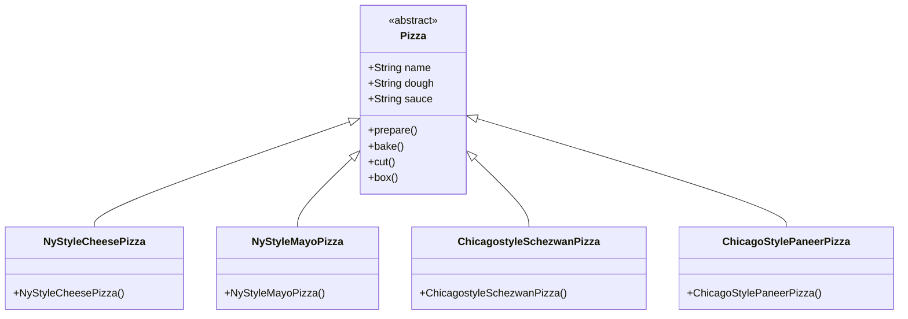
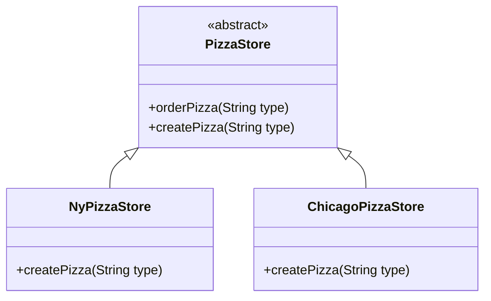

## Definition

The **Factory Method Pattern** defines an interface for creating an object but allows subclasses to decide which class to instantiate. In other words, it lets a class defer instantiation to its subclasses. This pattern helps in promoting loose coupling, encapsulating object creation, and enabling easier scalability when new types are added.

---
## Real-World Analogy

Imagine you have a **PizzaStore**. Popular pizza chains like Domino's or Pizza Hut have standardized processes so that anyone can order a pizza without knowing the details of its preparation. In our analogy, the pizza creation process is abstracted so that different stores can offer their own varieties of pizza.

Initially, you might have a base `Pizza` class with properties like name, dough, and sauce, and standard methods for preparing, baking, cutting, and boxing the pizza. Various concrete pizza classes (such as `NyStyleCheesePizza` and `ChicagoStylePaneerPizza`) extend this base class. The `PizzaStore` uses these classes to fulfill customer orders.

However, as your pizza business expands, you may introduce new pizza types and different styles across various stores. Rather than updating one monolithic method to handle all these variations, the Factory Method Pattern enables each store (or subclass) to decide which pizza types to create. This approach decouples the client code (the order processing) from the creation of the concrete pizza objects.

---
## Initial Implementation

Below is an example of the initial design using a single `PizzaStore` class that handles different pizza types through conditional statements in the `createPizza` method:
```java title="Pizza.java"
abstract class Pizza {
    public String name;
    public String dough;
    public String sauce;

    // Prepares the pizza by printing the preparation message
    public void prepare() {
        System.out.println(this.name + " is being prepared.");
    }

    // Bakes the pizza by printing the baking message
    public void bake() {
        System.out.println("Pizza is baking.");
    }

    // Cuts the pizza by printing the cutting message
    public void cut() {
        System.out.println("Pizza has been cut.");
    }

    // Boxes the pizza by printing the boxing message
    public void box() {
        System.out.println("Pizza is boxed and ready for delivery.");
    }
}
```

For example, you might create specialized pizza classes like these:
```java title="NyStyleCheesePizza.java"
class NyStyleCheesePizza extends Pizza {
    public NyStyleCheesePizza() {
        this.name = "NY Style Cheese Pizza";
        this.dough = "NY Style Dough";
        this.sauce = "NY Style Sauce";
    }
}
```

```java title="ChicagoStylePaneerPizza.java"
class ChicagoStylePaneerPizza extends Pizza {
    public ChicagoStylePaneerPizza() {
        this.name = "Chicago Paneer Pizza";
        this.dough = "Chicago Special Paneer Dough";
        this.sauce = "Chicago Homemade Sauce";
    }
}
```
And the initial `PizzaStore` might be implemented as:
```java title="PizzaStore.java"
class PizzaStore {

    // Processes the order by creating the pizza and performing standard steps
    public void orderPizza(String type) {
        Pizza pizza = createPizza(type);
        if (pizza != null) {
            pizza.prepare();
            pizza.bake();
            pizza.cut();
            pizza.box();
        } else {
            System.out.println("Sorry, we do not have that type of pizza.");
        }
    }

    // Selects the Pizza based on the type provided
    public Pizza createPizza(String type) {
        if (type.equalsIgnoreCase("cheese")) {
            return new NyStyleCheesePizza();
        } else if (type.equalsIgnoreCase("paneer")) {
            return new ChicagoStylePaneerPizza();
        }
        return null;
    }
}
```
**Problem:**  
This approach forces you to modify the `createPizza` method whenever you add new pizza types. It also makes it difficult to accommodate differing pizza styles across various stores, since the pizza creation logic is centralized rather than distributed among specialized stores.

---
## Applying the Factory Method Pattern

To overcome these issues, we modify `PizzaStore` into an **abstract class**, deferring the decision of which pizza to create to its subclasses. This enables each store to have its own implementation of the `createPizza` method and supply its unique pizza offerings.
### Revised Design
The design diagram for the Factory Method pattern can be outlined as follows:




### Implementing the Revised Pattern

1. **Abstract PizzaStore Class:**  
    The abstract class `PizzaStore` defines the common process (`orderPizza`) and declares the abstract `createPizza` method. Each subclass will implement the creation logic specific to its style.
    ```java title="PizzaStore.java"
    abstract class PizzaStore {
    
        // Processes the order by creating the pizza and performing the standard steps
        public void orderPizza(String type) {
            Pizza pizza = createPizza(type);
            if (pizza != null) {
                pizza.prepare();
                pizza.bake();
                pizza.cut();
                pizza.box();
            } else {
                System.out.println("Sorry, we do not have that type of pizza.");
            }
        }
    
        // Abstract method for creating a pizza of a given type
        abstract public Pizza createPizza(String type);
    }
    ```
    
2. **New York Pizza Store:**  
    The `NyPizzaStore` subclass implements `createPizza` by supplying New York style pizzas.
    ```java title="NyPizzaStore.java"
    // Pizza store for New York style pizzas.
    class NyPizzaStore extends PizzaStore {
        @Override
        public Pizza createPizza(String type) {
            if (type.equalsIgnoreCase("cheese")) {
                return new NyStyleCheesePizza();
            } else if (type.equalsIgnoreCase("mayonnaise")) {
                return new NyStyleMayoPizza();
            }
            return null;
        }
    }
    ```
    
3. **Chicago Pizza Store:**  
    The `ChicagoPizzaStore` subclass implements `createPizza` for Chicago style pizzas.
    ```java title="ChicagoPizzaStore.java"
    // Pizza store for Chicago style pizzas.
    class ChicagoPizzaStore extends PizzaStore {
        @Override
        public Pizza createPizza(String type) {
            if (type.equalsIgnoreCase("schezwan")) {
                return new ChicagostyleSchezwanPizza();
            } else if (type.equalsIgnoreCase("paneer")) {
                return new ChicagoStylePaneerPizza();
            }
            return null;
        }
    }
    ```
    
4. **Main Class to Demonstrate the Pattern:**  
    The following code snippet shows how the client code interacts with these stores without knowing the details of pizza creation.
    ```java title="FactoryMethod.java"
    public class FactoryMethod {
        public static void main(String[] args) {
            // Ordering the cheese pizza from the New York Pizza Store
            PizzaStore nyPizzaStore = new NyPizzaStore();
            nyPizzaStore.orderPizza("cheese");
    
            // Ordering the paneer pizza from the Chicago Pizza Store
            PizzaStore chicagoStore = new ChicagoPizzaStore();
            chicagoStore.orderPizza("paneer");
        }
    }
    ```
**Output:**
```
NY Style Cheese Pizza is being prepared.
Pizza is baking.
Pizza has been cut.
Pizza is boxed and ready for delivery.

Chicago Paneer Pizza is being prepared.
Pizza is baking.
Pizza has been cut.
Pizza is boxed and ready for delivery.
```
---
Next, we will discuss the Abstract Factory Pattern.
