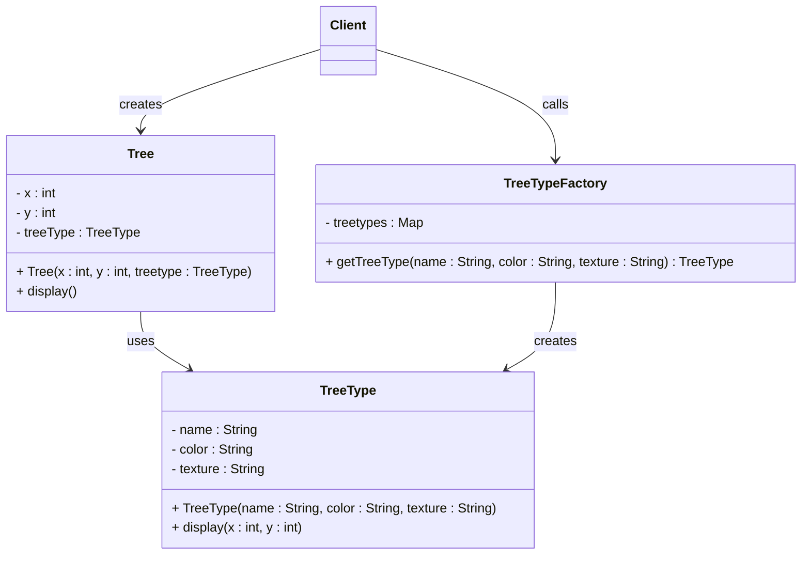

## Definition

The **Flyweight Pattern** is a structural design pattern used to reduce memory usage by sharing common object data among multiple objects.

---
## Real World Analogy

Imagine you are building a game like a forest simulator or something similar to Minecraft. In this game, you need to place thousands of trees across the map. All these trees might look exactly the same in terms of structure, color, and texture, but their positions will be different.

If you create a separate object for every tree including its full structure, then for 10,000 trees you will end up creating 10,000 complete objects. This consumes a lot of memory because the same data is repeated again and again.

Instead, the Flyweight Pattern helps you reuse the common part of the tree such as its type, color, and texture. This shared part is stored only once. Then each tree only stores its position like x and y.

So instead of creating 10,000 full objects, you create:
- 1 shared TreeType object
- 10,000 Tree objects that only store position

![[flyweight_explanation.png]]

This significantly reduces memory usage.

Now imagine scaling this to lakhs of trees. Without this pattern, memory usage would grow very quickly. With Flyweight, you avoid duplication and keep your application efficient.

---
## Design



This diagram shows how the shared object TreeType is reused across multiple Tree objects, while the factory ensures that duplicate objects are not created.

---
## Implementation in Java

```java title="TreeType.java"
// Intrinsic State (Shared Object)  
class TreeType {  
    private String name;  
    private String color;  
    private String texture;  
  
    public TreeType(String name, String color, String texture) {  
        this.color = color;  
        this.name = name;  
        this.texture = texture;  
    }  
  
    // Display the Tree based on different positions.  
    public void display(int x, int y) {  
        System.out.println("Tree: " + name + " at (" + x + "," + y + ")");  
    }  
}
```
This class represents the shared part of the object. It stores intrinsic data like name, color, and texture which does not change. The display method takes position as input, which is external data.

```java title="TreeTypeFactory.java"
class TreeTypeFactory {  
    // Map collection of each type of object  
    private static Map<String, TreeType> treetypes = new HashMap<String, TreeType>();  
  
    // Get the Tree type according to the key from the map  
    public static TreeType getTreeType(String name, String color, String texture) {  
        String key = name + color + texture;  
        if (!treetypes.containsKey(key)) {  
            // Add the Tree type in the map to share the same object  
            treetypes.put(key, new TreeType(name, color, texture));  
        }  
        return treetypes.get(key);  
    }  
}
```
This factory class ensures that objects are reused. Before creating a new TreeType, it checks if one already exists in the map. If it exists, it returns the existing object. Otherwise, it creates and stores a new one.

```java title="Tree.java"
// Extrinsic State  
class Tree {  
    private int x;  
    private int y;  
    private TreeType treeType; //shared object  
  
    public Tree(int x, int y, TreeType treetype) {  
        this.x = x;  
        this.y = y;  
        this.treeType = treetype;  
    }  
  
    // Display the Tree based on the shared object but on different positions  
    public void display() {  
        treeType.display(this.x, this.y);  
    }  
}
```
This class represents individual trees. It only stores the position which is the extrinsic state. The shared TreeType object is reused for all trees of the same type.

```java title="FlyWeightPattern.java"
public static void main(String[] args) {  
    List<Tree> forest = new ArrayList<>();  
  
    for (int i = 0; i < 5; i++) {  
        TreeType oak = TreeTypeFactory.getTreeType("Oak", "Green", "Rough");  
        forest.add(new Tree(i, i * 2, oak));  
    }  
  
    for (Tree tree : forest) {  
        tree.display();  
    }  
}
```
Here we are creating multiple trees using the same TreeType object. The factory ensures that only one Oak type is created and reused. Each tree has a different position, but the structure remains shared.

**Output**:
```bash
Tree: Oak at (0,0)
Tree: Oak at (1,2)
Tree: Oak at (2,4)
Tree: Oak at (3,6)
Tree: Oak at (4,8)
```

---
## Real World Example

- In Java, strings are a good example of the Flyweight Pattern.
	```java
	String a="Final";  
	String b="Final";  
	System.out.println(a==b);  
	
	System.out.println(a.hashCode() +" "+ b.hashCode());
	```
	When you create two strings with the same value, Java does not create two separate objects. Instead, it stores them in a common memory area called the String Pool and reuses the same object.

    That is why both references point to the same memory and the hash codes are also the same.

- Another example is in web development. You can define a CSS class once and reuse it across multiple buttons or elements. Instead of creating separate styles for each button, you reuse the same class, which reduces duplication and keeps things efficient.
---
## Design Principles:

- **Encapsulate What Varies** - Identify the parts of the code that are going to change and encapsulate them into separate class just like the Strategy Pattern. 
- **Favor Composition Over Inheritance** - Instead of using inheritance on extending functionality, rather use composition by delegating behavior to other objects. 
- **Program to Interface not Implementations** - Write code that depends on Abstractions or Interfaces rather than Concrete Classes. 
- **Strive for Loosely coupled design between objects that interact** - When implementing a class, avoid tightly coupled classes. Instead, use loosely coupled objects by leveraging abstractions and interfaces. This approach ensures that the class does not heavily depend on other classes.
- **Classes Should be Open for Extension But closed for Modification** - Design your classes so you can extend their behavior without altering their existing, stable code.
- **Depend on Abstractions, Do not depend on concrete class** - Rely on interfaces or abstract types instead of concrete classes so you can swap implementations without altering client code.
- **Talk Only To Your Friends** - An object may only call methods on itself, its direct components, parameters passed in, or objects it creates.
- **Don't call us, we'll call you** - This means the framework controls the flow of execution, not the user’s code (Inversion of Control).
- **A class should have only one reason to change** - This emphasizes the Single Responsibility Principle, ensuring each class focuses on just one functionality.