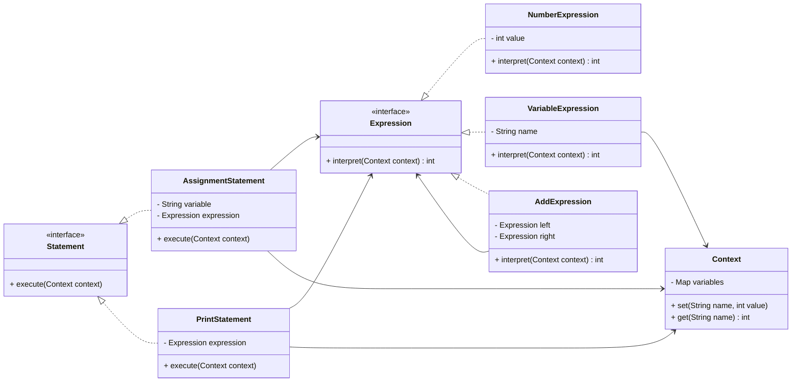

## Definition

The **Interpreter Pattern** is a behavioral design pattern that defines a representation for a language’s grammar and provides an interpreter to evaluate sentences in that language.

---
## Real World Analogy

Imagine you want to create a very small custom language for a specific task. For example, you define simple instructions like assigning values to variables, performing addition, and printing results.

Before executing such a language, you must first define how its grammar looks. That means deciding what kind of expressions are allowed, how variables behave, and how operations like addition work.

In real programming languages, this is usually handled by a parser, which is a complex component. In this example, we skip building a full parser and directly construct the expressions using code.

Here is the small language we are interpreting:
```txt
X=10
Y=10
Z=X+Y
PRINT Z
```
This language includes:
- Assignment of values
- Variables
- Addition operation
- Print operation
Using the **Interpreter Pattern**, we represent each of these rules as classes and then evaluate them.

---
## Key Concepts

**Terminal Expression**  
Terminal expressions are the simplest elements of the language. They do not contain other expressions. Examples include numbers and variables.

**Non-Terminal Expression**  
Non-terminal expressions are composed of other expressions. They represent operations such as addition, subtraction, or more complex rules.

---
## Design


_Class Diagram of the Interpreter Design Pattern_

---
## Implementation in Java

```java title="Context.java"
import java.util.HashMap;  
import java.util.Map;  
  
class Context {  
    private final Map<String, Integer> variables = new HashMap<>();  
  
    public void set(String name, int value) {  
        this.variables.put(name, value);  
    }  
  
    public int get(String name) {  
        if (!variables.containsKey(name)) {  
            throw new RuntimeException("Variable not Defined " + name);  
        }  
        return variables.get(name);  
    }  
}
```
The Context class acts as memory. It stores variable names and their values. Every expression uses this shared context to read or write values.

```java title="Expression.java"
interface Expression {  
    int interpret(Context context);  
}
```
This interface defines a common method for all expressions. Every expression must know how to interpret itself using the context.

```java title="NumberExpression.java"
class NumberExpression implements Expression {  
    private final int value;  
  
    public NumberExpression(int value) {  
        this.value = value;  
    }  
  
    public int interpret(Context context) {  
        return value;  
    }  
}
```
This is a terminal expression. It simply returns a constant number.

```java title="VariableExpression.java"
class VariableExpression implements Expression {  
    private final String name;  
  
    public VariableExpression(String name) {  
        this.name = name;  
    }  
  
    public int interpret(Context context) {  
        return context.get(name);  
    }  
}
```
This is also a terminal expression. It retrieves the value of a variable from the context.

```java title="AddExpression.java"
class AddExpression implements Expression {  
    private final Expression left, right;  
  
    public AddExpression(Expression left, Expression right) {  
        this.left = left;  
        this.right = right;  
    }  
  
    public int interpret(Context context) {  
        return left.interpret(context) + right.interpret(context);  
    }  
}
```
This is a non-terminal expression. It combines two expressions and returns their sum.

```java title="Statement.java"
interface Statement {  
    void execute(Context context);  
}
```
Statements represent actions instead of values. They execute logic using the context.

```java title="AssignmentStatement.java"
class AssignmentStatement implements Statement {  
    private final String variable;  
    private final Expression expression;  
  
    public AssignmentStatement(String variable, Expression expression) {  
        this.variable = variable;  
        this.expression = expression;  
    }  
  
    public void execute(Context context) {  
        int value = expression.interpret(context);  
        context.set(variable, value);  
    }  
}
```
This statement evaluates an expression and stores the result in the context under a variable name.

```java title="PrintStatement.java"
class PrintStatement implements Statement {  
    private final Expression expression;  
  
    public PrintStatement(Expression expression) {  
        this.expression = expression;  
    }  
  
    public void execute(Context context) {  
        System.out.println(expression.interpret(context));  
    }  
}
```
This statement evaluates an expression and prints the result.

```java title="InterpreterPattern.java"
public static void main(String[] args) {  
    Context context = new Context();  
  
    Statement[] statements = {  
            new AssignmentStatement("X", new NumberExpression(2)),  
            new AssignmentStatement("Y", new NumberExpression(3)),  
            new AssignmentStatement("Z", new AddExpression(  
                    new VariableExpression("X"),  
                    new VariableExpression("Y")  
            )),  
            new PrintStatement(new VariableExpression("Z"))  
    };  
  
    for (Statement st : statements) {  
        st.execute(context);  
    }  
}
```
Here we manually construct the language using objects. Each statement represents one line of our custom language. When executed in sequence, they simulate interpreting the language.

**Output**:
```bash
5
```

---
## Real World Examples

- Expression evaluators such as calculators where inputs like "2 + 3" are evaluated
- SQL-like query processing where conditions are interpreted step by step
- Simple rule engines where conditions and actions are defined as expressions

These examples follow the same idea of breaking a language into smaller parts and interpreting them using objects.

---
## Design Principles:

- **Encapsulate What Varies** - Identify the parts of the code that are going to change and encapsulate them into separate class just like the Strategy Pattern. 
- **Favor Composition Over Inheritance** - Instead of using inheritance on extending functionality, rather use composition by delegating behavior to other objects. 
- **Program to Interface not Implementations** - Write code that depends on Abstractions or Interfaces rather than Concrete Classes. 
- **Strive for Loosely coupled design between objects that interact** - When implementing a class, avoid tightly coupled classes. Instead, use loosely coupled objects by leveraging abstractions and interfaces. This approach ensures that the class does not heavily depend on other classes.
- **Classes Should be Open for Extension But closed for Modification** - Design your classes so you can extend their behavior without altering their existing, stable code.
- **Depend on Abstractions, Do not depend on concrete class** - Rely on interfaces or abstract types instead of concrete classes so you can swap implementations without altering client code.
- **Talk Only To Your Friends** - An object may only call methods on itself, its direct components, parameters passed in, or objects it creates.
- **Don't call us, we'll call you** - This means the framework controls the flow of execution, not the user’s code (Inversion of Control).
- **A class should have only one reason to change** - This emphasizes the Single Responsibility Principle, ensuring each class focuses on just one functionality.