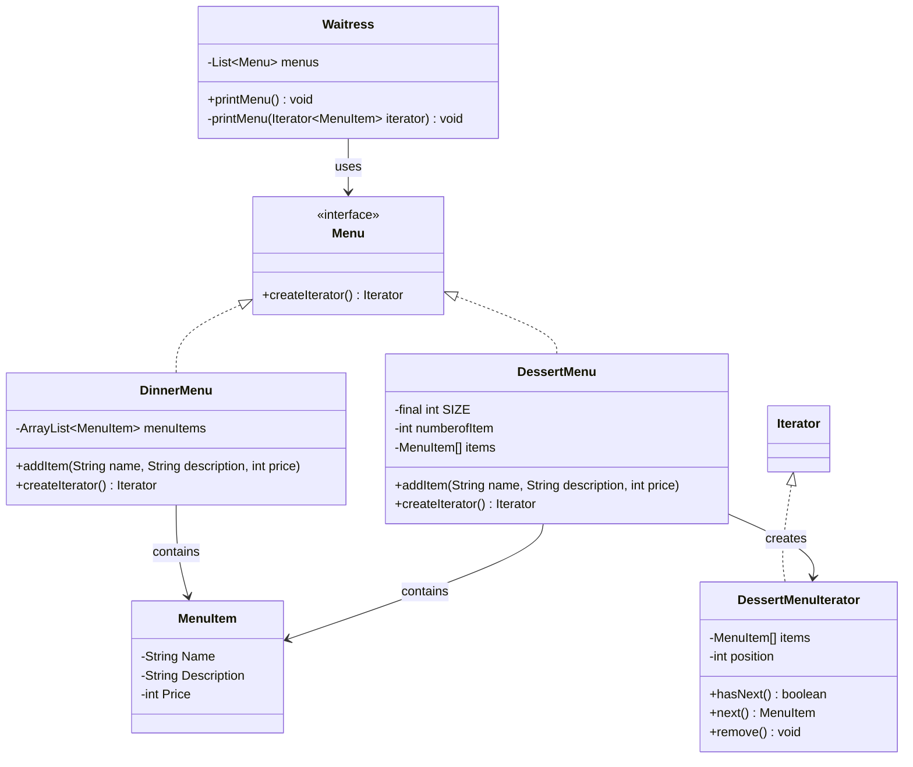

## Definition

The Iterator Pattern provides a way to access the elements of an aggregate object sequentially without exposing its underlying representation.

---
## Real World Analogy

The **Iterator Pattern** is used to access elements from a collection of objects (like `ArrayList`, `LinkedList`, `Stack`, `Queue`, or a raw `Array`) without exposing the collection's internal structure. Without this pattern, iterating over different collection types would be tedious, often requiring you to write custom access logic (new methods or classes) for _each_ underlying collection type. The Iterator Pattern provides a unified way to access the elements of all these different collections.

Suppose we are at a food court, and we have various food options from different sellers. The twist is that each seller has a different way of implementing their menu internally. For instance, 
- Shop 1's menu is based on an `ArrayList` implementation
- Shop 2 uses a `LinkedList`
- Shop 3 uses a raw `Array`, and so on.

To display the full menu to customers, we need a way to combine and iterate over the menus from all the shopkeepers. We'll refer to the component responsible for showing the complete menu as the **Waitress**. The Waitress needs to get the menus from every shop.

Let's focus on two shops: a Dinner shop and a Dessert shop. The **DinnerMenu** uses an `ArrayList` implementation, while the **DessertMenu** uses a fixed-size Java array. Each shop has its own strategy for managing its menu items.

If the Waitress were to iterate over these menus directly, she would need to check the underlying implementation of each menu and use specific iteration logic (e.g., a `for` loop for the array, a different loop for the `ArrayList`). If any new shop arrived with a different underlying collection, we would have to entirely change the implementation of the Waitress.

This is where the **Iterator Pattern** provides a clean solution. Although Java already provides the `Iterator` interface within its Collections Framework (which nearly all built-in collections use), this pattern shows us how to apply this abstraction to custom collections.

For any new shop that comes up with its own unique menu implementation, the shopkeeper just needs to create an **Iterator** for their specific collection type to integrate with the Food Court. The Waitress then only deals with the standard `Iterator` interface. She can easily add the new menu to her list, and the Iterator handles the logic of accessing the objects, regardless of the menu's internal structure.

![[iterator_waitress.png]] _Diagram explaining iteration over different menus._

----
## Design



_Class Diagram for Iterator Pattern._

## Implementation in Java

To implement the Iterator Pattern, the **Waitress** will now depend on the standard Java `Iterator` interface for accessing collections of **Menus** and **MenuItems** from the various food court shops.

We will use standard Java `List` and `Iterator` interfaces in our implementation.

**MenuItem** is the base class representing a single item on the menu, holding its name, description, and price.

```java title="MenuItem.java"
import java.util.ArrayList;
import java.util.Iterator;
import java.util.List;

class MenuItem {
    private String Name;
    private String Description;
    private int Price;

    public MenuItem(String Name, String Description, int Price) {
        this.Description = Description;
        this.Price = Price;
        this.Name = Name;
    }

    public String getDescription() {
        return Description;
    }

    public String getName() {
        return Name;
    }

    public int getPrice() {
        return Price;
    }
}
```

**Menu** interface defines the contract for all menu types. Any concrete menu class must implement this, ensuring it provides a `createIterator()` method to return a standard `Iterator`.

```java title="Menu.java"
// Creating the Interface for Menu which will return the iterator
interface Menu {
    public Iterator<MenuItem> createIterator();
}
```

This Dinner menu uses an `ArrayList` internally to store its items. Since `ArrayList` is a standard Java collection, we can simply return its built-in iterator from the `createIterator()` method.

```java title="DinnerMenu.java"
// Creating the Menus where it depends on the ArrayList
// It has the ArrayList as Implementation.
class DinnerMenu implements Menu {
    private ArrayList<MenuItem> menuItems = new ArrayList<MenuItem>();

    public DinnerMenu() {
        addItem("Paneer Masala", "Curry Paneer Masala", 123);
        addItem("Butter Paneer Masala", "Tadka butter Paneer Masala", 134);
        addItem("Tawa Paneer Masala", "Delicious Paneer in the Tawa", 178);
    }

    // Returning the Java Inbuilt iterator.
    @Override
    public Iterator<MenuItem> createIterator() {
        return menuItems.iterator();
    }

    public void addItem(String name, String description, int price) {
        MenuItem menuItem = new MenuItem(name, description, price);
        this.menuItems.add(menuItem);
    }
}
```

Dessert menu uses a simple fixed-size array (`MenuItem[]`) for its internal implementation. Because a raw array does not automatically provide a standard `Iterator`, we must create a custom iterator specifically for this collection type.

```java title="DessertMenu.java"
//Creating the another menu which implements the array so for it we need to create our custom iterator
class DessertMenu implements Menu {
    private final int SIZE = 3;
    private int numberofItem = 0;
    private MenuItem[] items = new MenuItem[SIZE];

    public DessertMenu() {
        addItem("Gulab Jamun", "Sweet and Juicy ", 89);
        addItem("Rasmalai", "Pure Milk Rasmalai", 350);
        addItem("Rabdi", "Pure and Fresh Milk Rabdi", 230);
    }

    public void addItem(String name, String description, int price) {
        MenuItem menuItem = new MenuItem(name, description, price);
        if (numberofItem < SIZE) {
            items[numberofItem++] = menuItem;
        } else {
            System.err.println("Number of Items Reached");
        }
    }

    // For this array-based menu, we return an instance of our custom iterator.
    @Override
    public Iterator<MenuItem> createIterator() {
        return new DessertMenuIterator(this.items);
    }
}
```

**DessertMenuIterator** is the **custom iterator** created specifically to traverse the raw `MenuItem[]` array used by the `DessertMenu`. It implements the standard `Iterator<MenuItem>` interface, providing uniform access methods like `hasNext()` and `next()`.

```java title="DessertMenuIterator.java"
// Creating our custom iterator using the java Iterator
class DessertMenuIterator implements Iterator<MenuItem> {
    private MenuItem[] items;
    private int position = 0;

    public DessertMenuIterator(MenuItem[] menuItems) {
        this.items = menuItems;
    }

    @Override
    public boolean hasNext() {
        // Check if the current position is within the bounds of the array and the item is not null
        return position < items.length && items[position] != null;
    }

    @Override
    public MenuItem next() {
        // Return the current item and advance the position
        return this.items[position++];
    }

    @Override
    public void remove() {
        throw new UnsupportedOperationException("This method is not implemented for the DessertMenuIterator");
    }
}
```

The `Waitress` class is the **client** that depends only on the high-level `Menu` interface and the standard `Iterator` interface. This allows her to work with any menu implementation without knowing or caring if the menu uses an `ArrayList`, a raw `Array`, or any other collection internally.

```java title="Waitress.java"
// Implementing the Waitress Code
class Waitress {
    private List<Menu> menus;

    public Waitress(List<Menu> menu) {
        this.menus = menu;
    }

    public void printMenu() {
        // Loop through all the menus provided
        for (Menu currentmenu : menus) {
            System.out.println("\n--- " + currentmenu.getClass().getSimpleName() + " Menu ---");
            // Ask the menu to create its appropriate iterator
            Iterator<MenuItem> iterator = currentmenu.createIterator();
            // Pass the standard iterator to the printing method
            printMenu(iterator);
        }
    }

    // Printing all the Menu items present in the Menus using the Iterator
    private void printMenu(Iterator<MenuItem> iterator) {
        // The iteration logic is now uniform regardless of the underlying collection type
        while (iterator.hasNext()) {
            MenuItem menuItem = iterator.next();
            System.out.print(menuItem.getName() + ", ");
            System.out.print("$" + menuItem.getPrice() + " --- ");
            System.out.println(menuItem.getDescription());
        }
    }
}
```

This is the main class where we demonstrate the pattern. We create instances of different menu types and pass them to the `Waitress`. The Waitress successfully prints both menus using a single, unified iteration logic defined by the `Iterator` interface.

```java title="IteratorPatternDemo.java"
public class IteratorPatternDemo {
    public static void main(String[] args) {
// Initiating the menu classes
        Menu desertMenu = new DessertMenu();
        Menu dinnerMenu = new DinnerMenu();

// The Waitress accepts a list of Menu objects, regardless of their internal implementation.
        Waitress waitress = new Waitress(new ArrayList<Menu>() {
            {
                add(desertMenu);
                add(dinnerMenu);
            }
        });

        waitress.printMenu();
    }
}
```

Now, whenever any new Menu Arrives, the developer only needs to create the Menu using the `Menu` interface and implement its specific `createIterator()` method. The new Menu is then simply added to the `ArrayList` of the Waitress, and the existing iteration logic remains unchanged. This is the power of the **Iterator Pattern**: decoupling the client (Waitress) from the collection structure (Menu implementation).

**Output:**
```txt
DessertMenu == 
Gulab Jamun, 89 --- Sweet and Juicy 
Rasmalai, 350 --- Pure Milk Rasmalai
Rabdi, 230 --- Pure and Fresh Milk Rabdi

DinnerMenu == 
Paneer Masala, 123 --- Curry Paneer Masala
Butter Paneer Masala, 134 --- Tadka butter Paneer Masala
Tawa Paneer Masala, 178 --- Delicious Paneer in the Tawa
```
These is the output for the `IteratorpatternDemo`class. 

---
## Real World Example

The Iterator Pattern is used in almost every application where element iteration is required. Key examples include:
- **Java Collections Framework:** All core collection classes (like `ArrayList`, `HashSet`, `HashMap` keys/values) implement the `Iterable` interface, which provides the `iterator()` method.
- **JDBC:** Iterators are implicitly used when reading result sets from a `SELECT` query.
- **I/O buffers:** Iteration is used when sequentially reading data from files or streams.

----
## Design Principles:

- **Encapsulate What Varies** - Identify the parts of the code that are going to change and encapsulate them into separate class just like the Strategy Pattern. 
- **Favor Composition Over Inheritance** - Instead of using inheritance on extending functionality, rather use composition by delegating behavior to other objects. 
- **Program to Interface not Implementations** - Write code that depends on Abstractions or Interfaces rather than Concrete Classes. 
- **Strive for Loosely coupled design between objects that interact** - When implementing a class, avoid tightly coupled classes. Instead, use loosely coupled objects by leveraging abstractions and interfaces. This approach ensures that the class does not heavily depend on other classes.
- **Classes Should be Open for Extension But closed for Modification** - Design your classes so you can extend their behavior without altering their existing, stable code.
- **Depend on Abstractions, Do not depend on concrete class** - Rely on interfaces or abstract types instead of concrete classes so you can swap implementations without altering client code.
- **Talk Only To Your Friends** - An object may only call methods on itself, its direct components, parameters passed in, or objects it creates.
- **Don't call us, we'll call you** - This means the framework controls the flow of execution, not the user’s code (Inversion of Control).
- **A class should have only one reason to change** - This emphasizes the Single Responsibility Principle, ensuring each class focuses on just one functionality.