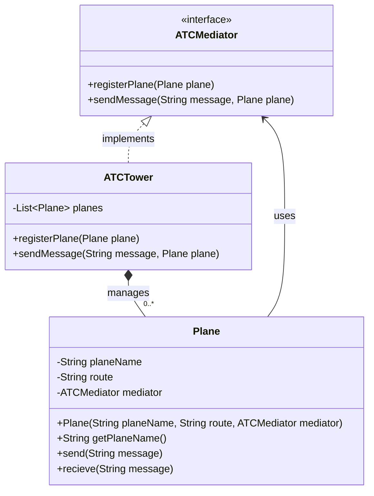

## Definition

The **Mediator Pattern** is a **behavioral design pattern** that defines an object (the mediator) that encapsulates how a set of objects interact with each other. Instead of objects communicating directly, they communicate through the mediator, which coordinates and controls their interactions.

---
## Real World Analogy

The main purpose of the Mediator Pattern is to reduce the direct dependencies between objects.

Consider a web application that contains a form with multiple input fields and a submit button. The submit button's responsibility is only to submit the form. It should not know how many input fields exist, how validation is performed, or where the data is stored. Its job is simply to trigger the submission process.

A better example is an e-commerce application.

Suppose a customer places an order. Without a mediator, the `OrderService` may directly communicate with several services:
```txt
OrderService ->
            PaymentService
            InventoryService
            UserService
```
In this approach, the `OrderService` becomes tightly coupled to multiple services. Whenever one of these services changes, there is a possibility that the `OrderService` must also be modified.
This is without the Mediator Pattern.

With the Mediator Pattern, the `OrderService` communicates only with a mediator.
```txt
OrderService ->
            Mediator
```
The mediator then decides what should happen next. For example:
1. Process the payment through the Payment Service.
2. Update stock through the Inventory Service.
3. Notify the user through the User Service.

The `OrderService` no longer needs to know how these services work internally. It simply forwards the request to the mediator.

If the implementation of `InventoryService` changes in the future, the `OrderService` remains unaffected because it only depends on the mediator. This reduces coupling, improves maintainability, and makes the system easier to extend.

This is exactly the problem that the Mediator Pattern solves.

---
## Design


In this design:
- `ATCMediator` defines the contract for communication.
- `ATCTower` acts as the concrete mediator and manages all planes.
- `Plane` objects do not communicate directly with each other.
- Every message passes through the ATC Tower, which coordinates the communication.
This structure keeps the planes loosely coupled and centralizes communication logic inside the mediator.

---
## Implementation in Java
```java
interface ATCMediator {
    public void registerPlane(Plane plane);

    public void sendMessage(String message, Plane plane);
}
```
The `ATCMediator` interface defines the operations that every mediator must provide.
The `registerPlane()` method is responsible for registering planes with the ATC tower, while `sendMessage()` is used to route messages from one plane to other planes.

By introducing an interface, the plane objects depend only on the abstraction rather than a concrete implementation.
```java
class Plane {
    private String planeName;
    private String route;

    // Mediator It only knows these Class
    private ATCMediator mediator;

    public Plane(String planeName, String route, ATCMediator mediator) {
        this.planeName = planeName;
        this.route = route;
        this.mediator = mediator;
    }

    public String getPlaneName() {
        return this.planeName;
    }

    public void send(String message) {
        System.out.printf("These is Plane %s --> ATC = %s%n", planeName, message);
        this.mediator.sendMessage(message, this);
    }

    public void recieve(String message) {
        System.out.printf("%s --> Recieved : %s%n", this.planeName, message);
    }
}
```
The `Plane` class represents a participant in the communication process.

Notice that a plane does not store references to other planes. Instead, it only knows about the mediator through the `ATCMediator` interface.

When a plane wants to send a message, it calls the `send()` method. Rather than directly contacting other planes, it forwards the message to the mediator.

The `receive()` method is called by the mediator whenever another plane sends a message.

This keeps every plane independent from the others.
```java
class ATCTower implements ATCMediator {
    private List<Plane> planes = new ArrayList<>();

    @Override
    public void registerPlane(Plane plane) {
        this.planes.add(plane);
    }

    @Override
    public void sendMessage(String message, Plane plane) {
        System.out.printf("Replaying Message From: %s  --> %s%n",
                plane.getPlaneName(), message);

        for (Plane senderPlane : this.planes) {
            if (plane != senderPlane) {
                senderPlane.recieve(message);
            }
        }
    }
}
```
The `ATCTower` class acts as the concrete mediator.
It maintains a list of all registered planes. Whenever a plane sends a message, the ATC Tower receives it and decides how the message should be distributed.
Inside `sendMessage()`, the tower forwards the message to all other registered planes except the sender.
This centralizes the communication logic in a single place. If communication rules change in the future, only the mediator needs modification.
```java
public static void main(String[] args) {
    ATCTower tower = new ATCTower();

    Plane planeA = new Plane("Indigo-123", "Ahemdabad", tower);
    Plane planeB = new Plane("SpiceJet-342", "Chennai", tower);
    Plane planeC = new Plane("AirIndia-412", "Mumbai", tower);

    tower.registerPlane(planeA);
    tower.registerPlane(planeB);
    tower.registerPlane(planeC);

    planeB.send("Request to Land Permission");
    planeC.send("I just about to takeoff");
}
```
The client first creates an `ATCTower`, which will act as the mediator.

Next, three planes are created and provided with a reference to the same ATC Tower. Each plane is then registered with the tower.
When `planeB` sends a landing request, the message goes to the tower. The tower then distributes that message to the remaining planes.
Similarly, when `planeC` sends a takeoff notification, the tower coordinates the communication and delivers the message to the other planes.
At no point does one plane directly communicate with another plane.

**Output:**
```txt
These is Plane SpiceJet-342 --> ATC = Request to Land Permission
Replaying Message From: SpiceJet-342  --> Request to Land Permission
Indigo-123 --> Recieved : Request to Land Permission
AirIndia-412 --> Recieved : Request to Land Permission

These is Plane AirIndia-412 --> ATC = I just about to takeoff
Replaying Message From: AirIndia-412  --> I just about to takeoff
Indigo-123 --> Recieved : I just about to takeoff
SpiceJet-342 --> Recieved : I just about to takeoff
```
The output clearly shows that every message passes through the ATC Tower before reaching other planes. The planes never communicate directly with each other, which is the key characteristic of the Mediator Pattern.

---
## Real World Examples

- In **.NET**, the **MediatR** library is a popular implementation of the Mediator Pattern. It helps different parts of an application communicate without directly depending on each other.  
- In **Spring Framework (Java)**, the `ApplicationEventPublisher` and event listeners follow the Mediator Pattern by allowing components to communicate through events.  
- In **Java Swing** and **JavaFX**, dialog boxes act as mediators by coordinating interactions between UI components such as buttons, text fields, and checkboxes.
----
## Design Principles:

- **Encapsulate What Varies** - Identify the parts of the code that are going to change and encapsulate them into separate class just like the Strategy Pattern. 
- **Favor Composition Over Inheritance** - Instead of using inheritance on extending functionality, rather use composition by delegating behavior to other objects. 
- **Program to Interface not Implementations** - Write code that depends on Abstractions or Interfaces rather than Concrete Classes. 
- **Strive for Loosely coupled design between objects that interact** - When implementing a class, avoid tightly coupled classes. Instead, use loosely coupled objects by leveraging abstractions and interfaces. This approach ensures that the class does not heavily depend on other classes.
- **Classes Should be Open for Extension But closed for Modification** - Design your classes so you can extend their behavior without altering their existing, stable code.
- **Depend on Abstractions, Do not depend on concrete class** - Rely on interfaces or abstract types instead of concrete classes so you can swap implementations without altering client code.
- **Talk Only To Your Friends** - An object may only call methods on itself, its direct components, parameters passed in, or objects it creates.
- **Don't call us, we'll call you** - This means the framework controls the flow of execution, not the user’s code (Inversion of Control).
- **A class should have only one reason to change** - This emphasizes the Single Responsibility Principle, ensuring each class focuses on just one functionality.