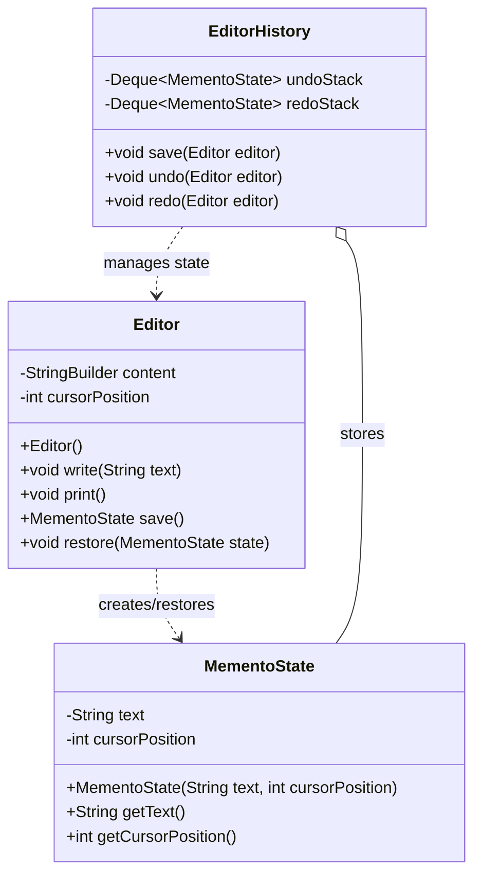

---
tags:
  - behavioral
created: 2026-06-05
title: Memento Pattern
---
## Definition

**Memento Pattern** is a **behavioral design pattern** that allows you to capture and save an object's internal state without exposing its implementation details, so that the object can be restored to that state later.

---
## Real World Analogy

The Memento Pattern is useful when we want to save the current state of an object and restore it later if needed.

A common example is a video game. While playing, the game allows you to save your progress manually or automatically creates checkpoints. If your character loses or the game crashes, you can return to the last saved checkpoint instead of starting from the beginning.

Another example is a text editor such as Microsoft Word or Google Docs. While you are typing, the application continuously keeps track of previous states of the document. When you press **Undo**, it restores a previous version of the document. When you press **Redo**, it moves forward to a state that was previously undone.

The important point is that the application does not store every operation individually. Instead, it stores snapshots of the state at different moments. These snapshots can later be restored whenever required.

The Memento Pattern follows the same idea by capturing and storing an object's state without exposing its internal implementation details.
### Participants in the Pattern

The Memento Pattern consists of three main participants:
1. **Originator**: The object whose state needs to be saved and restored.
	**Example:** `Editor`
2. **Memento**: Stores the snapshot of the Originator's state.
	**Example:** `MementoState`
3. **Caretaker**: Maintains the history of saved states and manages undo and redo operations.
	**Example:** `EditorHistory`

---
## Design


_Class Diagram of Memento Pattern_

---
## Implementation in Java

```java title="MementoState.java"
// Memento State
class MementoState {
    private String text;
    private int cursorPosition;

    public MementoState(String text, int cursorPosition) {
        this.text = text;
        this.cursorPosition = cursorPosition;
    }

    public int getCursorPosition() {
        return cursorPosition;
    }

    public String getText() {
        return text;
    }
}
```
This class represents the **Memento**. It stores the snapshot of the editor at a particular moment.
The state contains:
- The text currently present in the editor.
- The current cursor position.
Once created, this object is used later to restore the editor back to the same state.

```java title="Editor.java"
// This is the Originator where the client is depend on which will save the MementoState
class Editor {
    private StringBuilder content;
    private int cursorPosition;

    public Editor() {
        this.content = new StringBuilder();
        this.cursorPosition = 0;
    }

    public void write(String text) {
        this.content.append(text);
        this.cursorPosition = content.length();
    }

    public void print() {
        System.out.println(String.format(
            "Content = %s , Cursor = %d",
            this.content.toString(),
            this.cursorPosition
        ));
    }

    // Save the snapshot
    public MementoState save() {
        return new MementoState(
                this.content.toString(),
                cursorPosition
        );
    }

    // Restore the snapshot
    public void restore(MementoState state) {
        this.content = new StringBuilder(state.getText());
        this.cursorPosition = state.getCursorPosition();
    }
}
```
`Editor` is the **Originator**.
It is responsible for maintaining the current state of the text editor.
The `write()` method appends new text and updates the cursor position.
The `save()` method creates a new `MementoState` object containing the current content and cursor position. This acts as a snapshot.
The `restore()` method loads the data from a previously saved snapshot and restores the editor to that state.
```java title="EditorHistory.java"
// Caretaker of the history
class EditorHistory {
    private final Deque<MementoState> undoStack = new ArrayDeque<>();
    private final Deque<MementoState> redoStack = new ArrayDeque<>();

    public void save(Editor editor) {
        undoStack.push(editor.save());
        redoStack.clear();
    }

    public void undo(Editor editor) {
        if (undoStack.isEmpty()) {
            System.out.println("Nothing to undo");
            return;
        }

        MementoState lastundoState = undoStack.pop();
        redoStack.push(editor.save());
        editor.restore(lastundoState);
    }

    public void redo(Editor editor) {
        if (redoStack.isEmpty()) {
            System.out.println("Nothing to redo");
            return;
        }

        MementoState lastredoState = redoStack.pop();
        undoStack.push(editor.save());
        editor.restore(lastredoState);
    }
}
```
`EditorHistory` acts as the **Caretaker**.
It is responsible for storing all saved snapshots and managing undo and redo operations.
The `undoStack` keeps track of previously saved states.
The `redoStack` stores states that have been undone and can be restored again using redo.

When a new state is saved:
- The current snapshot is pushed into the undo stack.
- The redo stack is cleared because a new change creates a new history path.

During an undo operation:
- The current state is saved in the redo stack.
- The previous state is restored from the undo stack.

During a redo operation:
- The current state is saved in the undo stack.
- The state from the redo stack is restored.
```java title="MementoPattern.java"
// Client code
public static void main(String[] args) {
    Editor editor = new Editor();
    EditorHistory history = new EditorHistory();

    editor.write("Hello");
    history.save(editor);

    editor.print();

    editor.write(" Java");
    history.save(editor);

    editor.print();

    editor.write(" SpringBoot");
    history.save(editor);

    editor.print();

    // Undo the SpringBoot
    history.undo(editor);
    editor.print();

    history.undo(editor);
    editor.print();

    history.redo(editor);
    editor.print();

    history.undo(editor);
    editor.print();
}
```

The client creates an editor and a history manager.
After every important change, the current state of the editor is saved.
Later, undo and redo operations are performed using the stored snapshots. The editor itself does not manage the history. That responsibility is delegated to the caretaker.
This keeps the responsibilities separated and follows the Memento Pattern correctly.

**Output**: 
```bash
Content = Hello , Cursor = 5
Content = Hello Java , Cursor = 10
Content = Hello Java SpringBoot , Cursor = 21
Content = Hello Java SpringBoot , Cursor = 21
Content = Hello Java , Cursor = 10
Content = Hello Java SpringBoot , Cursor = 21
Content = Hello Java , Cursor = 10
```
---
## Real World Examples

- **Microsoft Word** uses the Memento Pattern concept to support Undo and Redo operations.
- **Java Swing's UndoManager** (`javax.swing.undo.UndoManager`) maintains a history of changes and provides Undo and Redo functionality.
- **Qt Framework** provides `QUndoStack` and `QUndoCommand` for implementing Undo and Redo operations in desktop applications.
- **Text editors and IDEs** such as IntelliJ IDEA, Eclipse, and Visual Studio use the same concept to restore previous document states.
- **Game engines and video games** use checkpoints and save-game systems that internally follow ideas similar to the Memento Pattern.
---
## Design Principles:

- **Encapsulate What Varies** - Identify the parts of the code that are going to change and encapsulate them into separate class just like the Strategy Pattern. 
- **Favor Composition Over Inheritance** - Instead of using inheritance on extending functionality, rather use composition by delegating behavior to other objects. 
- **Program to Interface not Implementations** - Write code that depends on Abstractions or Interfaces rather than Concrete Classes. 
- **Strive for Loosely coupled design between objects that interact** - When implementing a class, avoid tightly coupled classes. Instead, use loosely coupled objects by leveraging abstractions and interfaces. This approach ensures that the class does not heavily depend on other classes.
- **Classes Should be Open for Extension But closed for Modification** - Design your classes so you can extend their behavior without altering their existing, stable code.
- **Depend on Abstractions, Do not depend on concrete class** - Rely on interfaces or abstract types instead of concrete classes so you can swap implementations without altering client code.
- **Talk Only To Your Friends** - An object may only call methods on itself, its direct components, parameters passed in, or objects it creates.
- **Don't call us, we'll call you** - This means the framework controls the flow of execution, not the user’s code (Inversion of Control).
- **A class should have only one reason to change** - This emphasizes the Single Responsibility Principle, ensuring each class focuses on just one functionality.