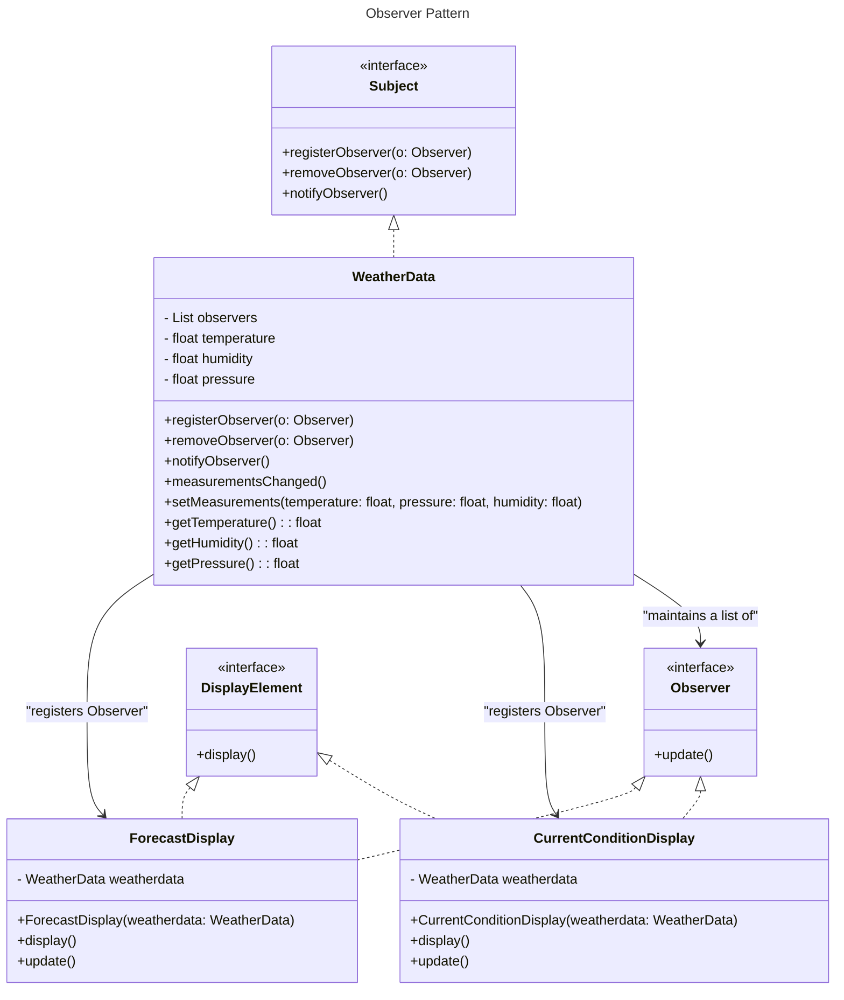

## Definition

It Defines a one-to-many dependency between objects so that when one object changes state, all its dependents are notified and updated automatically. Just like the Subscription, as long as you take the subscription you will get the updates, when you invoke the Subscription you will stop getting the updates or say the services.

---
## Real World Analogy

We are designing a **Weather Application** that consists of a `WeatherData` class. There are different types of displays attached to it, but currently, we only have `CurrentConditionsDisplay`.
When the data inside the `WeatherData` class changes (i.e., **temperature, pressure, and humidity**), the updated data should be reflected on the display as well.
The application should be designed in such a way that when a new display is added, we **don’t need to rewrite or modify** the existing code.
The **Observer Pattern** is the ideal solution here. When the `WeatherData` class updates, it acts as a **Subject**, and its dependents (Observers/Subscribers) are notified automatically—**as long as they are registered with the Subject**.

![[Pasted image 20250212000000.png]]
_Publisher Notifies all the Subscriber_
### Design

The Design will look like the Above. 

---
### Code in Java
```java title="Observerpattern.java"
// These is the Subject
interface Subject {
	public void registerObserver(Observer o);
	public void removeObserver(Observer o);
	public void notifyObserver();
}

interface Observer {
	public void update();
}

interface DisplayElement {
	public void display();
}

// These is the main subject the observer register here to receive the updates to all the subscribed observer.
class WeatherData implements Subject {

	private List<Observer> observers = new ArrayList<Observer>();
	private float temperature = 0;
	private float humidity = 0;
	private float pressure = 0;

	// Register the Observer
	@Override
	public void registerObserver(Observer o) {
		observers.add(o);
	}

	@Override
	public void removeObserver(Observer o) {
		observers.remove(o);
	}

	// Notify all the observer which are subscribed
	@Override
	public void notifyObserver() {
		for (Observer obs : observers) {
			obs.update();
		}
	}

	// when the measurements are changed notify's all the subscriber
	public void measurementsChanged() {
		this.notifyObserver();
	}

	// Sets the measurements and displays the updates.
	public void setMeasurements(float temperature, float pressure, float humidity) {
		this.humidity = humidity;
		this.pressure = pressure;
		this.temperature = temperature;
		this.measurementsChanged();
	}

	public float getTemperature() {
		return temperature;
	}

	public float getHumidity() {
		return humidity;
	}

	public float getPressure() {
		return pressure;
	}

}

// There can be multiple displays developer can add as many display as it wants by using DisplayElement Interface
class CurrentConditionDisplay implements Observer, DisplayElement {
	private WeatherData weatherdata;

	public CurrentConditionDisplay(WeatherData weatherdata) {
		this.weatherdata = weatherdata;
		this.weatherdata.registerObserver(this);
	}

	@Override
	public void display() {
		System.out.println("Current Condition = " + weatherdata.getHumidity() + " " + weatherdata.getPressure());
	}

	@Override
	public void update() {
		this.display();
	}

}

// lets add new display again
class ForecastDisplay implements DisplayElement, Observer {
	private WeatherData weatherdata;

	public ForecastDisplay(WeatherData weatherdata) {
		this.weatherdata = weatherdata;
		this.weatherdata.registerObserver(this);
	}

	@Override
	public void display() {
		System.out.println("Forecast Display = " + weatherdata.getHumidity() * 100 + " " + weatherdata.getPressure());
	}

	@Override
	public void update() {
		this.display();
	}

}

public class ObserverPattern {

	public static void main(String[] args) {
		// Creating the instance of Weather Class
		WeatherData weatherdata = new WeatherData();

		// Displaying the data from the Weather Data using Observer or Display
		CurrentConditionDisplay currcondition = new CurrentConditionDisplay(weatherdata);
		ForecastDisplay forecastdisplay = new ForecastDisplay(weatherdata);

		// Setting the measurements in the weather data
		weatherdata.setMeasurements(1, 1, 2);
		weatherdata.setMeasurements(5, 5, 5);
	}
}
```
**Output:**
```
 Current Condition = 2.0 1.0
 Forecast Display = 200.0 1.0
 Current Condition = 5.0 5.0
 Forecast Display = 500.0 5.0
```
---
## Real World Example

The **Observer Pattern** is commonly used in many libraries and frameworks. For example, the **Swing Library** uses the Observer Pattern in the `JButton` class, which has various action listeners that are triggered when the button is clicked.

This class allows you to **add or remove observers** easily. You can also create multiple listeners by implementing the `ActionListener` interface.

Below is an example demonstrating this.
```java title="SwingApp.java"
package observer;

import java.awt.Rectangle;
import java.awt.event.ActionEvent;
import java.awt.event.ActionListener;
import javax.swing.JButton;
import javax.swing.JFrame;

// It is mostly used in Swing application 
class SwingApp {
	private JFrame jframe;

	public SwingApp() {
		jframe = new JFrame("Swing Example");
		jframe.setVisible(true);
		jframe.setBounds(new Rectangle(50, 50, 400, 400));

	}

	public void defineButton() {
		JButton button = new JButton("Click Me");
		button.setBounds(10, 10, 50, 30);
		jframe.add(button);

		// we are subscribing the observer when the button is clicked.
		button.addActionListener(new AngelListener());
	}

}

// These is the observer 
class AngelListener implements ActionListener {

	@Override
	public void actionPerformed(ActionEvent e) {
		System.out.println(e.getActionCommand());
	}

}

public class SwingApplication {

	public static void main(String[] args) {
		SwingApp app = new SwingApp();
		app.defineButton();
	}

}

```
**Output:**

![[Pasted image 20250212233819.png|400]]

When the button is clicked, the text **"Click Me"** appears in the console. When you click on the `JButton`, it **notifies the observers** subscribed to it that a click event has occurred, prompting them to execute their respective code.

---
## Design Principles

- **Encapsulate What Varies** - Identify the parts of the code that are going to change and encapsulate them into separate class just like the Strategy Pattern. 
- **Favor Composition Over Inheritance** - Instead of using inheritance on extending functionality, rather use composition by delegating behavior to other objects. 
- **Program to Interface not Implementations** - Write code that depends on Abstractions or Interfaces rather than Concrete Classes. 
- **Strive for Loosely coupled design between objects that interact** - When implementing a class, avoid tightly coupled classes. Instead, use loosely coupled objects by leveraging abstractions and interfaces. This approach ensures that the class does not heavily depend on other classes.