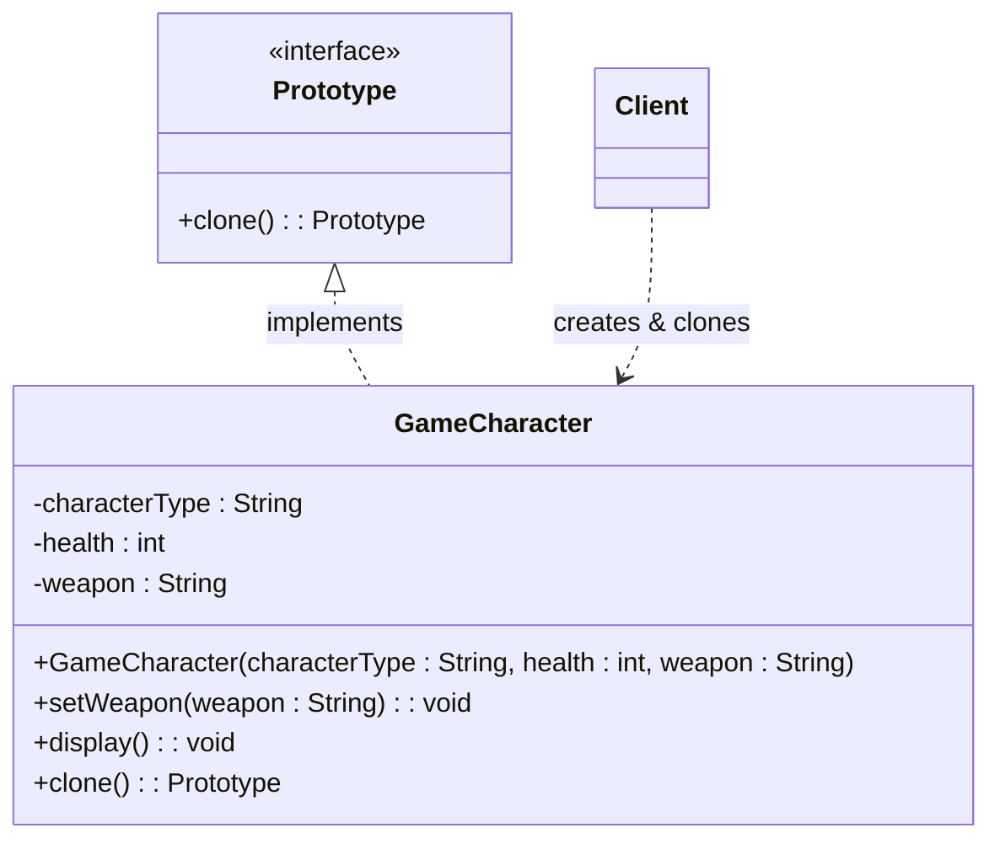

## Definition

**Prototype Pattern** is a **creational** design pattern that creates new objects by copying (cloning) an existing object, instead of creating and initializing a new object from scratch. This is useful when object creation is expensive or when many similar objects are needed.

---
## Real World Analogy

Imagine you have created a document containing 100 pages. Now you need another document that is almost identical to the first one. Creating the new document from scratch would require typing all 100 pages again, which is both time-consuming and unnecessary.

A better approach is to make a copy of the existing document and then modify only the parts that need to be different. The original document acts as a prototype, and the copied document becomes a new object created from that prototype.

The same idea applies to software development. Instead of repeatedly creating and configuring similar objects from scratch, we create one fully configured object and then clone it whenever needed.

Another good example comes from the gaming industry. Consider a game that contains hundreds of soldier characters. Creating a character may involve loading models, textures, animations, weapons, movement logic, and other assets. Loading these assets repeatedly for every character would be expensive.

Instead, the game creates one fully initialized soldier, loads all the required assets, and then clones that soldier multiple times. Each cloned soldier can then be customized with small changes such as a different weapon, health value, or appearance.

This approach reduces initialization overhead, improves performance, and avoids repeating the same setup process again and again.

This is exactly where the Prototype Pattern becomes useful.

---
## Design


In this design:
- `Prototype` defines the cloning contract.
- `GameCharacter` is the concrete prototype that knows how to create its own copy.
- `Client` creates an object and requests clones whenever new objects are required.
---
## Implementation in Java
```java title="Prototype.java"
// Prototype Pattern which can Supports the Cloning
interface Prototype {
    public Prototype clone();
}
```

The `Prototype` interface defines a single method called `clone()`. Any class that wants to support cloning must implement this interface and provide its own cloning logic.
```java title="GameCharacter.java"
// Game Character
class GameCharacter implements Prototype {
    private String characterType;
    private int health;
    private String weapon;

    public GameCharacter(String characterType, int health, String weapon) {
        this.characterType = characterType;
        this.health = health;
        this.weapon = weapon;
    }

    public void setWeapon(String weapon) {
        this.weapon = weapon;
    }

    public void display() {
        System.out.printf("Character=%s,Health=%d,Weapon=%s\n",
                this.characterType,
                this.health,
                this.weapon);
    }

    @Override
    public Prototype clone() {
        return new GameCharacter(
                this.characterType,
                this.health,
                this.weapon
        );
    }
}
```
`GameCharacter` represents the object that can be cloned.

The constructor initializes the character's state. The `setWeapon()` method allows us to modify a cloned object after it has been created.

The most important method is `clone()`. Instead of asking the client to create a new character manually, the object creates a copy of itself and returns it.

This is the core idea behind the Prototype Pattern.
```java title="PrototypePattern.java"
public static void main(String[] args) {

    // Soldier Character
    GameCharacter soldier =
            new GameCharacter("Soldier", 100, "Gun");

    // Soldier 2 Character
    GameCharacter soldier2 =
            (GameCharacter) soldier.clone();

    // Customize the clone
    soldier2.setWeapon("Pistol");

    soldier.display();
    soldier2.display();

    // Address
    System.out.println(soldier.hashCode());
    System.out.println(soldier2.hashCode());
}
```
First, we create a soldier character.
Instead of creating another soldier using the constructor, we create a copy by calling the `clone()` method.
After cloning, we change the weapon of the second soldier from `Gun` to `Pistol`.
Finally, we display both objects and print their hash codes. Different hash codes indicate that both objects are separate instances in memory even though one was created from the other.

**Output:**
```bash
Character=Soldier,Health=100,Weapon=Gun
Character=Soldier,Health=100,Weapon=Pistol
1721931908
1198108795
```
The output shows that changing the cloned object does not affect the original object.
The original soldier still has a `Gun`, while the cloned soldier uses a `Pistol`.

---
## Real World Examples
1. **Java Collections (`ArrayList.clone()`)**  
    Java's `ArrayList` provides a `clone()` method that creates a copy of an existing list instead of building a new one manually.
2. **.NET `MemberwiseClone()`**  
    The .NET framework provides `MemberwiseClone()` to create a shallow copy of an object, which follows the Prototype Pattern.
3. **Document Templates (Microsoft Word, LibreOffice)**  
    When you create a new resume, invoice, or report from a template, the application creates a copy of the template and lets you customize it.
4. **Game Engines (Unity, Unreal Engine)**  
    Game engines often duplicate existing game objects, NPCs, enemies, or prefabs instead of creating each object from scratch.
---
## Design Principles:

- **Encapsulate What Varies** - Identify the parts of the code that are going to change and encapsulate them into separate class just like the Strategy Pattern. 
- **Favor Composition Over Inheritance** - Instead of using inheritance on extending functionality, rather use composition by delegating behavior to other objects. 
- **Program to Interface not Implementations** - Write code that depends on Abstractions or Interfaces rather than Concrete Classes. 
- **Strive for Loosely coupled design between objects that interact** - When implementing a class, avoid tightly coupled classes. Instead, use loosely coupled objects by leveraging abstractions and interfaces. This approach ensures that the class does not heavily depend on other classes.
- **Classes Should be Open for Extension But closed for Modification** - Design your classes so you can extend their behavior without altering their existing, stable code.
- **Depend on Abstractions, Do not depend on concrete class** - Rely on interfaces or abstract types instead of concrete classes so you can swap implementations without altering client code.
- **Talk Only To Your Friends** - An object may only call methods on itself, its direct components, parameters passed in, or objects it creates.
- **Don't call us, we'll call you** - This means the framework controls the flow of execution, not the user’s code (Inversion of Control).
- **A class should have only one reason to change** - This emphasizes the Single Responsibility Principle, ensuring each class focuses on just one functionality.