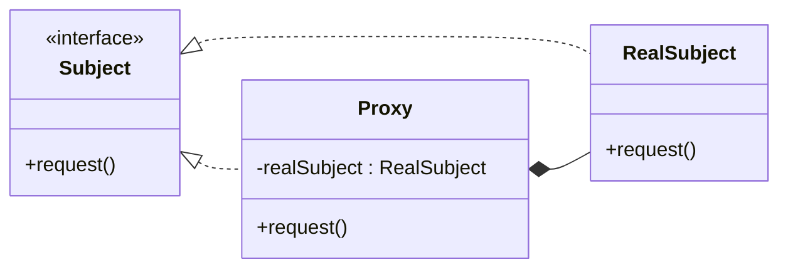

## Definition

**Proxy Pattern** provides a surrogate or placeholder for another object to control access to it.

---
## Real-World Analogy

In the previous section on the [[State Pattern]], we built a Gumball Machine example. In this pattern, we will reuse the same Gumball Machine and extend it with remote monitoring capabilities.

Now, imagine that you want to control or monitor a Gumball Machine remotely, for example, checking its current state, the number of gumballs available, or its location. This can be achieved using a **Remote Proxy**.

A Remote Proxy acts as a local representative for an object that exists in another Java Virtual Machine (JVM). Internally, this is implemented using **Remote Method Invocation (RMI)**.

![[remote_proxy.png]]

The diagram above shows the Remote Proxy setup for the Gumball Monitor.

Here, `GumballMonitor` acts as the client and communicates with the `GumballMachine` through a Remote Proxy. When the monitor invokes a method, the call is forwarded to the proxy. The proxy serializes the method call and sends it to the remote server. The server then invokes the method on the real `GumballMachine` and sends the result back to the client. This indirection is the essence of the Proxy Pattern.
### How This Works
![[remote_proxy_working.png]]

The diagram above illustrates the runtime behavior of a Remote Proxy. The flow is as follows:

1. The client calls a method on the remote object, for example `doSomething()`, as if it were a local method call.
2. The `RemoteProxy` intercepts the call, serializes the method name, arguments, and related metadata, and sends it to the `RemoteServer`.
3. The `RemoteServer` deserializes the request and invokes the corresponding method on the real `GumballMachine`.
4. Once the method execution is complete, the result is returned to the server layer.
5. The server packages the result and sends it back to the `RemoteProxy`.
6. The proxy deserializes the response and returns it to the client (`GumballMonitor`).
### Java RMI

RMI stands for **Remote Method Invocation**. It allows a client to invoke methods on an object that resides in a different JVM. Although RMI is considered an older technology and is not commonly used in modern systems, it is still very useful for learning and understanding the Remote Proxy pattern.

In RMI terminology, the client-side helper is called a _stub_, and the server-side helper is called a _skeleton_. The diagram below illustrates this relationship.

![[RMI_nomenclature.png]]

Next, we will implement the Gumball Monitor using the code from the [[State Pattern]].

---
## Design

The class diagram for the Proxy Pattern is straightforward. The `Subject` interface defines the operations that are implemented by both the `RealSubject` and the `Proxy`. The client interacts only with the `Subject` interface, remaining unaware of whether it is working with the real object or the proxy.



---
## Implementation in Java

We start by creating the `ProxyRemote` interface, which will be implemented by both the proxy and the `GumballMachine`. This interface plays the same role as the `Subject` interface shown in the design section.

Extending `Remote` marks this interface as a remote interface in RMI.
```java title="ProxyRemote.java"
import proxy.state.State;
import java.rmi.Remote;
import java.rmi.RemoteException;

public interface ProxyRemote extends Remote {
    int getCount() throws RemoteException;
    String getLocation() throws RemoteException;
    State getState() throws RemoteException;
}
```

The `getState()` method returns a custom `State` object. For RMI to work correctly, all non-primitive return types must be serializable. Primitive types and standard Java types are already handled by the RMI framework.

To make `State` serializable, we extend the `Serializable` interface from the `java.io` package.
```java title="State.java"
import java.io.Serializable;

public interface State extends Serializable {
    void insertQuarter();
    void ejectQuarter();
    void dispense();
    void turncrank();
}
```

At this point, the custom data type can be transferred across the network.

However, each concrete `State` implementation holds a reference to the `GumballMachine` so that it can trigger state transitions. We do not want the entire `GumballMachine` object to be serialized and sent over the network along with the state.

To prevent this, the reference to `GumballMachine` is marked as `transient` in each state class.

```java title="HasQuarterState.java"
class HasQuarterState implements State {
    private static final long serialVersionUID = 2L;
    private final transient GumballMachine gumballMachine;
    // remaining code
}
```

```java title="NoQuarterState.java"
class NoQuarterState implements State {
    private static final long serialVersionUID = 2L;
    private final transient GumballMachine gumballMachine;
    // remaining code
}
```

```java title="SoldOutState.java"
class SoldOutState implements State {
    private static final long serialVersionUID = 2L;
    private final transient GumballMachine gumballMachine;
    // remaining code
}
```

```java title="SoldState.java"
class SoldState implements State {
    private static final long serialVersionUID = 2L;
    private final transient GumballMachine gumballMachine;
    // remaining code
}
```

```java title="WinnerState.java"
class WinnerState implements State {
    private static final long serialVersionUID = 2L;
    private final transient GumballMachine gumballMachine;
    // remaining code
}
```

The `transient` keyword tells the JVM not to include this field during serialization. When the object is deserialized, the transient field is initialized with its default value, avoiding unnecessary data transfer.

Next, the `GumballMachine` is exposed as a remote service. To do this, it implements the `ProxyRemote` interface and extends `UnicastRemoteObject`, which provides the RMI infrastructure.

```java title="GumballMachine.java"
public class GumballMachine extends UnicastRemoteObject implements ProxyRemote {
    private static final long serialVersionUID = 2L;

    // other private variables

    public GumballMachine(String location, int numberOfGumballs) throws RemoteException {
        // initialization and state setup
    }
}
```

Here, extending `UnicastRemoteObject` allows the object to receive remote method calls, while implementing `ProxyRemote` exposes the methods that clients are allowed to invoke.
### Registering with the RMI Registry

The next step is to register the `GumballMachine` with the RMI Registry so that clients can discover it.
```java title="RemoteServer.java"
public class RemoteServer {
    public static void main(String[] args) {
        Remote remote;
        int count = 5;
        String location = "localhost";

        try {
            remote = new GumballMachine(location, count);
            Naming.rebind("//" + location + "/gumballmachine", remote);
        } catch (Exception e) {
            e.printStackTrace();
        }
    }
}
```

This makes the remote object available at `rmi://localhost/gumballmachine`.
Before running the server, the RMI Registry must be started.
```bash
start rmiregistry 1099
```
This command starts the RMI Registry on port `1099`.
After starting the registry, run `RemoteServer.java` to register the `GumballMachine`.
### Creating the Monitor (Client-Side Proxy)

The monitor class allows us to observe the `GumballMachine` through the exposed remote methods. It interacts only with the `ProxyRemote` interface, which makes it act as a proxy client.
```java title="RemoteMonitor.java"
public class RemoteMonitor {

    private final ProxyRemote gumballMachine;

    public RemoteMonitor(ProxyRemote machine) {
        this.gumballMachine = machine;
    }

    public void report() {
        try {
            System.out.println("Gumball Machine: " + gumballMachine.getLocation());
            System.out.println("Gumball Machine Inventory: " + gumballMachine.getCount() + " gumballs");
            System.out.println("Current State: " + gumballMachine.getState());
        } catch (RemoteException re) {
            re.printStackTrace();
        }
    }
}
```
This class typically runs on a different machine from the server.
### Creating the Client (RMI Stub User)

The client looks up the remote object from the RMI Registry and uses it through the `ProxyRemote` interface.
```java title="RemoteTest.java"
public class RemoteTest {
    public static void main(String[] args) {

        String location = "rmi://localhost/gumballmachine";
        RemoteMonitor monitor;

        try {
            ProxyRemote remote = (ProxyRemote) Naming.lookup(location);
            monitor = new RemoteMonitor(remote);
        } catch (Exception e) {
            throw new RuntimeException(e);
        }

        monitor.report();
    }
}
```
This code retrieves the proxy reference and allows the client to interact with the remote `GumballMachine` as if it were local.

_Output:_
```txt
Gumball Machine: localhost
Gumball Machine Inventory: 5 gumballs
Current State: NoQuarterState
```

---
## Implementation in Java – 2

In the previous implementation, we used **Remote Method Invocation (RMI)** to demonstrate the Proxy Pattern. In this section, we will implement a simpler proxy based on the [[#Design]] shown earlier. This example demonstrates a **Cache (Virtual) Proxy**.

```java title="Subject.java"
interface Subject {
    void request();
}
```

This interface defines the common contract that both the real object and the proxy must follow.
```java title="RealSubject.java"
class RealSubject implements Subject {
    private String resource;

    public RealSubject(String resource) {
        this.resource = resource;
        this.loadResource();
    }

    private void loadResource() {
        System.out.println("Loading the Resource: " + this.resource);
    }

    @Override
    public void request() {
        System.out.println("Requested: " + this.resource);
    }
}
```
The `RealSubject` represents the actual object that performs the expensive operation of loading a resource.
```java title="Proxy.java"
class Proxy implements Subject {
    private Subject subject;
    private String resource;

    public Proxy(String resource) {
        this.resource = resource;
    }

    @Override
    public void request() {
        if (subject == null) {
            subject = new RealSubject(resource);
        }
        subject.request();
    }
}
```
The proxy delays the creation of the `RealSubject` until it is actually needed and then delegates subsequent calls directly to it.
```java title="ProxyPattern.java"
public class ProxyPattern {
    public static void main(String[] args) {
        Subject subject = new Proxy("new pdf download");
        subject.request();
        subject.request();
    }
}
```
_Output:_
```txt
Loading the Resource: new pdf download
Requested: new pdf download
Requested: new pdf download
```
On the first request, the resource is loaded. On subsequent requests, the already-created object is reused.

---
## Types of Proxy

There are several commonly used types of proxies:
### Remote Proxy: 
With the Remote Proxy, the proxy acts as a local representative for an object that lives in a different JVM. A method call on the proxy results in the call being transferred over the wire and invoked remotely, and the result being returned back to the proxy and then to the client. 
### Virtual Proxy: 
The Virtual Proxy acts as a representative for an object that may be expensive to create. The virtual Proxy often defers the creation of the object until it is needed; the Virtual Proxy also acts as a surrogate for the object before and while it is being created. After that, the proxy delegates requests directly to the RealSubject. 
**Example**: Loading a Large Image only when it is displayed on the Screen 
### Protection Proxy: 
A Protection Proxy is used to control access to an object. Before forwarding a request to the Real Subject, the proxy checks whether the user has the required permissions. If the user is authorized, the request is allowed; otherwise it is blocked. 
### Cache Proxy: 
A Cache Proxy is used to store the results of expensive operations. When a request is made, the proxy first checks whether the result is already stored in the cache. If it is, the cached result is returned immediately. If not, the request is sent to the real object, and the result is saved for future use. 
**Example:** Caching API responses or database query results.

Other variants include firewall proxies, synchronization proxies, and smart proxies.

---
## Real-World Examples

Proxy patterns are widely used in modern frameworks and applications, often without us explicitly realizing it.

Object-Relational Mapping (ORM) frameworks such as Entity Framework Core in .NET and Hibernate in Java use proxies to manage database interactions and lazy loading of entities.

Proxies are also heavily used in Dependency Injection frameworks, where objects are wrapped to add cross-cutting concerns such as logging, security, or transaction management.

---
## Design Principles:

- **Encapsulate What Varies** - Identify the parts of the code that are going to change and encapsulate them into separate class just like the Strategy Pattern. 
- **Favor Composition Over Inheritance** - Instead of using inheritance on extending functionality, rather use composition by delegating behavior to other objects. 
- **Program to Interface not Implementations** - Write code that depends on Abstractions or Interfaces rather than Concrete Classes. 
- **Strive for Loosely coupled design between objects that interact** - When implementing a class, avoid tightly coupled classes. Instead, use loosely coupled objects by leveraging abstractions and interfaces. This approach ensures that the class does not heavily depend on other classes.
- **Classes Should be Open for Extension But closed for Modification** - Design your classes so you can extend their behavior without altering their existing, stable code.
- **Depend on Abstractions, Do not depend on concrete class** - Rely on interfaces or abstract types instead of concrete classes so you can swap implementations without altering client code.
- **Talk Only To Your Friends** - An object may only call methods on itself, its direct components, parameters passed in, or objects it creates.
- **Don't call us, we'll call you** - This means the framework controls the flow of execution, not the user’s code (Inversion of Control).
- **A class should have only one reason to change** - This emphasizes the Single Responsibility Principle, ensuring each class focuses on just one functionality.