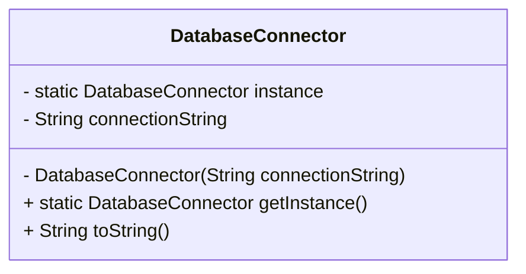

## Definition

The **Singleton Pattern** ensures that a class has only one instance and provides a global point of access to it.

---
## Real-World Analogy

Imagine you have a database that every part of your application needs to access. Creating a new database connection each time can be expensive and requires repetitive configuration connection strings, usernames, passwords, and so on. Instead, you can use a single shared database connector that’s created once and used everywhere. This is exactly where the Singleton Pattern is useful.
### Implementation in Java

First, create a `DatabaseConnector.java` class with a private constructor so that no one outside the class can directly create an instance. Then define a private static field to hold the single instance of the class. Provide a public static method, `getInstance()`, which returns the instance. If the instance doesn’t exist yet, it’s created; otherwise, the existing instance is returned.

```java title="DatabaseConnector.java"
public class DatabaseConnector {
    // Holds the single instance
    private static DatabaseConnector instance;

    private String connectionString;

    // Private constructor prevents external instantiation
    private DatabaseConnector(String connectionString) {
        this.connectionString = connectionString;
    }

    @Override
    public String toString() {
        return "DatabaseConnector[connectionString=" + connectionString + "]";
    }

    // Synchronized to avoid race conditions in multithreaded environments
    public static synchronized DatabaseConnector getInstance() {
        if (instance == null) {
            instance = new DatabaseConnector("PostgresSQL");
        }
        return instance;
    }
}
```

Notice that `getInstance()` is synchronized to prevent multiple threads from creating separate instances simultaneously.

To use the connector:
```java title="SingletonPatternExample.java"
public class SingletonPatternExample {
    public static void main(String[] args) {
        DatabaseConnector conn1 = DatabaseConnector.getInstance();
        System.out.println(conn1);

        DatabaseConnector conn2 = DatabaseConnector.getInstance();
        System.out.println(conn2);
    }
}
```

**Output:**
```
DatabaseConnector[connectionString=PostgresSQL]
DatabaseConnector[connectionString=PostgresSQL]
```
Both calls return the same instance.

---
## Design Diagram



---
## Real-World Example in Java

The `Runtime` class in Java also uses the Singleton Pattern. There is only one JVM per machine, so Java provides a single Runtime instance:

```java title="RuntimeExample.java"
public class RuntimeExample {
    public static void main(String[] args) {
        Runtime rt = Runtime.getRuntime();
        System.out.println("Available processors: " + rt.availableProcessors());
    }
}
```

**Output:**
```
Available processors: 8
```