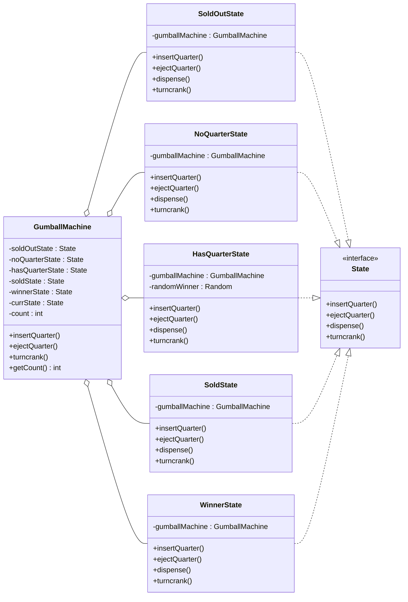

## Definition

The **State Pattern** allows and object to alter its behavior and when its internal state changes. The object will appear to changes its class. 

---
## Real World Analogy

To truly understand the power of the State Pattern, let's look at a classic mechanical device: the **Gumball Machine**.

> [!QUESTION] What is a Gumball Machine?
>A Gumball Machine is a coin-operated vending device commonly found in malls and arcades. It has a simple purpose: you give it a coin, and it gives you a round candy.

**How does it work?**

The user interaction is straightforward:
1. **Insert Coin:** You insert a quarter into the slot.
2. **Turn Crank:** You rotate the knob.
3. **Dispense:** The machine releases a gumball.
4. **Reject:** If you change your mind before turning the crank, you can eject the coin.
    
While the user interface is simple, the internal logic requires tracking the machine's current situation (or "state") to determine how it responds to actions.

#### The Mechanics:
Our machine supports four specific actions:
- **Insert Quarter:** The user inserts a coin.
- **Eject Quarter:** The user requests their coin back.
- **Turn Crank:** The user attempts to buy a gumball.
- **Dispense:** The internal mechanical step of releasing the candy.

The complete state flow is visualized below:
![[state_design.png]]

[Note: Ensure this image displays the transition diagram between states]

**How the States Flow:**

The machine begins in the No Quarter state, waiting for a customer. When a coin is inserted, it transitions to the Has Quarter state. From here, if the user turns the crank, the machine usually moves to the Sold state to dispense candy. However, we also have a "lucky" feature: sometimes, the machine transitions to a Winner state, awarding two gumballs.

After dispensing, the machine checks its inventory. If gumballs remain, it resets to **No Quarter**. If the inventory is empty, it transitions to **Out of Gumballs**, where it ceases to accept coins until refilled.

**Why not use switch or if-else?**

A naive implementation might use a massive conditional structure (e.g., if (state == HAS_QUARTER) ...). However, this leads to spaghetti code. Every time we add a new state (like "Winner"), we would have to modify every single method in the class, violating the Open/Closed Principle. The State Pattern solves this by encapsulating behavior within specific state classes.

---
## Design

To implement this, we create a `State` interface that defines all possible actions. We then create concrete classes for each state (e.g., `SoldState`, `NoQuarterState`) that implement this interface. The `GumballMachine` (the Context) will hold a reference to the current state object and delegate actions to it.



![[Pasted image 20251210061513.png]]
_The Class diagram for State Design Pattern_

The Actual design for the state pattern looks just like the above.

---
## Implementation in Java

First, we define the `State` interface. This ensures that every state class implements the four core actions of the machine. Even if a specific action isn't valid for a certain state (like ejecting a quarter when none is inserted)
```java title="State.java"
interface State {
    void insertQuarter();
    void ejectQuarter();
    void dispense();
    void turncrank();
}
```

The `GumballMachine` class acts as the **Context**. It holds instances of all possible states and a reference variable `currState` that tracks the machine's current mode. Instead of writing complex logic inside `insertQuarter()` or `turnCrank()`, the machine delegates these calls to the `currState`. This allows the behavior of the machine to change dynamically as the state object changes.
```java title="GumballMachine.java"
class GumballMachine {
    // Declaring all the possible states
    private final State soldOutState;
    private final State noQuarterState;
    private final State hasQuarterState;
    private final State soldState;
    private final State winnerState;

    private State currState;
    private int count = 0;

    public GumballMachine(int numberofGumballs) {
        this.soldState = new SoldState(this);
        this.soldOutState = new SoldOutState(this);
        this.noQuarterState = new NoQuarterState(this);
        this.hasQuarterState = new HasQuarterState(this);
        this.winnerState = new WinnerState(this);
        this.count = numberofGumballs;

        // Initialize state based on inventory
        if (numberofGumballs > 0) {
            this.currState = noQuarterState;
        } else {
            this.currState = soldOutState;
        }
    }

    // Allows states to transition the machine to a new state
    public void setState(State newstate) {
        this.currState = newstate;
    }

    public int getCount() {
        return this.count;
    }

    // Getters for states allow transitions between them
    public State getSoldOutState() { return soldOutState; }
    public State getNoQuarterState() { return noQuarterState; }
    public State getHasQuarterState() { return hasQuarterState; }
    public State getSoldState() { return soldState; }
    public State getWinnerState() { return winnerState; }

    // Helper method to physically release the ball
    public void releaseBall() {
        System.out.println("A gumball comes rolling out the slot...");
        if (count > 0) {
            count--;
        }
    }

    // Actions are delegated to the current state object
    public void insertQuarter() {
        this.currState.insertQuarter();
    }

    public void ejectQuarter() {
        this.currState.ejectQuarter();
    }

    public void turnCrank() {
        this.currState.turncrank();
        // We call dispense() internally after the crank is turned
        this.currState.dispense();
    }

    @Override
    public String toString() {
        return String.format("GumballMachine(balls=%d)", this.count);
    }
}
```

The `SoldOutState` represents the machine when it is empty. In this state, the machine is effectively locked. It rejects coins and turning the crank does nothing.
```java title="SoldOutState.java"
class SoldOutState implements State {
    private final GumballMachine gumballMachine;

    public SoldOutState(GumballMachine gumballMachine) {
        this.gumballMachine = gumballMachine;
    }

    @Override
    public void insertQuarter() {
        System.out.println("You can't insert a quarter, the machine is sold out");
    }

    @Override
    public void ejectQuarter() {
        System.out.println("You can't eject, you haven't inserted a quarter yet");
    }

    @Override
    public void dispense() {
        System.out.println("No gumball dispensed");
    }

    @Override
    public void turncrank() {
        System.out.println("You turned, but there are no gumballs");
    }

    @Override
    public String toString() {
        return "SoldOutState";
    }
}
```

The `NoQuarterState` is the default idle state. The machine is waiting for money. The only valid action here is `insertQuarter()`, which transitions the machine to the `HasQuarterState`. All other actions (ejecting or turning the crank) result in a message telling the user they need to pay first.
```java title="NoQuarterState.java"
class NoQuarterState implements State {
    private final GumballMachine gumballMachine;

    public NoQuarterState(GumballMachine gumballMachine) {
        this.gumballMachine = gumballMachine;
    }

    @Override
    public void insertQuarter() {
        System.out.println("You inserted a Quarter");
        this.gumballMachine.setState(gumballMachine.getHasQuarterState());
    }

    @Override
    public void ejectQuarter() {
        System.out.println("You haven't inserted a quarter");
    }

    @Override
    public void dispense() {
        System.out.println("You need to pay first");
    }

    @Override
    public void turncrank() {
        System.out.println("You turned, but there is no Quarter");
    }

    @Override
    public String toString() {
        return "NoQuarterState";
    }
}
```

The `HasQuarterState` is interesting because it represents a decision point. The user has paid, so they can either `ejectQuarter()` (returning to `NoQuarterState`) or `turnCrank()`. When the crank is turned, we use a random number generator to determine if the user wins a bonus. Depending on the result, we transition to either `WinnerState` or the standard `SoldState`.
```java title="HasQuarterState.java"
class HasQuarterState implements State {
    private final GumballMachine gumballMachine;
    private final Random randomWinner = new Random(System.currentTimeMillis());

    public HasQuarterState(GumballMachine gumballMachine) {
        this.gumballMachine = gumballMachine;
    }

    @Override
    public void insertQuarter() {
        System.out.println("You can't insert another Quarter");
    }

    @Override
    public void ejectQuarter() {
        System.out.println("Quarter returned");
        this.gumballMachine.setState(this.gumballMachine.getNoQuarterState());
    }

    @Override
    public void dispense() {
        System.out.println("No gumball dispensed");
    }

    @Override
    public void turncrank() {
        System.out.println("You turned");
        int winner = randomWinner.nextInt(10); // Check for 10% chance
        if ((winner == 0) && (gumballMachine.getCount() > 1)) {
            gumballMachine.setState(gumballMachine.getWinnerState());
        } else {
            this.gumballMachine.setState(this.gumballMachine.getSoldState());
        }
    }

    @Override
    public String toString() {
        return "HasQuarterState";
    }
}
```

The `SoldState` handles the actual dispensing of the product. The user has successfully paid and turned the crank. The `dispense()` method is called (triggered by the Context). It reduces the inventory count and then decides the next state: if the machine is empty, it goes to `SoldOutState`; otherwise, it resets to `NoQuarterState` to wait for the next customer.
```java title="SoldState.java"
class SoldState implements State {
    private final GumballMachine gumballMachine;

    public SoldState(GumballMachine gumballMachine) {
        this.gumballMachine = gumballMachine;
    }

    @Override
    public void insertQuarter() {
        System.out.println("Please Wait, we are already giving you the gumball");
    }

    @Override
    public void ejectQuarter() {
        System.out.println("Sorry, You Already turned the Crank");
    }

    @Override
    public void dispense() {
        this.gumballMachine.releaseBall();
        if (this.gumballMachine.getCount() > 0) {
            this.gumballMachine.setState(this.gumballMachine.getNoQuarterState());
        } else {
            System.out.println("Oops, out of gumball");
            this.gumballMachine.setState(this.gumballMachine.getSoldOutState());
        }
    }

    @Override
    public void turncrank() {
        System.out.println("Turning twice doesn't get you another gumball");
    }

    @Override
    public String toString() {
        return "SoldState";
    }
}
```

The `WinnerState` is a special variation of the Sold State. It dispenses two gumballs instead of one. It contains logic to handle edge cases, such as if the machine runs out of gumballs while trying to dispense the second prize ball.
```java title="WinnerState.java"
class WinnerState implements State {
    private final GumballMachine gumballMachine;

    public WinnerState(GumballMachine gumballMachine) {
        this.gumballMachine = gumballMachine;
    }

    @Override
    public void insertQuarter() {
        System.out.println("Please Wait, we are already giving you the gumball");
    }

    @Override
    public void ejectQuarter() {
        System.out.println("Sorry, You Already turned the Crank");
    }

    @Override
    public void dispense() {
        this.gumballMachine.releaseBall();
        if (this.gumballMachine.getCount() == 0) {
            this.gumballMachine.setState(gumballMachine.getSoldOutState());
        } else {
            this.gumballMachine.releaseBall();
            System.out.println("You are a winner! You got two gumballs for your quarter");
            if (gumballMachine.getCount() > 0) {
                gumballMachine.setState(gumballMachine.getNoQuarterState());
            } else {
                System.out.println("Oops, out of gumballs");
                gumballMachine.setState(gumballMachine.getSoldOutState());
            }
        }
    }

    @Override
    public void turncrank() {
        System.out.println("Turning twice doesn't get you another gumball");
    }

    @Override
    public String toString() {
        return "WinnerState";
    }
}
```

Finally, we use a `main` method to simulate user interaction. We create a machine with 5 gumballs and perform various actions like inserting quarters, turning cranks, and ejecting coins to demonstrate how the internal state changes the output.
```java title="StatePattern.java"
public static void main(String[] args) {
    // Testing the Gumball Machine
    GumballMachine gumballMachine = new GumballMachine(5);

    System.out.println(gumballMachine);

    // Normal Transaction
    gumballMachine.insertQuarter();
    gumballMachine.turnCrank();

    System.out.println(gumballMachine);

    // Sequence of transactions
    gumballMachine.insertQuarter();
    gumballMachine.turnCrank();
    gumballMachine.insertQuarter();
    gumballMachine.turnCrank();
    
    System.out.println(gumballMachine);
    
    // Testing Eject Feature
    gumballMachine.insertQuarter();
    gumballMachine.ejectQuarter(); // Should return quarter

    // Testing double insert (invalid action)
    gumballMachine.insertQuarter();
    gumballMachine.insertQuarter(); // Should fail
    
    System.out.println(gumballMachine);
}
```

**Output:**
```bash
GumballMachine(balls=5)
You inserted a Quarter
You turned
A gumball comes rolling out the slot...
GumballMachine(balls=4)
You inserted a Quarter
You turned
A gumball comes rolling out the slot...
You inserted a Quarter
You turned
A gumball comes rolling out the slot...
GumballMachine(balls=2)
You inserted a Quarter
You can't insert another Quarter
Quarter returned
GumballMachine(balls=2)
```
---
## Real World Examples

The State Pattern is ubiquitous in software engineering, far beyond simple vending machines.

State patterns are widely used in many frameworks and libraries such as EF core library of Dotnet for tracking the entity changes similar is available in the spring and hibernate for tracking the changes of the object. 

Java Input Output Streams for when it is available, open, close, end-of-stream and buffer-bull.

---
## Design Principles:

- **Encapsulate What Varies** - Identify the parts of the code that are going to change and encapsulate them into separate class just like the Strategy Pattern. 
- **Favor Composition Over Inheritance** - Instead of using inheritance on extending functionality, rather use composition by delegating behavior to other objects. 
- **Program to Interface not Implementations** - Write code that depends on Abstractions or Interfaces rather than Concrete Classes. 
- **Strive for Loosely coupled design between objects that interact** - When implementing a class, avoid tightly coupled classes. Instead, use loosely coupled objects by leveraging abstractions and interfaces. This approach ensures that the class does not heavily depend on other classes.
- **Classes Should be Open for Extension But closed for Modification** - Design your classes so you can extend their behavior without altering their existing, stable code.
- **Depend on Abstractions, Do not depend on concrete class** - Rely on interfaces or abstract types instead of concrete classes so you can swap implementations without altering client code.
- **Talk Only To Your Friends** - An object may only call methods on itself, its direct components, parameters passed in, or objects it creates.
- **Don't call us, we'll call you** - This means the framework controls the flow of execution, not the user’s code (Inversion of Control).
- **A class should have only one reason to change** - This emphasizes the Single Responsibility Principle, ensuring each class focuses on just one functionality.