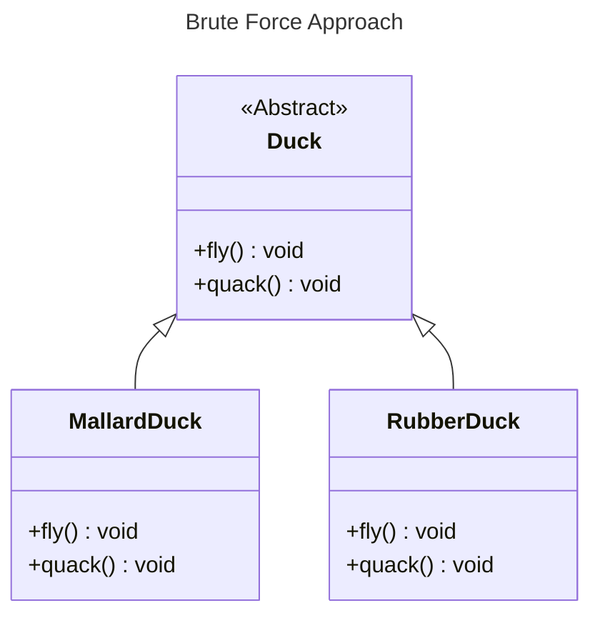
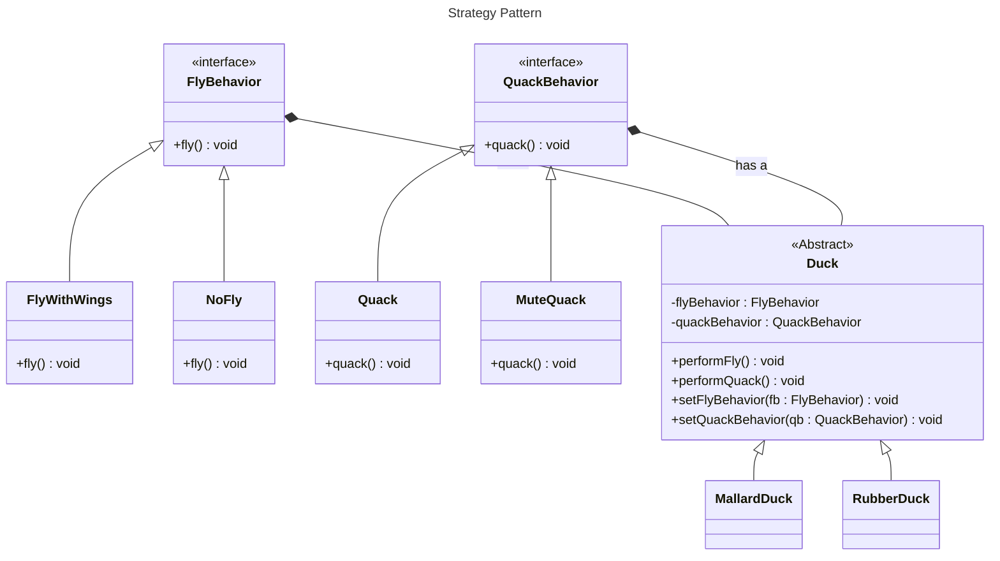
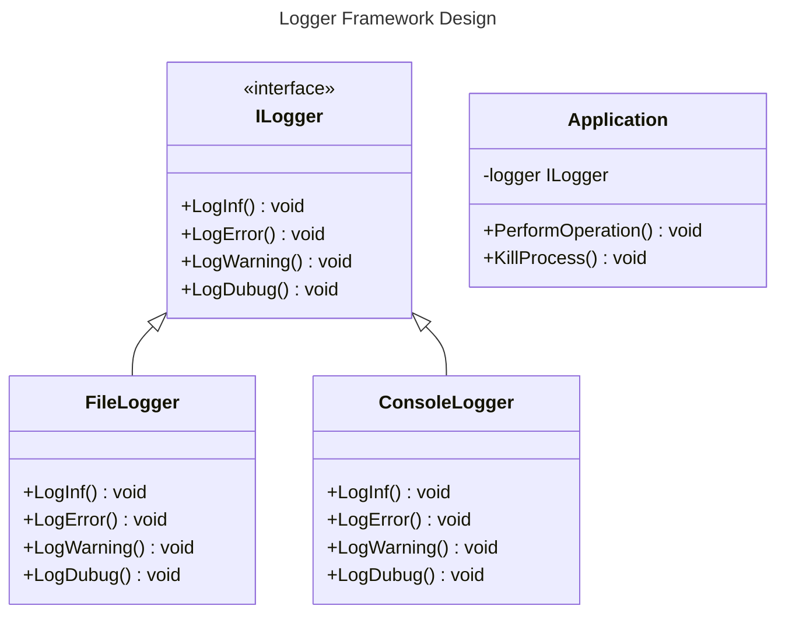

#behavioral
## Definition

It defines a family of algorithms, encapsulates each one, and makes them interchangeable. The **Strategy Pattern** allows algorithms to vary independently from the clients that use them.

---
## Real World Analogy - 1

Consider creating a **Duck** application with different types of ducks that can quack and fly. A simple approach would be to create a base class called `Duck` with methods like `fly()` and `quack()`, then implement these methods in specific duck types.



> [!Question] What is Wrong With These Approach ?
> You have implemented a base class called `Duck`, where methods like `fly()` and `quack()` are already defined. For example, the base class `Duck` has a default implementation of flying. However, in the case of a `RubberDuck` class, the duck **cannot** quack or fly.
>
>To modify this behavior, you would need to override the `fly()` and `quack()` methods, which becomes inefficient when dealing with dozens of duck types. To address this issue, you can use the **Strategy Pattern**.

Let's see the Implementation via Strategy Pattern:

Here, we create two interfaces:
- `FlyBehavior`, which defines different flying behaviors.
- `QuackBehavior`, which defines different quacking behaviors.

By implementing these interfaces, you can create new behaviors independently. The **abstract base class `Duck`** uses these interfaces in the constructor, allowing you to dynamically change behaviors or even create a new duck type by passing specific or custom behaviors.

Now, instead of modifying the base `Duck` class for every new type, you can simply create new behavior implementations and **plug them in**—making the system more flexible and scalable!

---
### Code in Java

Below is the Code for the above Strategy Pattern we discussed over Here. 
```java
// Strategy Design Pattern Example: Ducks with Flying and Quacking Behaviors

public interface FlyBehavior {
  // Interface defining the fly behavior contract
  void fly();
}

public class FlyWithWings implements FlyBehavior {
  @Override
  public void fly() {
    System.out.println("Can Fly");
  }
}

public class NoFly implements FlyBehavior {
  @Override
  public void fly() {
    System.out.println("Can't Fly");
  }
}

public interface QuackBehavior {
  // Interface defining the quack behavior contract
  void quack();
}

public class Quack implements QuackBehavior {
  @Override
  public void quack() {
    System.out.println("Quacking....");
  }
}

public class MuteQuack implements QuackBehavior {
  @Override
  public void quack() {
    System.out.println("Mute Quacking");
  }
}

public class Squeak implements QuackBehavior {
  @Override
  public void quack() {
    System.out.println("Squeak");
  }
}

public abstract class Duck {

  private FlyBehavior _flyBehavior;
  private QuackBehavior _quackBehavior;

  // Constructor taking FlyBehavior and QuackBehavior arguments
  // This allows for flexible behavior assignment at runtime
  public Duck(FlyBehavior flybehavior, QuackBehavior quackBehavior) {
    this._flyBehavior = flybehavior;
    this._quackBehavior = quackBehavior;
  }

  public void quack() {
    this._quackBehavior.quack();
  }

  public void fly() {
    this._flyBehavior.fly();
  }
}

public class RubberDuck extends Duck {

  public RubberDuck(FlyBehavior flybehavior, QuackBehavior quackBehavior) {
    super(flybehavior, quackBehavior);
  }

}

public class MallardDuck extends Duck {

  public MallardDuck(FlyBehavior flybehavior, QuackBehavior quackBehavior) {
    super(flybehavior, quackBehavior);
  }

}

public class Index {
  public static void main(String[] args) {
    // The duck which is mute and cannot fly lets create that duck using rubber duck
    System.out.println("======= Rubber Duck ======");
    Duck rubberDuck = new RubberDuck(new NoFly(), new MuteQuack());
    rubberDuck.fly();
    rubberDuck.quack();

    System.out.println();

    // Mallard Duck
    // Making the code feasible here we can change the behavior any time we want
    // just need to change the constuctor call.
    System.out.println("===== Mallard Duck =====");
    Duck mallardDuck = new MallardDuck(new FlyWithWings(), new Squeak());
    mallardDuck.fly();
    mallardDuck.quack();
  }
}
```
**Output:**
```
======= Rubber Duck ======
Can't Fly
MUte Quacking

===== Mallard Duck =====
Can Fly
Squeak
```

---
## Real World Analogy - 2

Let's take another example: the **Logging Framework**.

This type of pattern is commonly used in logging frameworks, where you only pass the **Logger Interface** and call the `log()` method. The rest is handled by the class that implements the interface.

Suppose an application uses an `ILogger` interface, which declares methods like `LogInfo()`, `LogError()`, and `LogDebug()`. The logger can have multiple implementations, such as `ConsoleLogger`, `FileLogger`, `JsonLogger`, or `DBLogger`.

Using this approach, there is **no need to modify** all the methods in the application when changing the type of logger. You only need to **switch to a new logger** by defining it in the configuration section, while the rest is managed by the respective logging class.

Below is the **class diagram** illustrating this approach.

---
## Real World Example

The `Comparator` interface acts as the Strategy Pattern. By inheriting this interface, you can create your custom comparator, which allows you to sort collections.

```java title:Person.java
class NameComparator implements Comparator<Person> {
    public int compare(Person p1, Person p2) {
        return p1.name.compareTo(p2.name);
    }
}

List<Person> people = Arrays.asList( 
	new Person("Alice", 25), 
	new Person("Bob", 30), 
	new Person("Charlie", 22) 
);

// Apply sorting strategy at runtime 
Collections.sort(people, new NameComparator()); 
System.out.println("Sorted by name: " + people);
```
---
## Design Principles

> [!Note] Note
> The Design Principles will be changing based on the Design Patterns and new design principles will be added to it as you go through the Different Design Patterns.

- **Encapsulate What Varies** - Identify the parts of the code that are going to change and encapsulate them into separate class just like the Strategy Pattern. 
- **Favor Composition Over Inheritance** - Instead of using inheritance on extending functionality, rather use composition by delegating behavior to other objects. 
- **Program to Interface not Implementations** - Write code that depends on Abstractions or Interfaces rather than Concrete Classes. 
---

