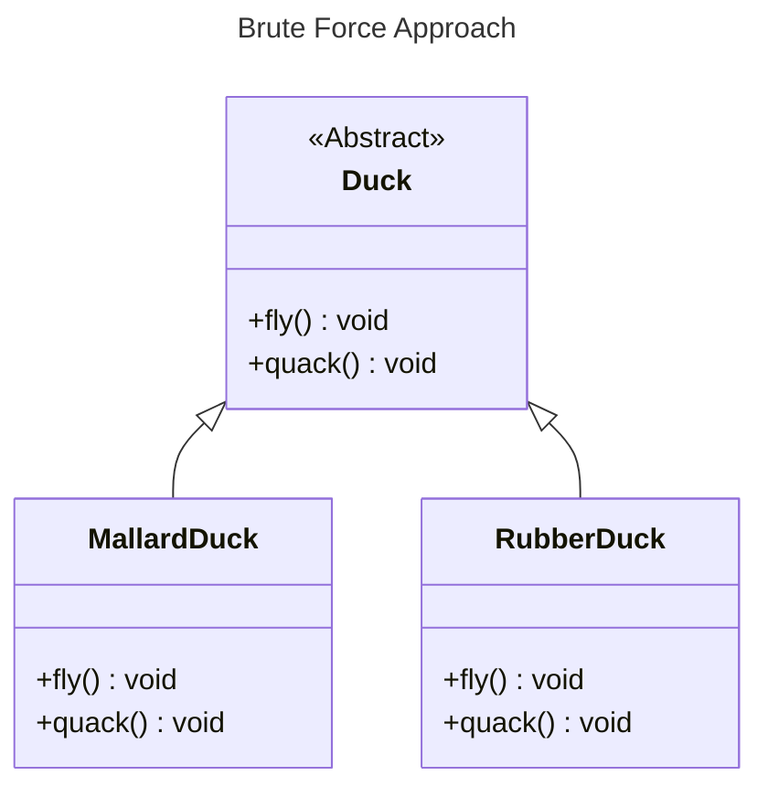
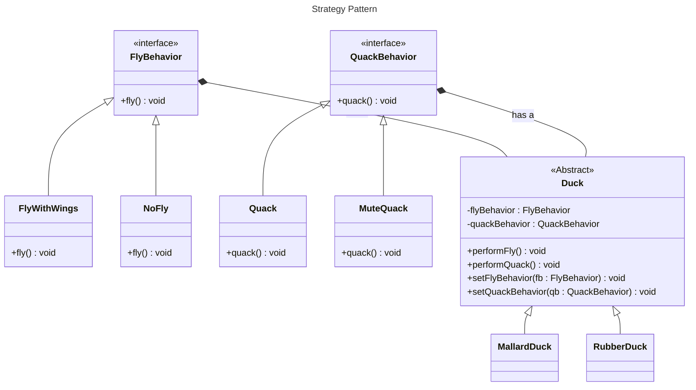

#behavioral
## Definition

It Defines a family of algorithms encapsulates each one, and makes them interchangeable. Strategy Lets the algorithms vary independently from clients that use it. 

---
## Real World Analogy

Consider you are creating the Duck Application in which there are many types of Duck which may quack, fly. The Simple Approach would be just create the base class Duck and the method like fly, quack and implement it to other types of Duck. 


> [!Question] What is Wrong With These Approach ?
> You have just implement the Base class as Duck in which the methods are also implemented. For Example the Base Class of the Duck has the implementation of the Fly Ducks. Then for RubberDuck Class, Duck cannot quack nor fly. To modify these behavior you need to rewrite the code again for the method fly and quack which is not feasible when it comes to dozens of duck. You need some approach to tackle these type of solution. Solution is **Strategy Pattern**.

Let's see the Implementation via Strategy Pattern:

Here we Created the Interface FlyBehavior and QuackBehavior which takes the method. By implementing these interface you can create new behavior. For Abstract Base Class Duck just make use of the Interface in the constructor means you can change the behaviour or even implement the new Duck by passing the Duck Behavior or Custom Behavior. 

---
## Code in Java

Below is the Code for the above Strategy Pattern we discussed over Here. 
```java
// Strategy Design Pattern Example: Ducks with Flying and Quacking Behaviors

public interface FlyBehavior {
  // Interface defining the fly behavior contract
  void fly();
}

public class FlyWithWings implements FlyBehavior {
  @Override
  public void fly() {
    System.out.println("Can Fly");
  }
}

public class NoFly implements FlyBehavior {
  @Override
  public void fly() {
    System.out.println("Can't Fly");
  }
}

public interface QuackBehavior {
  // Interface defining the quack behavior contract
  void quack();
}

public class Quack implements QuackBehavior {
  @Override
  public void quack() {
    System.out.println("Quacking....");
  }
}

public class MuteQuack implements QuackBehavior {
  @Override
  public void quack() {
    System.out.println("Mute Quacking");
  }
}

public class Squeak implements QuackBehavior {
  @Override
  public void quack() {
    System.out.println("Squeak");
  }
}

public abstract class Duck {

  private FlyBehavior _flyBehavior;
  private QuackBehavior _quackBehavior;

  // Constructor taking FlyBehavior and QuackBehavior arguments
  // This allows for flexible behavior assignment at runtime
  public Duck(FlyBehavior flybehavior, QuackBehavior quackBehavior) {
    this._flyBehavior = flybehavior;
    this._quackBehavior = quackBehavior;
  }

  public void quack() {
    this._quackBehavior.quack();
  }

  public void fly() {
    this._flyBehavior.fly();
  }
}

public class RubberDuck extends Duck {

  public RubberDuck(FlyBehavior flybehavior, QuackBehavior quackBehavior) {
    super(flybehavior, quackBehavior);
  }

}

public class MallardDuck extends Duck {

  public MallardDuck(FlyBehavior flybehavior, QuackBehavior quackBehavior) {
    super(flybehavior, quackBehavior);
  }

}

public class Index {
  public static void main(String[] args) {
    // The duck which is mute and cannot fly lets create that duck using rubber duck
    System.out.println("======= Rubber Duck ======");
    Duck rubberDuck = new RubberDuck(new NoFly(), new MuteQuack());
    rubberDuck.fly();
    rubberDuck.quack();

    System.out.println();

    // Mallard Duck
    // Making the code feasible here we can change the behavior any time we want
    // just need to change the constuctor call.
    System.out.println("===== Mallard Duck =====");
    Duck mallardDuck = new MallardDuck(new FlyWithWings(), new Squeak());
    mallardDuck.fly();
    mallardDuck.quack();
  }
}
```
