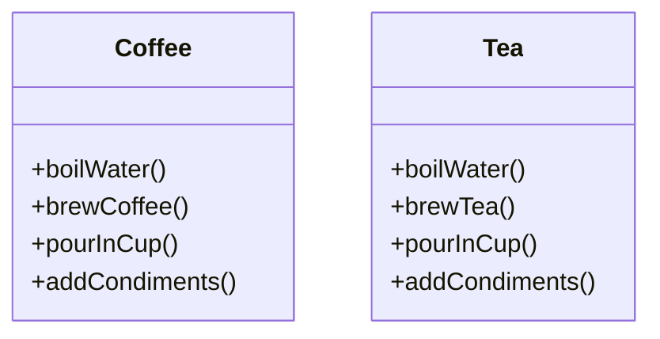
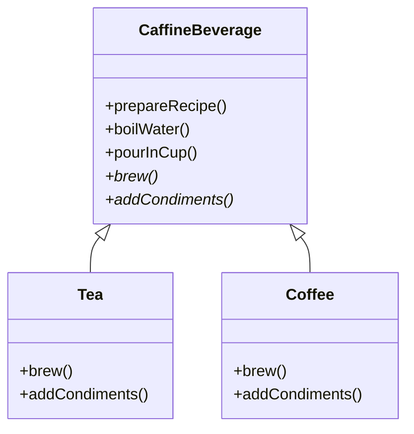

## Definition

**Template Method Pattern** defines the skeleton of an algorithm in a method, deferring some steps to subclasses. Template Method lets subclasses redefine certain steps of an algorithm without changing the algorithm’s structure.

---
## Real World Analogy

This pattern is widely used in many frameworks and libraries. For example, **Django**, **Flask**, and **Spring** provide hooks or decorators. You simply implement a few methods and the framework handles the flow. These are perfect examples of the Template Method pattern: the framework or base class controls the overall process (request handling, lifecycle, etc.), and you supply only the specific steps.

Consider you want to make tea and coffee. To make either you need to:
- Boil the water
- Brew the coffee or tea
- Pour into the cup
- Add condiments

Class Diagram for Coffee and Tea:



The diagram shows two concrete classes, `Coffee` and `Tea`, each listing methods for steps required to prepare the beverage. In the Template Method pattern a shared base class controls the flow and subclasses provide the specific implementations for brewing and adding condiments.

You might ask why make separate methods when it is just an algorithm: boil → brew → pour → add condiments. Putting the common flow in an abstract base class keeps the shared algorithm in one place and lets subclasses provide only the varying steps.

---
### Design



_Class Diagram for Template Method Pattern_  
This diagram highlights the abstract base class `CaffineBeverage` that defines the overall procedure (`prepareRecipe`) and the concrete subclasses `Tea` and `Coffee` that implement the varying parts (`brew()` and `addCondiments()`). The `prepareRecipe()` method is the template method that controls the sequence while delegating variable steps to subclasses.

---
### Implementation in Java

Below is the implementation for creating Tea and Coffee using the Template Method Pattern.
```java title="CaffineBeverage.java"
abstract class CaffineBeverage {
	// These is our Algorithm or Say Recipe to Create the Caffine
	public final void prepareRecipe() {
		boilWater();
		brew();
		pourInCup();
		addCondiments();
	}

	// These steps are common for Coffee and Tea
	public void boilWater() {
		System.out.println("Boiling the Water");
	}

	// Common Steps for Tea and Coffee
	public void pourInCup() {
		System.out.println("Pouring in the Cup");
	}

	// Sub class must provide these for creating the caffine based on what they want
	public abstract void brew();

	// Sub class must provide these for creating the caffine based on what they
	// want.
	public abstract void addCondiments();
}
```

The `CaffineBeverage` class contains the fixed recipe in `prepareRecipe()` which is final so subclasses cannot change the order of steps. `boilWater()` and `pourInCup()` are implemented in the base class because they are common. `brew()` and `addCondiments()` are abstract and must be implemented by subclasses to provide beverage-specific behavior.

There are subclasses which implement the steps:
```java title="Tea.java"
// Implementation for the algorithm
class Tea extends CaffineBeverage {

	@Override
	public void brew() {
		System.out.println("Brewing Tea");
	}

	@Override
	public void addCondiments() {
		System.out.println("Adding Elachi and Malai");
	}
}

```

`Tea` implements the abstract methods with tea-specific actions. When `prepareRecipe()` runs on a `Tea` object, the base class runs the common steps and calls `Tea`'s `brew()` and `addCondiments()` at the right points.

```java title="Coffee.java"
// Implementation for the algorithm with different calculation
class Coffee extends CaffineBeverage {

	@Override
	public void brew() {
		System.out.println("Brewing Coffee");
	}

	@Override
	public void addCondiments() {
		System.out.println("Adding Extra Sugar and Milk into the Coffee");
	}

}
```

`Coffee` provides its own versions of `brew()` and `addCondiments()`. The overall recipe from the base class is reused unchanged and only the subclass behavior differs.

Now Preparing the Recipe

```java title="TemplatePattern.java"
		// Calling the Algorithm
		CaffineBeverage mytea = new Tea();
		mytea.prepareRecipe();

		System.out.println();

		CaffineBeverage mycoffee = new Coffee();
		mycoffee.prepareRecipe();
```

This code shows how client code creates concrete beverage objects and calls the single `prepareRecipe()` method. The client does not need to manage the steps; it simply invokes the template and the subclasses fill in the details.

**Output:**
```txt
Boiling the Water
Brewing Tea
Pouring in the Cup
Adding Elachi and Malai

Boiling the Water
Brewing Coffee
Pouring in the Cup
Adding Extra Sugar and Milk into the Coffee
```

The output demonstrates the shared steps and subclass-specific steps appearing in the correct order, showing reuse of flow and customization of behavior.

---
## Real World Example

In our case the real world example can be sorting a list of custom objects. You can use `ArrayList.sort()` directly for primitive or comparable types. However, for sorting non-primitive types we often implement a custom comparator and pass it to the sort method. This is similar to giving the variable part (comparison logic) to the library sorting algorithm (the template).

In this example we are going to sort ducks by their weight using the inbuilt sort method of **ArrayList**.
```java title="CustomSort.java"
package template;

import java.util.ArrayList;
import java.util.Comparator;

// Custom Class/Object
class Duck {
	private int Weight;
	private String Name;

	public int getWeight() {
		return Weight;
	}

	public String getName() {
		return Name;
	}

	public Duck(int weight, String name) {
		this.Name = name;
		this.Weight = weight;
	}
}

// Implementing the Custom Comparator for sorting
class SortDuckByWeight implements Comparator<Duck> {

	@Override
	public int compare(Duck o1, Duck o2) {
		return Integer.compare(o1.getWeight(), o2.getWeight());
	}

}

public class CustomSort {

	public static void main(String[] args) {
		// Create the List of Duck class
		ArrayList<Duck> list = new ArrayList<Duck>();
		addInList(list, 23, "Duck23");
		addInList(list, 12, "Duck12");
		addInList(list, 34, "Duck34");
		System.out.println("Before Sorting");
		printList(list);

		list.sort(new SortDuckByWeight());
		System.out.println("\nAfter Sorting");
		printList(list);

	}

	public static void addInList(ArrayList<Duck> ducks, int weight, String name) {
		ducks.add(new Duck(weight, name));
	}

	public static void printList(ArrayList<Duck> ducks) {
		for (Duck duck : ducks) {
			System.out.println("Ducks\tWeight=" + duck.getWeight() + " Name=" + duck.getName());
		}
	}

}
```

`Duck` is a simple data class with `Weight` and `Name` fields and getters. `SortDuckByWeight` implements `Comparator<Duck>` and contains the weight-based comparison. `CustomSort` builds a list, prints it, sorts it with the custom comparator, and prints the result, showing how library algorithms can be reused by providing the variable parts.

**Output:**
```txt
Before Sorting
Ducks	Weight=23 Name=Duck23
Ducks	Weight=12 Name=Duck12
Ducks	Weight=34 Name=Duck34

After Sorting
Ducks	Weight=12 Name=Duck12
Ducks	Weight=23 Name=Duck23
Ducks	Weight=34 Name=Duck34
```

The before and after output shows the effect of passing a custom comparator into the standard sorting algorithm; the algorithm is reused while the comparison logic is supplied externally.

---
## Design Principles:

- **Encapsulate What Varies** - Identify the parts of the code that are going to change and encapsulate them into separate class just like the Strategy Pattern. 
- **Favor Composition Over Inheritance** - Instead of using inheritance on extending functionality, rather use composition by delegating behavior to other objects. 
- **Program to Interface not Implementations** - Write code that depends on Abstractions or Interfaces rather than Concrete Classes. 
- **Strive for Loosely coupled design between objects that interact** - When implementing a class, avoid tightly coupled classes. Instead, use loosely coupled objects by leveraging abstractions and interfaces. This approach ensures that the class does not heavily depend on other classes.
- **Classes Should be Open for Extension But closed for Modification** - Design your classes so you can extend their behavior without altering their existing, stable code.
- **Depend on Abstractions, Do not depend on concrete class** - Rely on interfaces or abstract types instead of concrete classes so you can swap implementations without altering client code.
- **Talk Only To Your Friends** - An object may only call methods on itself, its direct components, parameters passed in, or objects it creates.
- **Don't Call us, we'll call you** - The framework/base class controls the flow and calls subclass code when needed.